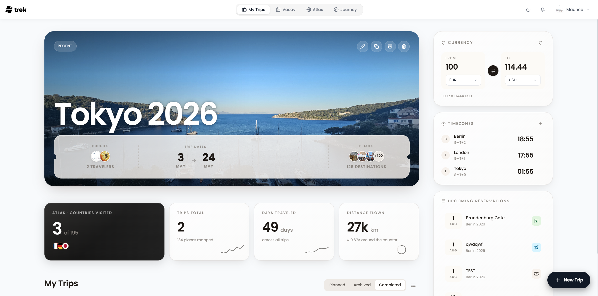
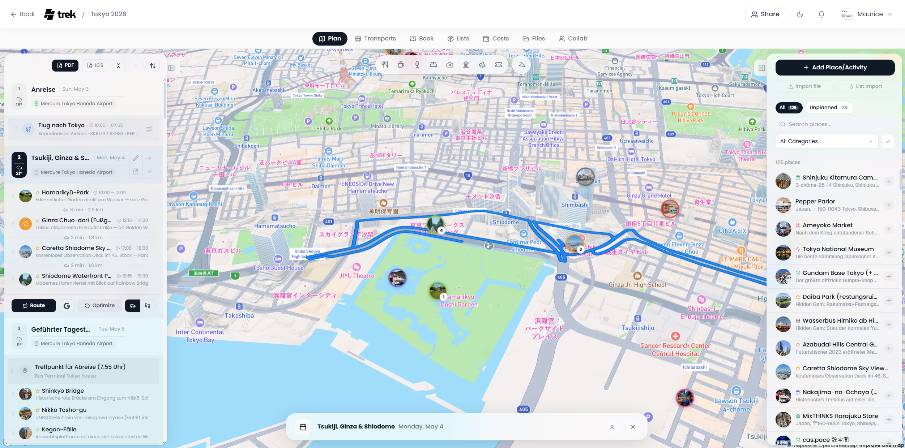
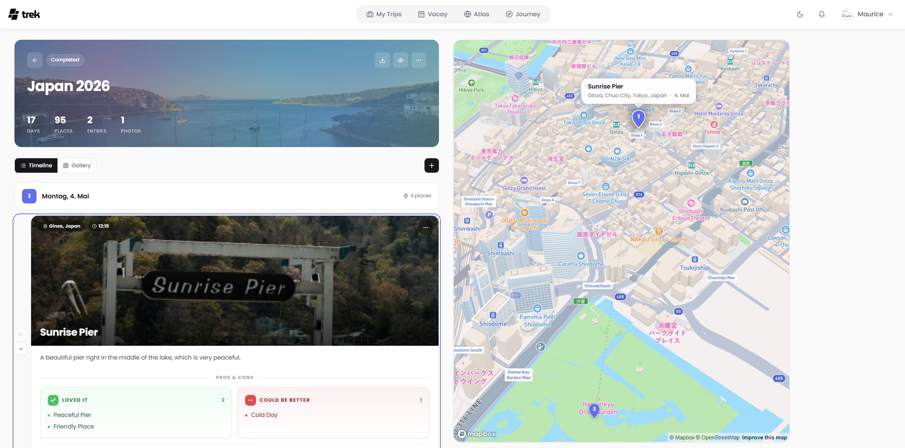
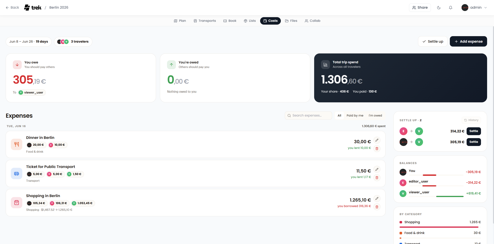
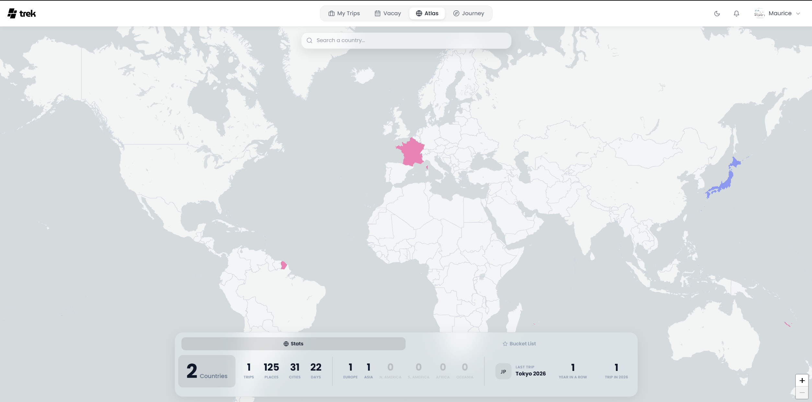
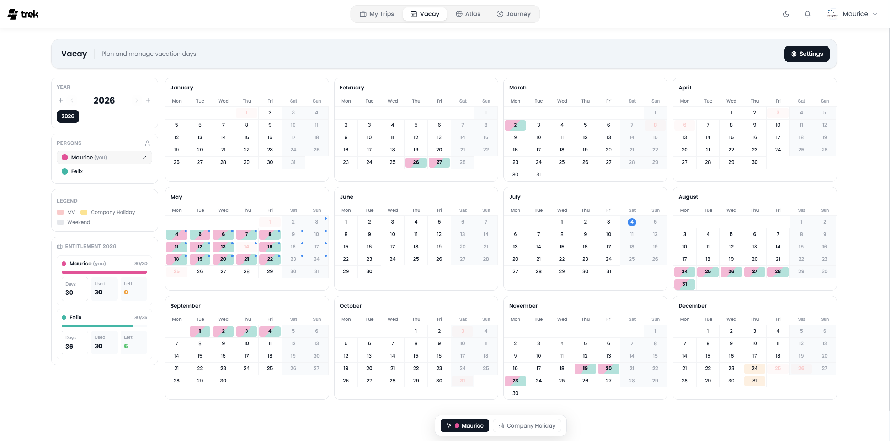

<div align="center">


<br /><br />

# Trek Wanderer

**My personal self-hosted travel planner — running at [rodadas.info](https://rodadas.info:446)**

A fork of [TREK](https://github.com/mauriceboe/TREK) with a glassmorphism redesign and custom branding.

<br />

[](https://rodadas.info:446)
[](https://github.com/mauriceboe/TREK)
[](LICENSE)

</div>

---

## What is this?

Trek Wanderer is my personal instance of TREK — a self-hosted travel planner I use to organise my trips, log bike routes, and keep track of places I've visited.

I've customised it with:

- 🪟 **Glassmorphism UI redesign** — frosted glass panels, blurred backdrops, and layered depth across the entire app
- 🧭 **Trek Wanderer branding** — new route/waypoint logo and gradient wordmark
- 🌗 **Full light & dark mode** support for all new styles

---

## Features

Everything from the original TREK, including:

| | |
|---|---|
| 🗺️ **Trip planner** | Drag & drop day plans, interactive map, place search, weather |
| 🚗 **Transport & reservations** | Flights, hotels, restaurants with confirmation numbers and files |
| 💰 **Budget tracking** | Expenses by category, per-person splits, multi-currency |
| 🎒 **Packing lists** | Templates, categories, user assignment, progress tracking |
| 📔 **Journey journal** | Write travel diaries with photos, gallery view, public sharing |
| 🌍 **Atlas** | World map with visited countries and travel statistics |
| 📅 **Vacay planner** | Calendar view with holidays and time-off planning |
| 📁 **Documents** | Attach files and PDFs to trips, places, and reservations |
| 👥 **Collaboration** | Real-time multi-user editing with live presence |
| 🔐 **Auth** | Local accounts + OIDC / SSO single sign-on |

---

## Screenshots

<div align="center">
  <a href="docs/screenshots/dashboard.png"></a>
  <a href="docs/screenshots/trip-planner.png"></a>
  <a href="docs/screenshots/journey.png"></a>
  <a href="docs/screenshots/budget.png"></a>
  <a href="docs/screenshots/atlas.png"></a>
  <a href="docs/screenshots/vacay.png"></a>
</div>

---

## Self-hosting with Docker

```bash
git clone https://github.com/MelAnubis/trek.git
cd trek
cp .env.example .env
# Edit .env with your settings
docker compose up -d --build
```

The app will be available at `http://localhost:3000` by default.

### Requirements

- Docker + Docker Compose
- A domain or local network (optional but recommended for HTTPS)

### Environment variables

See `.env.example` for all available options including:
- Database path and backup settings
- Google Maps / Weather API keys (optional)
- OIDC / SSO configuration
- SMTP for email notifications

---

## My setup

Running on a home server behind a reverse proxy at **[rodadas.info:446](https://rodadas.info:446)**.

- Docker Compose on a Linux server
- Nginx reverse proxy with SSL
- Automatic hourly backups

---

## Credits

Trek Wanderer is a fork of **[TREK](https://github.com/mauriceboe/TREK)** by [Maurice Boe](https://github.com/mauriceboe) — an amazing open-source travel planner. All the core functionality, architecture, and original design belong to him.

If you're looking for the original project to self-host, head over to the upstream repo:
👉 **https://github.com/mauriceboe/TREK**

---

<div align="center">
  <sub>Built with ❤️ on top of TREK · Running at <a href="https://rodadas.info:446">rodadas.info</a></sub>
</div>
