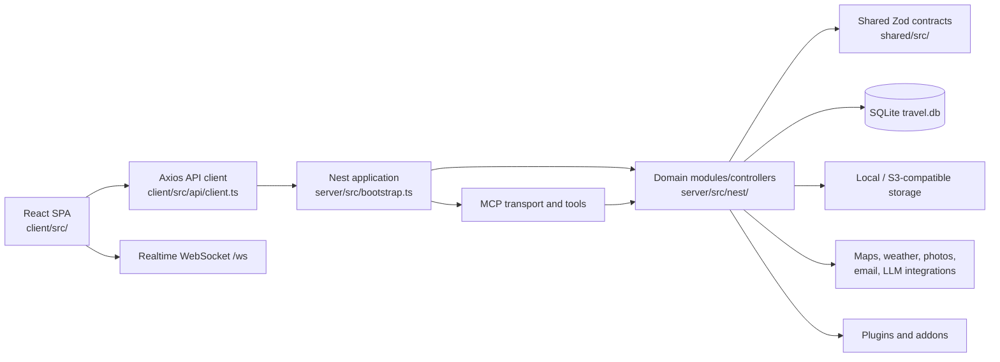
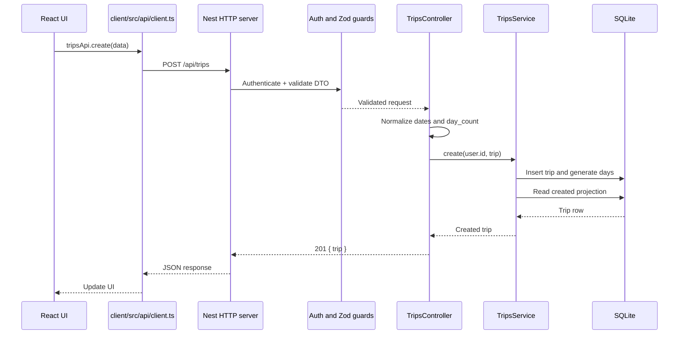

# World-Travel Architecture

Last reviewed: 2026-08-28

## System context

Evidence: `client/src/main.tsx`, `client/src/App.tsx`, `client/src/api/client.ts`, `server/src/bootstrap.ts`, `server/src/nest/app.module.ts`, `server/src/db/database.ts`, and `shared/src/`.

## Create-trip request

Evidence: `client/src/api/client.ts:377-384`, `server/src/nest/trips/trips.controller.ts:77-143`, `server/src/nest/trips/trips.service.ts:351-379`, and `server/src/db/schema.ts:81-100`.

Storage, external integrations, MCP, and WebSockets are architectural boundaries but are not required for this basic create-trip path.
