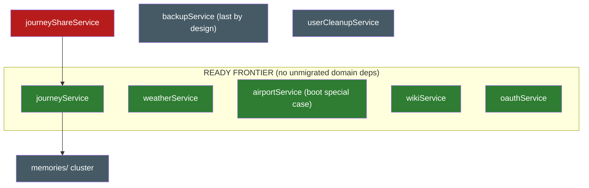

# Legacy `src/services/` dependency graph

Generated from the actual imports in `server/src` on **2026-08-02** (after the
adminService fold — the last Wave-5 god file, and the fold where two long-carried
claims in this document turned out to be **wrong**: there is no admin MCP surface
(`src/mcp/tools/admin.ts` has never existed in the repo's history; the
"11 MCP consumers" figure below predated the Phase-0 addons extraction) and
`plugin-host-deps.factory.ts` never imported the domain, so recipe steps 3 and 4
were both no-ops — the `systemNotices/conditions.ts` consumer listed in the
frontier table was stale too, it imports `addons.bridge`. Ahead of the fold the
11 packing-template functions relocated to `PackingService`, which already owned
all three template tables (`saveAsTemplate` writes every one of them); that
resolved the `admin-2` residual **with no bridge**, since `packing.mcp.ts`
already injects that service, and it kept one owner per table instead of freezing
a create-here/delete-there split. The 851-line module then folded into the
wrapper `AdminService` over `DatabaseService` + injected SettingsService,
AddonsService, PasskeyService, PackingService, AuthService, PermissionsService
and NotificationsService — the `auth.bridge` (`resolveAuthToggles`),
`notifications.bridge` (`send`) and `permissions.bridge`
(`getAllPermissions`/`savePermissions`) imports all became injections, while
`PERMISSION_ACTIONS` stayed a plain const import and the deliberate
`mcp/sessionManager` deep import kept its anti-cycle comment (the `../../mcp`
barrel would close a nest->mcp->nest cycle). The pure + module-scoped half moved
to the plain module `admin.helpers.ts`: `compareVersions`, `utcSuffix`,
`BCRYPT_COST`, the import-time `isDocker` probe (`/.dockerenv` + `/proc/1/cgroup`
at module evaluation — a documented parity exception, auth.helpers precedent) and
the 5-minute version cache, **module-scoped on purpose** (permissions-cache
precedent) so the bridge instance and the container singleton share one GitHub
fetch between the cron and `GET /api/admin/version-check`. The bridge tax landed
as predicted at one file: a 1-export `admin.bridge.ts` (`checkAndNotifyVersion`)
for `scheduler.ts`'s daily cron. Four lines are non-verbatim, all path
re-anchoring one directory deeper for `nest/admin/` — `rotateJwtSecret`'s
`data/` dir, the `package.json` version require and the websocket/demo-reset
lazy requires — with both resolved paths verified against the emitted `dist/`
layout, since a wrong depth on the first would silently write `.jwt_secret` into
`dist/` and log every user out on the next boot. Tests moved with IDs preserved
(adminService.test.ts -> `nest/admin.service.test.ts`, ADMIN-SVC-001...069
including the pre-existing 029/030 gap and the duplicated 069, plus a new
ADMIN-BR-001 pinning both the bridge delegation and the shared version cache;
versionNotification.test.ts -> `nest/admin.version-notification.test.ts`,
VNOTIF-001...007, still driving real notification rows; the template cases rode
along to `packing.service.test.ts`), and the module e2e went DI-native — the
3-method whole-module mock died and 6 cases became 15 over real SQL. A sibling
DTO ratchet cleared all **twenty** `AdminController` allow-list entries, the
largest single block in the file, trading the three
`'enabled must be a boolean'` checks plus `'permissions object required'` and
`'Object body required'` for the pipe envelope; the twelve schemas are
deliberately permissive wherever `AdminService` already owns a bespoke 400
('Invalid role', 'Name is required', 'Username, email and password are
required'), and `savePermissions` keeps `z.unknown()` values so bad levels still
land in the 200 response's `skipped` list. **journeyService and oauthService now
head the frontier.** Earlier the same day, the notificationService fold — the
notifications fan-in, step 3 of the
dependency-honest order, cashed in at last after being deferred through the
whole step-4 chain: the 354-line `send()` dispatcher and the 371-line
`inAppNotifications.ts` in-app store folded **together** into the existing
thin wrapper `nest/notifications/notifications.service.ts`
(`NotificationsService`) over `DatabaseService` + injected `RealtimeService` —
the wrapper's in-app delegation became the real SQL (identical statements,
the three divergent `toUtcIso` treatments, the action-before-CAS respond
flow), and `send()` arrived with its event-config map, gating and log lines
verbatim. The notifications *cluster* did NOT fold: the preference matrix,
the smtp/webhook/ntfy transports, `notifications/{channelRegistry,builtins}`
(their registry⇄prefs cycle included) and `inAppNotificationActions` stay
plain infra modules per the classification below — the fold consumes the
cluster's seams as plain imports, exactly like tripAccess/webauthnConfig
before them. The bridge tax — the heaviest of any remaining fold — landed as
ONE file: the 1-export `notifications.bridge.ts` (`send`) serves the
scheduler's two cron `require()`s, the legacy adminService +
memories/{unified,synology} senders, and the six deliberately-lazy
fire-and-forget `import().then(({ send }) => …)` sends inside migrated Nest
services (collab/collections/packing/reservations/trips/vacay — path-only
repoints that keep the lazy shape so a send can never block or cycle a
domain module). In-container static consumers inject instead:
`AdminController`'s dev test-notification send (AdminModule →
NotificationsModule) and the plugin RPC host, where
`sendPluginNotification`'s legacy import became the injected
`NotificationsService` — the factory's 24th constructor dep, leaving
weatherService + journeyService as its last legacy domain imports. The
5-tool legacy registrar `mcp/tools/notifications.ts` and the
`notifications-in-app` resource moved onto the decorator registry as
`notifications.mcp.ts` (no `when:` — the domain is core, not addon-gated;
the `'Notification not found.'` trailing-period divergence from REST's
`'Not found'` is pinned, not fixed). Tests moved with IDs preserved
(notificationService.test.ts → nest/notifications.service.test.ts,
NSVC-001…019/NTFY-SVCB-*/NSVC-PLUG-001…007 + the new NSVC-020 bridge pin;
inAppNotificationPrefs.test.ts → nest/notifications.inapp-prefs.test.ts,
INOTIF-*), ~18 suites repointed their path mocks/warm-ups to the bridge
path, admin.controller.test and the plugin-host factory suite converted
theirs to constructor stubs, and the module e2e went DI-native (real
notifications DDL; prefs/transports stay path-mocked). A sibling DTO ratchet
cleared all five `NotificationsController` allow-list entries —
`testNtfyRequestSchema` gained `.nullable()` server/token because the client
sends null to mean "use the saved value" — trading the inline
`response`-enum and url-type checks for the pipe envelope. **adminService is
unblocked and heads the frontier.** Earlier the same day, the
passkeyService fold — the second frontier cash-in of the auth fold and the
last member of the oidc/passkey pair:
the 364-line WebAuthn module folded into a
**new** `nest/auth/passkey.service.ts` (`PasskeyService`) over
`DatabaseService` + injected `AuthService` — unlike every prior fold there
was no wrapper service to fill: the delegation shim was `PasskeyController`
itself (`import * as passkey`), which now injects the service. The frontier
row's "bridge tax: none (a leaf)" held exactly: no MCP registrar ever
existed, the plugin host never imported it, and both consumers were already
in-container — the controller, and `AdminService.resetUserPasskeys`, which
swapped its legacy function import for the injection (`exports:
[PasskeyService]` + an AdminModule→AuthModule import, the todo→TripsService
precedent) — so `auth.bridge`'s legacy customer list is down to adminService
alone. The three `auth.bridge` imports resolved on schedule: `generateToken`
became `this.auth.generateToken`, `stripUserForClient`/`avatarUrl` became
plain helper imports (exactly what the bridge re-exports), and
`resolveWebauthnConfig` stays a plain `services/webauthnConfig` import (the
helper also feeds auth's `isPasskeyConfigured`). Where oidc converted module
maps to instance state, passkey had **no state to convert at all** — the
challenge store is DB-backed (`webauthn_challenges`: single-use
`DELETE … RETURNING` claim before any await, 5-min TTL) — so the fold is a
plain stateless injectable with every SQL string, error string (the uniform
CWE-203 'Authentication failed' 401, the clone-detection audit path) and the
counter/login-bookkeeping transaction relocated verbatim (reshaped one line
for `DatabaseService.transaction`). Tests: the module had **no service-level
suite** — the third fold in a row to hit that risk — so PASSKEY-SVC-001…030
were written fresh (characterization over a real `:memory:` DB,
`@simplewebauthn/server` mocked at the ceremony-verdict boundary — the
repo's first such mock; the fold puts 364 previously ungated lines under the
≥80% `src/nest/**` gate), the controller suite's path mock became a
constructor stub, and the test helper's `RESET_TABLES` gained the two
webauthn tables. A sibling DTO ratchet cleared the last four
`PasskeyController` allow-list entries with deliberately permissive schemas
(password optional, ceremony payloads `z.unknown()`) so the bespoke 401/400
strings stay service rules. The trailing `fix(server)` commit then cleared
the two verified defects the relocation had faithfully carried — the DELETE
route's untyped `{ password }` body (a non-string 500'd in bcrypt) and the
un-transactioned dup-check→INSERT in registerVerify — see "Quirks fixed
after the passkey fold" below. The day
before, the oidcService fold — the first frontier cash-in of the auth fold,
landed the same day as auth, while the notifications fan-in stayed the
order's official next step: the 508-line SSO module folded whole into the existing thin wrapper
`nest/oidc/oidc.service.ts` (`OidcService`) over `DatabaseService` + injected
`AuthService` — the `resolveAuthToggles` import off `auth.bridge` (exactly the
repoint the auth fold predicted for this trio) became the injection, shrinking
the bridge's legacy customer list to adminService/passkeyService (adminService
alone since the passkey fold the next day). The frontier
row's "bridge tax: none" held exactly: no MCP registrar ever existed, the
plugin host never imported it, and nothing outside the container consumes the
domain — the first fold since day-notes/trip-invite with **no bridge and no
repoints at all**. That zero made this the first fold where instance state was
viable: the `pendingStates`/`authCodes` maps, their two sweep `setInterval`s
(legacy started them at import, never unref'd), the single-slot discovery
cache and the JWKS cache moved onto the `OidcService` instance — the
module-scope precedent (permissions cache, atlas-geo, auth's maps) exists only
so a bridge instance and the container singleton share one copy, and no such
sharer exists here; the sweepers start in the constructor and are cleared in
`onModuleDestroy`, the one wire-invisible deviation. Everything else relocated
verbatim: the `uuid`/`bcryptjs` lazy requires, the `invite_exhausted`
reference-compared sentinel transaction (reshaped one line for
`DatabaseService.transaction`), the `||` env→db→literal config chains, all 14
SQL strings. The controller and its unit suite needed zero edits. Tests moved
with IDs preserved (tests/unit/services/oidcService.test.ts →
tests/unit/nest/oidc.service.test.ts, OIDC-SVC-001…045, superseding the
18-case delegation-shim suite whose wrapper cases carried over as 046–048),
and the path-mock rot the auth fold flagged got cleaned at the source:
oidc.e2e swapped its 12-fn whole-module mock for
`vi.spyOn(app.get(OidcService), …)` instance spies, and the integration suite
now spies the four HTTP methods on the container instance while driving the
real `createState`/`createAuthCode` state on that same instance — the maps
live where the routes look. The trailing `fix(server)` commit then cleared
the carried defects (un-timeboxed `fetch`es, the 10-min state cookie vs the
5-min STATE_TTL, the hand-built no-re-select new-user object, the single-slot
discovery cache, the `no_email` assert, the `any`-typed invite row and the
lazy requires) — see "Quirks fixed after the oidc fold" below. Before that, the
authService fold — the Wave-5 chain opener, cashed in the moment the atlas
fold unblocked it: the 1497-line auth core — the biggest single fold of the
migration — split places-style. The pure crypto half (backup-code hash/match/generate with
the bcrypt/legacy-SHA dual verify, `stripUserForClient`, key masking, the
import-time `DUMMY_PASSWORD_HASH` timing equaliser and the `avatarDir` mkdir,
both documented parity exceptions) moved to the plain module
`nest/auth/auth.helpers.ts`; the DB half (toggles/app-config, register/login
with the CWE-208 dummy-hash path, MFA setup/enable/disable/verify-login, the
password-reset throttle + token flows with their two `db.transaction()`
revocation blocks, API keys/settings, travel stats, MCP/ws/resource tokens,
`isDemoUser` and the two token verifiers) folded into the DI-native
`AuthService` over `DatabaseService` + injected `PermissionsService` (ex
`permissions.bridge`) + `AtlasService` (ex `atlas.bridge`, which **died on
schedule** — its doc-comment said "delete this file when authService
migrates"). The `mfaSetupPending` and per-email reset-throttle maps stay
module-scoped (with the import-time unref'd cleanup interval, atlas-geo
class) so the bridge instance and the container singleton share one copy;
`require('../../../package.json')` and `avatarDir` re-anchored one directory
deeper — with the two injection swaps, the only non-verbatim lines. No MCP
registrar existed and the plugin host never imported authService, so neither
surface changed — but the fold's real fan-out was in-container: the 15
domain `*.mcp.ts` demo guards now inject `AuthService` (15 modules gained an
`AuthModule` import), with `atlas.mcp.ts` alone staying on a bridge import
because AuthService injects AtlasService and the reverse module edge would
close an AuthModule↔AtlasModule cycle — the second entry in the
cycle-break-bridge category the place fold opened (`assignments.bridge`
precedent), except this time on the brand-new bridge. That bridge —
the 8-export `nest/auth/auth.bridge.ts` — otherwise serves exactly the
predicted tax: `mcp/index.ts`'s token verification
(`verifyMcpToken`/`verifyJwtToken`), `isDemoUser` for the three legacy
registrars (journey/notifications/transports), and
`resolveAuthToggles`/`generateToken`/`stripUserForClient`/`avatarUrl` for the
still-legacy consumers — adminService/oidcService/passkeyService then,
adminService/passkeyService since the oidc fold later the same day, and
adminService alone since the passkey fold (2026-08-02). Tests moved with case
IDs preserved (authService.test.ts → auth.helpers.test.ts,
authServiceDb.test.ts → auth.service.test.ts, which also gained
AUTH-BR-001…007 bridge-delegation cases and AUTH-DB-050…088 — the fold put
~1400 previously ungated lines under the ≥80% `src/nest/**` branch gate, and
the legacy suite left getAppConfig/resetPassword/the MFA success flows
unpinned); `auth.e2e.test.ts` converted DI-native (the 30-method whole-module
mock died — login now runs real bcrypt against a factory hash and audit rows
land in a real audit_log), and `oidc.e2e.test.ts` swapped its silently-dead
`services/authService` path mock for a `vi.spyOn(app.get(AuthService), …)`
instance stub. A sibling DTO ratchet cleared all **14** auth allow-list
entries (9 `AuthController` + 5 `AuthPublicController`; `PasskeyController`'s
4 stayed until the passkey fold cleared them on 2026-08-02), adding the six missing request schemas
(mapsKey/apiKeys/settings/appSettings/mfaDisable/resourceToken) to
`shared/src/auth/auth.schema.ts`. No trailing quirk commit yet — the
faithfully-carried defects are listed under "Quirks preserved" below,
awaiting their own `fix(server)` pass. Earlier the same day, the
atlasService fold — the second frontier pull-forward of the day, opening the
Wave-5 auth chain: the 1612-line atlas core split two ways, places precedent. The DB
half — the stats aggregation with its two divergent return shapes, visited
countries/regions with the #1490 tombstone/cascade logic, bucket-list CRUD —
folded into the DI-native `AtlasService` over `DatabaseService` alone (no
broadcasts anywhere: atlas rows are uid-scoped). The ~750-line pure-geo half —
the bundled admin0/admin1 boundary stores with their #1576 OOM-shaped
streaming builders, the point-in-polygon country/region indexes, Nominatim
geocoding with its shared ≥1.1s throttle, the 50k geocode cache with its
import-time unref'd cleanup interval, and the `geocodingInFlight` dedup set —
moved verbatim to the **plain module** `nest/atlas/atlas-geo.ts` (maps.helpers
class), so those caches stay process-global across the container instance, the
bridge instance and test helpers; `assetPath` re-anchored one directory
deeper, the only non-verbatim line. The 10-tool `mcp/tools/atlas.ts` registrar
**plus all four atlas resources in `mcp/resources.ts`** (`trek://bucket-list`,
`trek://visited-countries`, `trek://atlas/stats`, `trek://atlas/regions`)
moved onto the decorator registry as `atlas.mcp.ts` — here the `when:`
atlas-addon gate IS parity (unlike collections, the legacy registrar and
resources both gated on the addon while the REST controller deliberately does
not), and that emptied `mcp/resources.ts`'s test suite: `resources.test.ts`
retired with its last two cases. The plugin RPC host swapped its 9 atlas
imports for the injected `AtlasService` (its 23rd constructor dep) — journeys
is now the factory's last legacy domain import. And the zero-bridge streak
ends at five: `authService.getTravelStats` (legacy, Wave-5) consumes
`getCountryFromCoords` + `getHiddenCountries`, so a minimal 2-export
`atlas.bridge.ts` exists for that one edge — `getCountryFromCoords`
re-exported straight from atlas-geo, `getHiddenCountries` over the bridge
instance — and it died with the auth fold later the same day. A sibling DTO ratchet cleared
all three `AtlasController` body-contract allow-list entries
(mark-region + bucket create/update), trading the hand-rolled
`'name and country_code are required'` 400 for the pipe envelope while the
whitespace-only bucket name keeps its legacy `'Name is required'` trim guard.
Earlier the same day, the collectionsService fold —
the biggest single fold yet, taken off the ready
frontier while the notifications fan-in stayed the order's official next step:
the 1024-line saved-places core (visibility/roles, the collection-scoped
dedup, saved-places CRUD, copy-to-trip with the ratings filters, labels, the
fusion invitation state machine) folded into the DI-native `CollectionsService`
over `DatabaseService` + `PermissionsService` + `RealtimeService` — the
`permissions.bridge` and websocket `broadcastToUser` imports became injections,
the `placeImage` helper import stays plain, the `sendInvite` call-time
`import()` of notificationService stays lazily as-is (collab precedent), and
`deleteOldCollectionCover` re-anchored its `__dirname` path one directory
deeper. The whole 25-tool `mcp/tools/collections.ts` registrar moved onto the
decorator registry as `collections.mcp.ts` — deliberately with **no `when:`
addon gate**, because the legacy registrar registered unconditionally while
REST (`CollectionsAddonGuard`) and the plugin host (`requireAddon`) gate on the
addon; that asymmetry is now pinned as a characterization case. The plugin RPC
host swapped its 7 collections imports for the injected `CollectionsService`
(its 22nd constructor dep), so the domain needed **no bridge at all** — the
fifth consecutive zero-bridge fold. The legacy registrar had no tool-level
tests; a new 23-case `tools-collections` suite now covers payloads, error
texts, scope gating and the addon-gate absence, and the moved 47-case
`COLLECTIONS-SVC-*` suite gained two membership-lookup cases. A sibling DTO
ratchet cleared both collections body-contract allow-list entries (`reorder`,
`delete-many`), retiring the last two hand-rolled 400 strings of the domain in
favour of the pipe envelope (places precedent). A day earlier, the
transitItineraryService relocation closed step 4 — the fourth and final link
of that chain, and the first pure-helpers relocation with no
service fold at all: the 287-line module is 100% pure — no SQL, no DB, no
broadcasts — so its Zod itinerary schemas + endpoint/metadata builders moved
byte-identical to `nest/transit/transit-itinerary.helpers.ts` (the schemas must
stay module-level plain exports: `transit.mcp.ts` consumes them inside
`@Tool({ inputSchema })` decorators, which evaluate at module load before any
container exists), its sole consumer — the in-container `transit.mcp.ts` — was
a one-import repoint, and a new 21-case `TRANSIT-ITIN-*` characterization suite
pins the previously untested superRefine error strings, `??` time fallbacks,
coordinate tolerances and builder output. The
notifications fan-in headed the frontier from there (cashed in 2026-08-02,
above). Before that, the placeService
migration (2026-07-30): the 1029-line place core (CRUD + ratings SQL,
the GPX/KML/KMZ importers, the Google/Naver list importers) folded into the
DI-native `PlacesService`; the pure pieces — the frozen XML parsers, the KMZ
unpacker, the dedup predicates, the Google hex-id parsers, `reclaimPhotoCache`
— into `nest/places/places.helpers.ts` (maps.helpers precedent); the whole
10-tool `mcp/tools/places.ts` registrar **plus** the
`trek://trips/{tripId}/places` resource onto the decorator registry
(`places.mcp.ts`, with `search_place` coming along because its gate is
`places:read` and now injecting `MapsService`); TripsService, DaysMcp,
BookingImportService and the plugin RPC host (its 21st constructor dep) all
inject `PlacesService`, so the domain needs **no bridge at all**. The sibling
`placeEnrichment` fold went further: that helper's DB/websocket/Maps half became
`PlacesService` methods over the injected
`DatabaseService`/`RealtimeService`/`MapsService` and its pure match selector
joined `places.helpers.ts` — which retired **`maps.bridge.ts`** with its last
consumer. A DTO ratchet commit cleared all seven `PlacesController` body
allow-list entries, and a trailing `fix(server)` commit repaired four verified
defects the relocation had faithfully carried (see "Quirks fixed" below).
Earlier the same week, the transitService migration opened the tail of step 4
(the 333-line Transitous/MOTIS proxy into the dep-free `TransitService`, pure
stats/types into `nest/transit/transit.helpers.ts`, the 3-tool registrar onto
the decorator registry — zero bridge files, registrar deleted); before that the
mapsService fold (the 1429-line geo core into `MapsService`, pure helpers into
`maps.helpers.ts`, the 3 geo MCP tools onto the registry), and before that the
tripService fold completing step 2 (the 1121-line hub into `TripsService`, its
MCP surface onto `trips.mcp.ts`/`share.mcp.ts`, the plugin host injecting it,
and the bridge cascade — `todo.bridge`, `share.bridge`, `collab.bridge` and
`vacay.bridge` deleted with their last consumers, days/budget pruned to their
survivors). Earlier context: the budgetService migration (step 1) and the
Phase 0 quick wins: `getAppUrl`/`getMcpSafeUrl` → `src/app-config` deleted the
fake `→ notifications` edges for the identity/MCP stack and freed mapsService;
the addon-enablement reads moved from adminService into `nest/addons/`
(`addons.bridge.ts` for out-of-container consumers), collapsing the admin
god-file's ~27-consumer fan-in to the admin routes + one `admin-2` residual
and freeing oauthService.
This regeneration parses **static `from '...'`, `require('...')` and dynamic
`import('...')`** specifiers, so the lazy edges the earlier grep-based analysis
missed (scheduler jobs, the db-boot airport backfill, the fire-and-forget
notification sends) are included. Regenerate any time by re-running that
three-pattern import scan over `server/src` (a throwaway script suffices; the
patterns are the whole trick).

How to read it:

- **imports (services/)** — what the legacy file pulls from other legacy files. A service is
  *migration-ready* when this column contains only helpers (see classification below) and/or
  `tripAccess` (Wave-2 "don't migrate, delete": absorb into `DatabaseService.canAccessTrip`).
  Edges tagged **(lazy)** are `import()`/`require()` at call time — they never block a
  migration, because a migrated Nest service can keep the same lazy import until the target
  domain migrates (collab/collections/packing/trips/reservations/vacay all did exactly that
  for `notificationService`; since its 2026-08 fold those lazy `import()`s point at
  `nest/notifications/notifications.bridge`, still lazily).
- **imported by (services/)** — legacy files that would need a **bridge or repoint** when this
  one migrates (a legacy module can't inject).
- **nest consumers** — in-container consumers: repoint to the injected service
  (`exports: [XService]` + module import), never a bridge.
- **out-of-container consumers** — `mcp/`, `scheduler.ts`, `websocket.ts`, `db/`,
  `middleware/`, `systemNotices/`, `index.ts`: these are the **bridge pressure**
  (todo.bridge.ts precedent).

## Node classification

- **Already DI-native (legacy file deleted):** tags, categories, todo, packing, day-notes,
  trip-invite, assignments, share, settings, files, collab, vacay, reservations, day,
  permissions (module-scoped cache retained on purpose — the bridge and DI instances share
  one invalidation), audit (the `writeAudit` injectable; `client-ip.ts` and the deliberately
  side-effectful `audit-log.logger.ts` stay plain modules inside `nest/audit/`),
  exchange-rates (the exchangeRateService fold into `nest/budget/` as the dep-free
  `ExchangeRatesService` — module-scoped rate cache retained on purpose, permissions-style,
  so out-of-container instances and the DI singleton share one cached upstream feed;
  its `exchange-rates.bridge` was deleted with the budgetService migration),
  budget (the 755-line money core folded into `BudgetService`; `budget.bridge.ts` is down
  to the two exports still consumed outside the container — userCleanupService and the
  legacy transports registrar),
  trip (the 1121-line hub folded into `TripsService`; its six bridge imports became
  injected services, and the fold deleted `todo.bridge`, `share.bridge`, `collab.bridge`
  and `vacay.bridge` with their last consumers; a 3-export `trips.bridge.ts` serves the
  legacy prompts registrar's getTripSummary and `budget.mcp.ts`'s getTripOwner/listMembers
  seam — injecting there would need a forwardRef'd TripsModule↔BudgetModule cycle;
  `days.bridge.ts` shrank to getDay/listDays — since the transit fold, for the
  transports registrar alone),
  maps (the 1429-line geo core folded into `MapsService`; pure helpers —
  `buildUserAgent`, the opening-hours parsers, POI categories, Overpass endpoint
  resolution — are plain exports in `nest/maps/maps.helpers.ts` (the DI-native
  TransitService imports its UA from there); the module-scoped POI
  cache / photo-fetch semaphore / frozen Overpass mirrors stay module-scoped on
  purpose so any out-of-container instance and the DI singleton share them;
  **`maps.bridge.ts` is gone** — the place fold absorbed both of its consumers,
  the `placeEnrichment` helper and the places MCP registrar, and PlacesService /
  PlacesMcp / BookingImportService now inject `MapsService` directly),
  admin (the 851-line Wave-5 god file folded into `AdminService`; the pure +
  module-scoped half — `compareVersions`, `utcSuffix`, the import-time `isDocker`
  probe and the 5-minute version cache — lives in the plain module
  `admin.helpers.ts`, the cache module-scoped on purpose so `admin.bridge`'s
  instance and the DI singleton share one GitHub fetch; the packing-template CRUD
  went to `PackingService`, which already owned those tables; `admin.bridge.ts`
  has a single export, `checkAndNotifyVersion`, for `scheduler.ts`'s cron),
  transit (the first fully SQL-free domain fold: the Transitous/MOTIS proxy
  became the dep-free `TransitService` — response cache, frozen-at-import
  `TRANSIT_API_BASE` and lazy User-Agent memo stay module-scoped on purpose;
  the pure `deriveTransitStats` + `SCHEDULED_TRANSIT_MODES` + itinerary types
  are plain exports in `nest/transit/transit.helpers.ts` (maps.helpers
  precedent), consumed since the 2026-08 relocation by the colocated
  `transit-itinerary.helpers.ts`; the 3-tool
  registrar moved to `transit.mcp.ts` and was deleted — no bridge ever
  existed for this domain),
  transit-itinerary (the pure-helpers relocation closing step 4: schemas +
  endpoint/metadata builders moved byte-identical from the legacy
  `transitItineraryService` to `nest/transit/transit-itinerary.helpers.ts` —
  plain exports, no service, no bridge, no DTO, no plugin-host work; the
  `distanceService`/`timezoneService` helper imports stay plain, the
  `EndpointInput` type import repointed from `reservations.bridge` to
  `reservations.service` directly),
  place (the 1029-line place core folded into `PlacesService`, its pure half into
  `nest/places/places.helpers.ts`, and the whole MCP surface — 10 tools + the
  trip-places resource — onto `places.mcp.ts`; the `placeEnrichment` helper was
  absorbed in the same wave, taking `maps.bridge.ts` with it. **Zero bridge
  files**: every consumer is in-container. The two `assignments.bridge` imports
  that `places.mcp.ts` keeps are a deliberate cycle break —
  AssignmentsModule imports DaysModule and DaysModule imports PlacesModule for
  `days.mcp.ts`'s place creation, so injecting AssignmentsService there would
  close DaysModule → PlacesModule → AssignmentsModule → DaysModule; the same
  seam `reservations.mcp.ts` uses and the same trade `trips.bridge.ts`
  documents),
  collections (the 1024-line saved-places core folded into `CollectionsService`
  over `DatabaseService`/`PermissionsService`/`RealtimeService`; the 25-tool
  registrar moved to `collections.mcp.ts` **without** a `when:` addon gate —
  the legacy registrar's addon-gate asymmetry, preserved and test-pinned; the
  plugin host injects the service as its 22nd constructor dep; the `sendInvite`
  lazy notificationService `import()` stays call-time (collab precedent); the
  dead `buildDedupSet` module helper was dropped in the move — the only
  non-verbatim line. **Zero bridge files**: every consumer is in-container),
  atlas (the 1612-line core split places-style: the DB half into `AtlasService`
  over `DatabaseService` alone, the pure-geo half — boundary stores, poly/box
  indexes, Nominatim geocoding, all the module-scoped caches including the
  import-time unref'd cleanup interval — verbatim into the plain module
  `nest/atlas/atlas-geo.ts` so the multi-MB caches stay process-global across
  every instance (#1576); the 10-tool registrar + all four resources onto
  `atlas.mcp.ts` with the `when:` atlas-addon gate that IS parity here; the
  plugin host injects the service as its 23rd constructor dep; its 2-export
  `atlas.bridge.ts` served legacy `authService.getTravelStats` and died on
  schedule with the auth fold),
  auth (the 1497-line credential/MFA/reset/settings core folded into
  `AuthService` over `DatabaseService` + injected `PermissionsService` +
  `AtlasService`; the pure crypto half — backup-code hashing/matching,
  `stripUserForClient`, key masking, the import-time `DUMMY_PASSWORD_HASH`
  and `avatarDir` mkdir parity exceptions — is plain exports in
  `nest/auth/auth.helpers.ts`; `mfaSetupPending` + the per-email
  reset-throttle map (and its unref'd interval) stay module-scoped so the
  bridge and container instances share them; **one bridge**, the 8-export
  `auth.bridge.ts` — for `mcp/index.ts` token verification, the three legacy
  registrars' `isDemoUser` (oidc, passkey and admin all folded 2026-08 and
  inject instead), and the one in-container
  cycle-break consumer `atlas.mcp.ts` (AuthService injects AtlasService, so
  AtlasModule cannot import AuthModule — assignments.bridge precedent); the
  other 15 domain `*.mcp.ts` demo guards inject `AuthService`),
  oidc (the 508-line SSO flow folded into the wrapper `OidcService` over
  `DatabaseService` + injected `AuthService` — the `auth.bridge`
  `resolveAuthToggles` repoint cashed in as an injection; no MCP surface, no
  plugin-host import, **no bridge** — nothing outside the container consumes
  it, so the state/auth-code maps, sweep intervals and discovery/JWKS caches
  are **instance state** with `onModuleDestroy` clearing the timers, the first
  fold where that was viable; `apiKeyCrypto`/`tripMembership`/`cookie` stay
  plain helper imports),
  passkey (the 364-line WebAuthn module folded into a **new**
  `nest/auth/passkey.service.ts` `PasskeyService` over `DatabaseService` +
  injected `AuthService` — the first fold whose target service did not
  pre-exist, because the delegation shim was `PasskeyController` itself; no
  MCP surface, no plugin-host import, **no bridge**, and no state at all —
  the challenge store is DB-backed (`webauthn_challenges`, single-use
  `DELETE … RETURNING` claim), so it is a plain stateless injectable;
  `AdminService` injects it for the passkey reset via `exports:
  [PasskeyService]` + an AdminModule→AuthModule import;
  `webauthnConfig`/`stripUserForClient`/`avatarUrl` stay plain helper
  imports),
  notifications (the `send()` dispatcher **and** the `inAppNotifications`
  in-app store folded together into the pre-existing wrapper
  `NotificationsService` over `DatabaseService` + `RealtimeService`; the
  preference matrix, transports, channel registry and
  `inAppNotificationActions` stay plain infra imports; a 1-export
  `notifications.bridge.ts` (`send`) serves scheduler + legacy
  memories + the six lazy fire-and-forget sends in migrated
  Nest services; `AdminController`, `AdminService` (since the 2026-08 admin
  fold) and the plugin host (24th factory dep) inject; the 5-tool registrar + in-app resource moved to
  `notifications.mcp.ts`).
- **Domain migration targets** (the wave material): airportService,
  backupService,
  journeyService, journeyShareService, oauthService,
  weatherService, wikiService.
- **Cross-cutting Wave-2 targets:** permissions and auditLog are done (2026-07) — see the
  DI-native list above; only tripAccess remains (delete, don't migrate).
- **Helpers that stay as plain modules** (pure/infra, not wave material): avatarUrl,
  queryHelpers, conflictResult, cookie, demo, distanceService, ephemeralTokens, apiKeyCrypto,
  mfaCrypto, passwordPolicy, webauthnConfig, timezoneService, llmConfig, kmlImport, placeImage,
  placePhotoCache, unsplashService, userCleanupService, tripMembership (the prose below
  already treats it as one — consumed by nest/auth, nest/oidc, nest/trip-invite and the
  plugin host; a candidate to fold into the trip-invite or trips domain some day, but
  nothing blocks on it),
  inAppNotificationActions, notificationPreferencesService, notifications
  (+ `notifications/` registry), `memories/` cluster, `airtrail/` cluster. Several of these are
  themselves candidates to fold *into* a domain service when its domain migrates — and three
  already have: exchangeRateService → budget (2026-07), **placeEnrichment → place**
  (2026-07, the latter also retiring a bridge), and **inAppNotifications → notifications**
  (2026-08 — the in-app store folded with the dispatcher; the rest of the notifications
  cluster stayed plain on purpose). The four still reached only from
  `nest/places/*` (kmlImport, placeImage, placePhotoCache, unsplashService) are the
  next obvious fold candidates, but none of them blocks anything.

## Domain-level graph (edges = "must migrate first, or bridge"; dotted = lazy, non-blocking)

(The `notificationService` node — and the `notifications cluster` infra node
under it — are gone since the 2026-08-02 fold: the dispatcher + in-app store
went DI-native, the cluster's only remaining consumers are the DI-native
`NotificationsService`'s plain imports (infra never blocks), and every legacy
edge onto the domain became a `nest/notifications/notifications.bridge`
repoint (adminService, memories/{unified,synology}, the scheduler's two lazy
`require()`s) or an injection (AdminController, the plugin host's 24th
factory dep). That cleared `adminService`'s last hard domain import — and,
unpredicted, the `memories/` cluster's last domain edge with it, so **both
adminService and journeyService moved into the frontier** (journey's only
legacy deps are the avatarUrl helper + the now-pure-infra
memories/photoResolver seam; journeyShareService stays blocked on
journeyService itself). The lazy sends inside migrated Nest services keep
their call-time shape, pointed at the bridge.
The `authService` node is gone since the 2026-08-01 fold — the Wave-5 chain
opener landed the same day its atlas blocker cleared. The three `--> auth`
edges (admin/oidc/passkey, all `resolveAuthToggles`-class imports, passkey
also `generateToken`/`stripUserForClient`/`avatarUrl`) became import-path-only
repoints onto the 8-export `nest/auth/auth.bridge` (todo-bridge precedent),
which put **oidcService and passkeyService on the frontier** — their only
other legacy deps are helpers (apiKeyCrypto/tripMembership,
webauthnConfig) — while `adminService` stayed blocked on its hard
`notificationService` import alone (cleared by the 2026-08-02 notifications
fold above). The `oidcService` node is gone since the
2026-08-01 fold later the same day — its `auth.bridge` repoint became the
injected `AuthService` inside the DI-native `OidcService`, its
apiKeyCrypto/tripMembership edges stay plain helper imports (helpers never
block), and no bridge replaced it (nothing outside the container consumes the
domain), leaving `passkeyService` alone from that pair on the frontier. The
`passkeyService` node is gone since the 2026-08-02 fold — its `auth.bridge`
repoint became the injected `AuthService` inside the new `PasskeyService`,
its `webauthnConfig` edge stays a plain helper import, and no bridge replaced
it either (both consumers were in-container; `AdminService` now injects the
service), emptying that pair from the frontier. `userCleanupService` is infra, not a
blocker (helpers never block). The `atlasService` node left the frontier
earlier the same day as the first fold whose legacy dependent outlived it:
its former `auth --> atlas` bridge edge died with the auth fold, and
`atlas.bridge.ts` with it.
The `collectionsService` node is gone since the 2026-08-01 fold — its dotted
call-time `import()` edge to notificationService survives inside the DI-native
`CollectionsService`, exactly like the identical lazy sends in the
already-migrated collab/packing/trips/reservations/vacay services, so it never
appears here again; its `permissions.bridge` repoint became an injected
`PermissionsService` and its `placeImage` import stays a plain helper import.
The `transitItineraryService` node is gone since the 2026-08-01 relocation —
its `transitService` edge had already become the pure
`nest/transit/transit.helpers` import when the transit domain went DI-native,
and the relocation moved the whole module into `nest/transit/` as
`transit-itinerary.helpers.ts`, so nothing was left to bridge or repoint beyond
the one `transit.mcp.ts` import. The `placeService` node is gone since the
2026-07-30 fold — its legacy imports were
all helpers, and the former `placeService → mapsService` edge (via `placeEnrichment`)
died with the helper rather than becoming a repoint.
The former `notificationService → notifications cluster` hard import went
DI-native with the 2026-08-02 fold (the cluster stays plain infra under
`NotificationsService`); the even earlier
`mapsService/transitService/webauthnConfig/
oauthService → notifications` edges were only `getAppUrl`/`getMcpSafeUrl` and died with the
Phase 0 move to `src/app-config`, which had put mapsService on the frontier.
The `memories/ ⇄ admin` tangle is gone since the 2026-08 admin fold. The
direction was always the other way round than this document claimed: nothing
under `memories/` imports the admin domain (thumbnailService's edge was only
`isAddonEnabled`, an `addons.bridge` repoint since Phase 0) — it was
`adminService` that imported `getPhotoProviderConfig` from
`memories/helpersService`. That is now a plain helper import in the DI-native
`AdminService`, and helpers never block, so the journey/memories corner is a
clean frontier pick. The former
`auth/collections/backup → permissions` and `notifSvc/oauth → auditLog` edges are gone since the
2026-07 Wave-2 pair: the permissions consumers repointed to `nest/permissions/permissions.bridge`,
the writeAudit consumers to `nest/audit/audit.bridge`, and the log*-only consumers to the plain
`nest/audit/audit-log.logger` — none of them block a migration anymore. The
tripService hub node is gone since the 2026-07 trip fold — the DI-native
`TripsService` injects its former bridge targets and keeps the legacy
avatarUrl/timezoneService/userCleanupService helpers as plain imports (helpers
never block).)

## Full adjacency table

| service | imports (services/) | imported by (services/) | nest consumers | out-of-container consumers |
|---|---|---|---|---|
| `airportService` | (none) | (none) | nest/airports/airports.service.ts, nest/booking-import/kitinerary-mapper.ts | db/database.ts (lazy boot backfill), mcp/tools/mapsWeather.ts, mcp/tools/transports.ts |
| `apiKeyCrypto` | (none) | airtrail/airtrailService, llmConfig, memories/helpersService, memories/immichService, memories/photoResolverService, memories/synologyService, memories/unifiedService, notifications, unsplashService | nest/admin/admin.service.ts, nest/auth/auth.helpers.ts, nest/auth/auth.service.ts, nest/maps/maps.service.ts, nest/oidc/oidc.service.ts, nest/plugins/plugin-oauth.service.ts, nest/plugins/plugin-runtime.service.ts, nest/plugins/plugins.service.ts, nest/settings/settings.service.ts | db/migrations.ts |
| `avatarUrl` | (none) | journeyService | nest/admin/admin.service.ts, nest/auth/auth.bridge.ts, nest/auth/auth.service.ts, nest/auth/passkey.service.ts, nest/budget/budget.service.ts, nest/collab/collab.service.ts, nest/files/files.service.ts, nest/notifications/notifications.service.ts, nest/packing/packing.service.ts, nest/reservations/reservations.service.ts, nest/trips/trips.service.ts | (none) |
| `backupService` | (none — `permissions.bridge`, plugin backup/paths infra only) | (none) | nest/backup/backup.controller.ts, nest/backup/backup.service.ts | scheduler.ts (lazy) |
| `conflictResult` | (none) | (none) | nest/packing/packing.controller.ts, nest/packing/packing.service.ts, nest/places/places.controller.ts, nest/places/places.service.ts, nest/plugins/host/plugin-host-deps.factory.ts | (none) |
| `cookie` | (none) | (none) | nest/auth/auth-public.controller.ts, nest/auth/auth.service.ts, nest/auth/passkey.controller.ts, nest/oidc/oidc.controller.ts, nest/oidc/oidc.service.ts | (none) |
| `demo` | (none) | (none) | nest/auth/auth.controller.ts, nest/auth/auth.service.ts, nest/collections/collections.controller.ts, nest/files/files.controller.ts, nest/places/places.controller.ts, nest/plugins/host/plugin-host-deps.factory.ts, nest/trips/trips.controller.ts | middleware/auth.ts, middleware/mfaPolicy.ts |
| `distanceService` | (none) | (none) | nest/auth/auth.service.ts, nest/transit/transit-itinerary.helpers.ts | (none) |
| `ephemeralTokens` | (none) | (none) | nest/auth/auth.service.ts, nest/files/files.service.ts | index.ts, websocket.ts |
| `inAppNotificationActions` | (none) | (none) | nest/notifications/notifications.service.ts | (none) |
| `journeyService` | avatarUrl, memories/photoResolverService | journeyShareService | nest/assignments/assignments.service.ts, nest/journey/journey.service.ts, nest/places/places.mcp.ts, nest/places/places.service.ts, nest/plugins/host/plugin-host-deps.factory.ts, nest/plugins/journal-entry-rows.controller.ts | mcp/resources.ts, mcp/tools/journey.ts |
| `journeyShareService` | journeyService | (none) | nest/journey/journey.service.ts | mcp/tools/journey.ts |
| `kmlImport` | (none) | (none) | nest/places/places.helpers.ts, nest/places/places.service.ts | (none) |
| `llmConfig` | apiKeyCrypto | (none) | nest/admin/admin.service.ts, nest/llm-parse/llm-client.factory.ts, nest/llm-parse/llm-config.resolver.ts | (none) |
| `mfaCrypto` | (none) | (none) | nest/auth/auth.service.ts | (none) |
| `notificationPreferencesService` | notifications, notifications/builtins, notifications/channelRegistry | notifications, notifications/channelRegistry | nest/admin/admin.service.ts, nest/notifications/notifications.service.ts, nest/plugins/install/manifest.ts | (none) |
| `notifications` | apiKeyCrypto, notificationPreferencesService (+ `audit-log.logger`) | notificationPreferencesService, notifications/builtins | nest/auth/auth.service.ts, nest/notifications/notifications.service.ts | (none) |
| `oauthService` | (none — `addons.bridge` + `audit.bridge` only) | (none) | nest/oauth/oauth-api.controller.ts, nest/oauth/oauth.service.ts | mcp/index.ts, mcp/oauthProvider.ts |
| `passwordPolicy` | (none) | (none) | nest/admin/admin.service.ts, nest/auth/auth.service.ts | (none) |
| `placeImage` | (none) | (none) | nest/collections/collections.controller.ts, nest/collections/collections.service.ts, nest/common/place-image-upload.ts, nest/places/places.controller.ts, nest/places/places.service.ts | (none) |
| `placePhotoCache` | (none) | (none) | nest/maps/maps.service.ts, nest/places/places.helpers.ts, nest/share/share.service.ts | scheduler.ts (lazy) |
| `queryHelpers` | (none) | (none) | nest/assignments/assignments.service.ts, nest/days/days.service.ts, nest/places/places.service.ts, nest/share/share.service.ts | (none) |
| `timezoneService` | (none) | airtrail/airtrailMapper | nest/transit/transit-itinerary.helpers.ts, nest/trips/trips.service.ts | (none) |
| `tripAccess` | (none) | (none) | nest/booking-import/booking-import.service.ts, nest/budget/budget.service.ts, nest/collab/collab.service.ts, nest/days/day-notes.service.ts, nest/integrations/airtrail-import.controller.ts, nest/packing/packing.service.ts, nest/reservations/reservations.service.ts, nest/todo/todo.service.ts | (none) |
| `tripMembership` | (none) | (none) | nest/auth/auth.service.ts, nest/oidc/oidc.service.ts, nest/plugins/host/plugin-host-deps.factory.ts, nest/trip-invite/trip-invite.service.ts | (none) |
| `unsplashService` | apiKeyCrypto | (none) | nest/places/places.service.ts, nest/trips/trips.controller.ts, nest/trips/trips.service.ts | (none) |
| `userCleanupService` | (none — `budget.bridge`, plugin paths infra only) | (none) | nest/admin/admin.service.ts, nest/auth/auth.service.ts, nest/trips/trips.service.ts | (none) |
| `weatherService` | (none) | (none) | nest/plugins/host/plugin-host-deps.factory.ts, nest/weather/weather.controller.ts, nest/weather/weather.service.ts | mcp/tools/mapsWeather.ts |
| `webauthnConfig` | (none) | (none) | nest/auth/auth.service.ts, nest/auth/passkey.service.ts | (none) |
| `wikiService` | (none) | (none) | nest/help/help.controller.ts | (none) |

## Subdirectory clusters

- **`notifications/`**: `channelRegistry` ⇄ `notificationPreferencesService` (cycle),
  `builtins → notifications + channelRegistry`, and `notificationPreferencesService →
  builtins` (registering the built-in channels closes a second loop). **Stayed plain infra
  through the 2026-08 notifications fold** — the DI-native `NotificationsService` consumes
  the cluster via plain imports (the cycles never blocked the fold), and only
  `inAppNotifications` folded into the service.
- **`memories/`**: `helpersService` (base) ← immich/synology/unified/photoResolver;
  `photoResolverService` is the seam `journeyService` consumes (it also pulls
  immich/synology/thumbnail/`trekPhotoCache` — the latter is swept by `scheduler.ts`);
  `synology/unified` send via `nest/notifications/notifications.bridge` since the 2026-08
  fold — that was the cluster's **last legacy-domain edge** (`thumbnailService`'s
  adminService edge was only `isAddonEnabled` — `addons.bridge` since Phase 0), so the
  cluster is pure infra now and no longer blocks the journey corner; `immichService`
  writes audits via `nest/audit/audit.bridge`.
- **`airtrail/`**: `airtrailClient` (base) ← mapper ← service ← import/sync; `import`/`sync`
  consume (since the 2026-07 reservations fold) the
  `nest/reservations/reservations.bridge` instead of the deleted `reservationService`
  (their adminService edge was only `isAddonEnabled` — now `addons.bridge`); since
  the auditLog fold, `airtrailService` writes audits via `nest/audit/audit.bridge` and
  `airtrailSync` logs via the plain `nest/audit/audit-log.logger` (same split in
  `memories/immichService` → bridge).

## Decoding "what's next"

**Ready frontier** (all legacy deps are helpers, `tripAccess`, or lazy sends):

With the adminService fold landed on 2026-08-02, **every Wave-5 god file is
done** and the remaining legacy surface is the journey corner, the oauth pair
and three independent leaves. The frontier candidates:

| Candidate | Why now / why not | Bridge tax (legacy dependents + out-of-container) |
|---|---|---|
| **journeyService** | Unblocked 2026-08-02: the memories cluster's last domain edge (`synology/unified → notificationService`) became a bridge repoint, leaving journey's deps pure infra (avatarUrl + memories/photoResolver). With admin done, coherence now puts it first — and it is the only remaining domain-on-domain blocker (`journeyShareService`). Note the place fold added two in-container consumers (`places.service.ts` hooks, `places.mcp.ts` skeleton reconcile) | `mcp/resources.ts`, `mcp/tools/journey.ts`, `journeyShareService` |
| **oauthService** | Dependency-free since the Phase 0 addons extraction (adminService edge was only `isAddonEnabled` → `addons.bridge`), and no longer held back by the coherence order now that admin is done — take it with the `mcp/oauthProvider.ts` merge (`mcp-2`). Its former table-mate **passkeyService cashed in on 2026-08-02** — the predicted "none (a leaf)" bridge tax held exactly | `mcp/index.ts`, `mcp/oauthProvider.ts` |
| **weatherService / wikiService / airportService** | Independent leaves; airport has the `db/database.ts` boot lazy-require special case | little / none |

**Blocked, and by what (shortest unblock path):**

- `journeyShareService` ← `journeyService` (the only remaining domain-on-domain
  block). Note the place fold added two more in-container journeyService
  consumers (`places.service.ts`'s hooks and `places.mcp.ts`'s skeleton
  reconcile), so that migration's repoint list grew by two.
- `backupService`: unblocked since the permissions fold (its edge is a
  `permissions.bridge` repoint now) but stays last by design (owns the
  closeDb/reinitialize lifecycle and the plugin backup/paths infra).
  `collectionsService` cashed in the same unblock on 2026-08-01 — done.

**Dependency-honest order** (each step's deps are already done at that point;
`vacayService`, `reservationService` (the residue fold), `dayService` and the
Wave-2 `permissions` + `auditLog` pair were the first frontier picks — all done
2026-07, after `collabService` completed Wave 3):

1. `exchangeRateService` fold → `budgetService` (both done 2026-07 — `ExchangeRatesService`
   then the full `BudgetService` fold in `nest/budget/`; `userCleanupService` is free,
   repointed to `budget.bridge`)
2. `tripService` (done 2026-07 — the hub folded into `TripsService`; the trips/share MCP
   surfaces moved to the decorator registry, the plugin host injects it, and the
   todo/share/collab/vacay bridges died with their last consumers)
3. notifications cluster → `notificationService` (done 2026-08-02 — deferred
   while steps 4–5 ran, then landed as one fold: the `send()` dispatcher +
   `inAppNotifications` store into the wrapper `NotificationsService` over
   DatabaseService + RealtimeService, the cluster deliberately staying plain
   infra; the 1-export `notifications.bridge.ts` covers scheduler +
   adminService + memories + the six lazy Nest sends, AdminController and the
   plugin host (24th factory dep) inject, the 5-tool registrar + in-app
   resource moved to `notifications.mcp.ts`, and the DTO ratchet cleared all
   five `NotificationsController` allow-list entries — **adminService and,
   unpredicted, journeyService joined the frontier**)
4. `mapsService` (done 2026-07 — the geo core folded into `MapsService`, geo MCP
   tools onto the decorator registry, BookingImportService injects it, and a
   3-export `maps.bridge` covered placeEnrichment + the places registrar)
   → `transitService` (done 2026-07 — the SQL-free proxy folded into the dep-free
   `TransitService`, pure stats/types to `transit.helpers.ts`, the whole 3-tool
   registrar to `transit.mcp.ts`; no bridge)
   → `placeService` (done 2026-07 — the place core folded into `PlacesService`,
   the pure half to `places.helpers.ts`, the 10-tool registrar + trip-places
   resource to `places.mcp.ts`; TripsService/DaysMcp/BookingImportService/the
   plugin host inject it, so **no bridge**; the sibling `placeEnrichment` fold
   deleted `maps.bridge` with its last consumer, and the DTO ratchet cleared all
   seven `PlacesController` allow-list entries)
   → `transitItineraryService` (done 2026-08 — the last link: the 100%-pure
   module relocated byte-identical to `nest/transit/transit-itinerary.helpers.ts`
   as plain exports, `transit.mcp.ts` repointed, no service/bridge/DTO work, a
   new 21-case `TRANSIT-ITIN-*` characterization suite — **step 4 complete**)
5. `atlasService` (done 2026-08 — the frontier pull-forward that opened this
   chain: the DB half into `AtlasService`, the pure-geo half into the plain
   `atlas-geo.ts`, the 10-tool registrar + 4 resources onto `atlas.mcp.ts`,
   the plugin host's 23rd constructor dep, the 2-export `atlas.bridge.ts` for
   authService, and the DTO ratchet clearing all three allow-list entries)
   → `authService` (done 2026-08 — the 1497-line chain opener: the crypto half
   to the plain `auth.helpers.ts`, the DB half into `AuthService` over
   DatabaseService + injected Permissions/AtlasService, `atlas.bridge` deleted
   on schedule, the 8-export `auth.bridge.ts` for the mcp transport + three
   legacy registrars + admin/oidc/passkey, 15 `*.mcp.ts` demo guards injecting
   AuthService with `atlas.mcp.ts` as the documented cycle-break exception,
   and the DTO ratchet clearing all 14 auth allow-list entries)
   → `oidcService` (done 2026-08 — the first frontier cash-in of the chain:
   the 508-line SSO module folded into the wrapper `OidcService` over
   DatabaseService + injected AuthService; no MCP surface, no plugin-host
   import, **no bridge** — the state/auth-code maps, sweep intervals and
   discovery/JWKS caches became instance state with `onModuleDestroy`
   cleanup; tests moved with OIDC-SVC IDs preserved, the e2e/integration
   path mocks became container-instance spies)
   → `passkeyService` (done 2026-08 — the pair's second cash-in: the 364-line
   WebAuthn module into a **new** `PasskeyService` in `nest/auth/` over
   DatabaseService + injected AuthService; no MCP surface, no plugin-host
   import, **no bridge**, no state — the challenge store is DB-backed;
   AdminService injects it for the passkey reset; a fresh
   PASSKEY-SVC-001…030 suite characterizes the previously untested module,
   and the DTO ratchet cleared the last four passkey allow-list entries)
   → `adminService` → `oauthService`
6. `memories/` cluster → `journeyService` → `journeyShareService`; `collectionsService`
   (done 2026-08-01 — taken off the frontier ahead of step 3: the 1024-line fold
   into `CollectionsService`, the 25-tool registrar onto `collections.mcp.ts`,
   the plugin host injecting it as its 22nd constructor dep, no bridge, and the
   DTO ratchet clearing both allow-list entries)
7. Independent any time: `weatherService`, `wikiService`, `airportService` (move the
    boot backfill into Nest bootstrap when you do it); `backupService` last

**Corrections to `migrate.md` this graph surfaced:**

- `reservationService` did **not** import `budgetService`/`dayService` — the claimed Wave-4
  ordering constraint didn't exist at the service layer; its legacy remainder was
  frontier-ready. **Borne out by the 2026-07 fold**: the budget/day coupling lives in the
  Nest wrapper's budget-sync seam and the MCP surface, which keep their legacy imports until
  those domains migrate.
- Every remaining Wave-3/4 domain had legacy `tripService` as a dependent — each migration
  before tripService paid a small bridge/repoint tax the files migration didn't have.
  **Resolved by the 2026-07 trip fold**: that recurring tax is gone, and the fold cashed in
  the accumulated bridges (todo/share/collab/vacay deleted, days/budget pruned).
- (2026-07-28 regeneration) The earlier grep-based analysis only saw static imports, so it
  missed every lazy edge: the scheduler's `require()` jobs (admin, notificationService,
  placePhotoCache, airtrailSync, trekPhotoCache), the `db/database.ts` boot backfill's
  airportService require, `index.ts` → ephemeralTokens, `systemNotices/conditions.ts` →
  adminService, and `collectionsService`'s call-time `import()` of notificationService. It
  also under-reported `tripService`'s bridge repoints (six, not three: budget, collab, days,
  packing, reservations, vacay). None of this changes the order — lazy edges don't block —
  but the bridge-pressure column was undercounting scheduler/system-notice consumers.
- (2026-07-29 regeneration, post trip fold) The predicted bridge tax was right in shape but
  the fold went further than a bridge: the whole trips MCP surface (10 tools + 3 resources
  + the first `@Prompt`) and the 3 share-link tools moved onto the decorator registry, so
  the only bridge left is the 3-export `trips.bridge.ts` for the legacy prompts registrar
  and `budget.mcp.ts`'s owner/member seam. `verifyTripAccess`'s `tripAccess` re-export died
  with the legacy file, leaving `services/tripAccess` with zero legacy importers — it is
  now purely Nest-consumed (Wave-2 "delete, don't migrate" is down to those repoints).
- (2026-07-29 regeneration, post maps fold) The predicted bridge tax over-counted:
  `transitService` needed no bridge at all — its only import was the pure `buildUserAgent`,
  which now lives in `maps.helpers.ts` as a plain export (helpers never block), and after
  the geo tools moved onto the decorator registry `mcp/tools/mapsWeather.ts` no longer
  consumes the maps domain (the registrar file survives for its weather + airport tools;
  its `searchPlaces` import turned out to be dead code and died with the prune). The
  bridge is 3 exports for `placeEnrichment` + `mcp/tools/places.ts`, both of which the
  placeService migration will absorb. Step 4's remaining chain — transitService →
  placeService — is now entirely frontier-ready.
- (2026-07-29 regeneration, post transit fold) The "no bridge at all" prediction held —
  and the fold went further than predicted in the other direction: the whole 3-tool
  registrar moved onto the decorator registry, **including `create_transit_journey`**,
  which never imported transitService — its days/reservations bridge imports became
  injected `DaysService`/`ReservationsService` and its raw `canAccessTrip` the injected
  `DatabaseService`. `mcp/tools/transit.ts` was deleted outright (no mapsWeather-style
  survivor), `days.bridge.ts` is down to its last consumer (the transports registrar),
  and `reservations.bridge.ts` lost two of its remaining out-of-container call sites.
  The `transitItineraryService → transitService` edge became the pure
  `transit.helpers` import, and its only remaining consumer is the **in-container**
  `transit.mcp.ts` — so transitItineraryService joined the frontier with a bridge tax
  of zero, ahead of the order's placeService step.
- (2026-07-30 regeneration, post place fold) The prediction that placeService "will absorb"
  both `maps.bridge` consumers held exactly: `placeEnrichment` folded into `PlacesService`
  and the places registrar became `places.mcp.ts` injecting `MapsService`, so
  **`maps.bridge.ts` was deleted** and the place domain needed no bridge of its own — the
  fourth consecutive fold to end with zero new bridge files. Two things the earlier analysis
  did not predict: (a) `search_place` travelled with the *places* registrar rather than
  joining `maps.mcp.ts`, because its gate is `places:read` and not the read-only `geo`
  group — the same gate-follows-the-tool rule that sent the share-link tools to
  `share.mcp.ts` during the trip fold; and (b) the fold **created** a module cycle risk
  the recipe had not hit before — DaysModule must import PlacesModule for
  `days.mcp.ts`'s place creation, while AssignmentsModule already imports DaysModule, so
  `places.mcp.ts` keeps its two `assignments.bridge` imports rather than injecting
  AssignmentsService. That leaves `assignments.bridge.ts` with **only in-container
  consumers** (places.mcp.ts + reservations.mcp.ts) — a bridge kept purely as a cycle
  break, which is a new category the classification above should track. The four helpers
  now reached only from `nest/places/*` (kmlImport, placeImage, placePhotoCache,
  unsplashService) are the residue this fold could have absorbed and did not; none of them
  blocks anything, so they stay as plain modules for now.
- (2026-08-01 regeneration, post transit-itinerary relocation) The "bridge tax zero" and
  "the fold is a repoint" predictions held exactly — and the shape went one step further
  than the frontier row implied: there was no fold at all. The module turned out to be
  100% pure (no SQL, no DB access, no broadcasts), so every recipe step except the move
  itself was a no-op, and a hard constraint settled the target shape: the Zod schemas are
  consumed inside `transit.mcp.ts`'s `@Tool({ inputSchema })` decorators, which evaluate
  at module load — before any container exists — so they must stay module-level plain
  exports (maps.helpers precedent), not members of an injectable. The type-only
  `reservations.bridge` import repointed to `reservations.service` directly (the bridge
  only re-exports `EndpointInput`), so the relocation removed one of
  `reservations.bridge.ts`'s remaining import sites without touching its runtime exports.
  One risk the graph had not tracked: the legacy module had **no direct test suite** — its
  12 superRefine error strings and the endpoint/metadata builder were pinned only through
  the 9 MCP transit tool cases — so the relocation added a 21-case `TRANSIT-ITIN-*`
  characterization suite (the file now sits inside the ≥80% `src/nest/**` coverage gate).
  Still open, now tracked here: the client's `TransitSearchPanel.tsx` hand-duplicates the
  `endpoints`/`metadata.transit` build with observable divergences from
  `buildTransitReservationParts` (the scheduled-time fallback one is a real defect, fixed
  in the trailing commits below); the durable cure is lifting the contract to
  `shared/src/`, which remains follow-up work, not part of the relocation.
- (2026-08-01 regeneration, post collections fold) The frontier row's predictions held
  almost exactly: the legacy deps really were just `placeImage` + `permissions.bridge` +
  the lazy notificationService send, and the "bridge tax: `mcp/tools/collections.ts`"
  claim resolved to **zero bridges** because the whole 25-tool registrar moved onto the
  decorator registry rather than being repointed — the fifth consecutive zero-bridge fold,
  which by now looks like the rule rather than the exception (the graph's "bridge tax"
  column consistently over-predicts: a registrar is a *port*, not a repoint). The row's
  suggestion that the fold could share the dedup helpers with `places.helpers.ts` was NOT
  taken — the collection-scoped ports differ in table and semantics (name-first dedup with
  coords as fallback, vs. places' variants), so they stayed private to the service; only
  the never-called `buildDedupSet` module helper was dropped. Two things the graph had not
  tracked: (a) like transit-itinerary before it, the domain's MCP surface had **no tests
  at all** — the 25 tools were pinned only through the service suite — so the fold added a
  23-case `tools-collections` characterization suite; and (b) the legacy registrar
  registered **without an addon gate** while REST and the plugin host both gate on the
  collections addon — a real behavioral asymmetry that a naive "add `when:` like todo"
  port would have silently fixed; parity kept it and the new suite pins it (fixed in the
  trailing quirk commit below).

- (2026-08-01 regeneration, post atlas fold) The frontier row's "bridge lives long"
  warning held — the zero-bridge streak ends at five, exactly where the row predicted,
  because `authService` is a *legacy dependent*, not a registrar: a registrar is a port,
  but a legacy importer really is a repoint, and `atlas.bridge.ts` (2 exports:
  `getCountryFromCoords` re-exported from the pure helper, `getHiddenCountries` over a
  bridge-local `AtlasService`) now waits for the authService fold to die. The "bridge
  tax: `mcp/tools/atlas.ts`, `mcp/resources.ts`" half over-predicted as usual — both
  were ports, and the resources port had a knock-on the graph had not tracked:
  `resources.test.ts`'s harness runs `withTools: false`, which never attaches the
  decorator registry, so the moved resource cases had to migrate into
  `tools-atlas-expanded.test.ts` (vacay-harness shape) and the suite retired with its
  last two cases. Two more shapes the graph should keep tracking: (a) this was the
  second places-style **split fold** — the pure half went to a plain module
  (`atlas-geo.ts`) rather than the injectable, forced here by cache lifetime (two
  `AtlasService` instances exist in prod — container + bridge — and instance state
  would duplicate the multi-MB #1576 indexes and split the shared Nominatim
  throttle); and (b) unlike collections, the legacy MCP surface DID gate on the
  addon, so the `when:` gate is parity, not a trailing fix — the gate-asymmetry
  check is now a per-domain question, not a default.

- (2026-08-01 regeneration, post auth fold) The frontier row's bridge tax held **exactly**
  — adminService/oidcService/passkeyService plus the four `mcp/` consumers, all
  import-path-only repoints — and the "18 in-container `.mcp.ts` consumers" count resolved
  to 16 files (15 injections + the atlas exception; the row had counted `oidc.service.ts`
  and the passkey guard among them). Three shapes the graph had not tracked: (a) the fold
  created the **reverse** of the place fold's cycle — AuthService must inject AtlasService
  for `getTravelStats`, so `atlas.mcp.ts` cannot inject AuthService and stays on
  `auth.bridge` (the cycle-break-bridge category now has two members, one per direction);
  (b) the in-container fan-out was the real cost — 15 modules gained an `AuthModule`
  import and `tests/helpers/mcp-test-controllers.ts` threads one shared `AuthService`
  into 15 constructions — a class of diff no bridge column predicts; and (c) two suites
  held **silently-dead path mocks**: `oidc.e2e.test.ts` mocked `services/authService`
  which OidcService no longer imports (fixed with an instance spy), and the legacy unit
  suite's `vi.mock('src/mcp')` never intercepted anything (authService always imported
  `mcp/sessionManager` directly) — path-mock rot is now a named risk for every remaining
  fold. Also borne out: moving ~1400 lines under the `src/nest/**` gate dropped its
  branch coverage below 80% until the fold added AUTH-DB-050…088 — the gate polices
  relocations, not just new code.

- (2026-08-01 regeneration, post oidc fold) The frontier row's "bridge tax: none" held
  **exactly** — no bridge, no repoints, the first zero-surface fold since
  day-notes/trip-invite — and the auth fold's predicted `auth.bridge` cash-in landed as
  a single injection swap. Two shapes worth naming: (a) **instance state became viable
  for the first time** — every prior fold with module-level maps/caches/intervals kept
  them module-scoped so a bridge instance and the container singleton share one copy,
  but with no bridge and no out-of-container consumer the oidc maps moved onto the
  service instance (with `onModuleDestroy` clearing the sweep timers); the module-scope
  default is now a per-domain question, not a rule; and (b) the path-mock rot flagged
  post-auth was three-deep here — the delegation-shim unit suite, oidc.e2e's 12-fn
  whole-module stub, and the integration suite's `importOriginal` partial mock would all
  have gone silently dead — and the integration conversion had a subtlety the others
  didn't: its real `createState`/`createAuthCode` calls must run on the **container's**
  instance now that the state maps are per-instance, or the routes look in a different
  map than the test wrote to.

- (2026-08-02 regeneration, post passkey fold) The frontier row's "bridge tax: none (a
  leaf)" held **exactly** — no bridge, no repoints, the second consecutive zero-surface
  fold — but the row's "folds into the existing thin Nest surface" mis-described the
  shape: there was no wrapper service to fill. The delegation shim was the **controller
  itself** (`PasskeyController` did `import * as passkey`), so the fold *created*
  `nest/auth/passkey.service.ts` — the first fold whose target service did not
  pre-exist. Three shapes worth naming: (a) the adjacency row's second nest consumer
  (`admin.service.ts`) resolved to the chain's first **cross-module in-container
  repoint** — `AdminService` swapped a legacy function import for the injected
  `PasskeyService` (`exports: [PasskeyService]` + an AdminModule→AuthModule import, the
  todo→TripsService precedent) — exactly the consumer class the bridge column correctly
  prices at zero; (b) unlike oidc there was no module-scope-vs-instance-state decision
  at all — the challenge store was DB-backed from the start (`webauthn_challenges`,
  single-use `DELETE … RETURNING` claim before any await), so the fold is a plain
  stateless injectable and the decision tree ended at "neither"; and (c) the no-test
  risk repeated for the third fold in a row: the 364-line module had **no service-level
  suite** (its behavior was pinned only through the controller's stub-based cases), so
  the fold wrote PASSKEY-SVC-001…030 fresh — characterization over a real `:memory:`
  DB with `@simplewebauthn/server` mocked at the ceremony-verdict boundary, the repo's
  first mock of that library — and `tests/helpers/test-db.ts` gained the two webauthn
  tables in `RESET_TABLES` (they were never reset before; the suites that touched them
  did so via user-cascade only). The trailing `fix(server)` commit then cleared the two
  faithfully-carried quirks that were verified defects — the DELETE route's untyped
  `{ password }` body and the un-transactioned check→INSERT in registerVerify — see
  "Quirks fixed after the passkey fold" below; the rest (cross-user challenge burn,
  counter-0 clone exemption, unthrottled register/verify) are deliberate and stay.

- (2026-08-02 regeneration, post notifications fold) The heaviest bridge-tax row on the
  table resolved to **one bridge file with one export**: the registrar was a port as
  always (5 tools + the in-app resource onto `notifications.mcp.ts`), the plugin host
  was an injection, AdminController was an injection, and everything else — scheduler's
  two `require()`s, legacy adminService/memories, and the six lazy Nest sends — shares
  the single `send` re-export. Four shapes worth naming: (a) this is the first fold to
  deliberately leave **in-container** consumers on a bridge — the six fire-and-forget
  `import().then(({ send }) => …)` sends keep their call-time shape (path-only
  repoints) so a notification can never block or cycle a domain module; the how-to-read
  note's "lazy edges never block" rule now has a post-fold continuation clause. (b) The
  fold consumed a whole infra cluster *without folding it* — prefs/transports/
  channelRegistry (cycles and all) stay plain modules under the DI service, validating
  the "helpers stay plain" classification at fan-in scale — while `inAppNotifications`
  crossed the line the other way (the third helper to fold into its domain). (c) The
  unblock cascade over-delivered: the graph predicted adminService; it did not predict
  that repointing memories/{unified,synology} would erase the **memories cluster's**
  last domain edge and put journeyService on the frontier in the same stroke. (d) Two
  test-infrastructure risks the graph had never priced: the ~8 suites that warm the
  lazy import in `beforeAll` (`await import('…/notificationService')`) are hard-coupled
  to the module *path*, and the module e2e's DI conversion forced explicit
  `DatabaseModule`/`RealtimeModule` imports the moment the wrapper gained constructor
  deps — both now standing items for any fold with lazy consumers or a dep-free
  wrapper. The trailing `fix(server)` commit then cleared the verified defects the
  relocation had faithfully carried — see "Quirks fixed after the notifications fold"
  below.

## Quirks fixed after the admin fold (the trailing `fix(server)` commit)

The relocation itself was byte-identical; these were then fixed on top, each with a
regression pin, so the parity diff and the behaviour change stayed in separate commits:

1. **The three places toggles were fail-open** — `getPlacesPhotos`/`Autocomplete`/
   `Details` read `row?.value !== 'false'` (unset ⇒ ON) while their sibling
   `AddonsService.getBagTracking()` reads `=== 'true'` (unset ⇒ OFF). The asymmetry
   was long documented as deliberate, but it contradicts the fail-closed rule. All
   three now read `=== 'true'`, and an **append-only migration** (schema version 185)
   backfills `'true'` for the three keys with `INSERT OR IGNORE`, so an install that
   never touched the switches keeps the features it has today and an explicit
   `'false'` is left alone (ADMIN-SVC-071).
2. **`updateTemplateItem`/`deleteTemplateItem` ignored their `:templateId`** — the
   path param was accepted and never used, so any admin could edit or delete an item
   through an unrelated template's URL. Both now look the item up through
   `packing_template_categories`, exactly as the sibling category routes do
   (ADMIN-SVC-076).
3. **`updateUser` silently no-opped on an empty username/email** — `username || null`
   fell through `COALESCE(?, username)` and meant "leave unchanged", so the admin UI
   reported success for a change it never made. Both now 400
   (`'Username cannot be empty'` / `'Email cannot be empty'`) (ADMIN-SVC-072).
4. **`createInvite` swallowed an unresolvable `trip_id`** — a stale or non-integer id
   bound `null` and handed back a plain registration invite the admin never asked for.
   It now 404s `'Trip not found'`; an absent or blank binding still means a plain
   invite (ADMIN-SVC-073).
5. **`listOAuthSessions` parsed `scopes` without a guard** — one malformed row threw
   and 500'd the entire admin OAuth-sessions panel. Bad JSON now yields `scopes: null`
   for that row and the rest still render (ADMIN-SVC-074).
6. **GitHub fetches had no timeout, no size cap and a silent `catch`** — both
   `getGithubReleases` and `checkVersion` violated the outbound-fetch rule in
   `server/CLAUDE.md`. They now share a `fetchGithub` helper with
   `AbortSignal.timeout(10s)`, a 2 MB response cap and an error log.
7. **`checkVersion` cached only the success path** — every early return (`!resp.ok`,
   no prereleases, throw) re-fetched on the next call, so a GitHub outage meant a live
   request on every admin page load. Failures now cache on a 60s TTL, successes keep
   the 5-minute one (ADMIN-SVC-070).
8. **Multi-statement writes were not transactional** — `updateOidcSettings`' five
   sequential `INSERT OR REPLACE`s (a partial apply leaves an issuer with no client
   id) and `updateAddon`'s enabled-then-config pair now run in `db.transaction()`, as
   does `updateUser`'s write. The writes with non-SQL side effects
   (`deleteMcpToken`/`revokeOAuthSession` session revocation,
   `checkAndNotifyVersion`'s `await send`, `deleteUser`'s `emitUserDeleted`)
   deliberately keep the side effect **outside** the transaction — a rollback must not
   un-send a notification (ADMIN-SVC-075).
9. **`admin.oauth_session.revoke` used dot separators** where every sibling audit
   action uses underscores; renamed to `admin.oauth_session_revoke`. Historical rows
   keep the old spelling, so the log holds two names for one action.
10. **Two mutations wrote no audit row** — `POST /packing-templates` and
    `DELETE /mcp-tokens/:id` now emit `admin.packing_template_create` and
    `admin.mcp_token_delete`, matching sibling naming and detail shape.
11. **`getAuditLog` emitted a `{ _parse_error: true }` sentinel** for unparseable
    `details`, which the admin UI rendered as a literal object. It now falls back to
    the raw stored string (ADMIN-SVC-046, retitled).

**Quirks deliberately preserved** (parity, not oversights): `isDocker`'s disk I/O at
module evaluation (making it lazy would change *when* `fs` is consulted relative to a
suite's `vi.mock` setup, and could shift `is_docker` in `checkVersion` payloads — it
stays a documented exception in `admin.helpers.ts`); the two coexisting UTC-suffix
implementations (`utcSuffix` for users, an inlined variant for audit rows);
`MCP_RELEVANT_ADDONS` being rebuilt per `updateAddon` call; `createInvite`'s
`max_uses: 0 = unlimited` / `|| 1` / cap-5 arithmetic; the `COALESCE(is_guest, 0) = 0`
guest exclusions being present on five user queries but deliberately absent from the
admin-count and `deleteUser` lookups; and `saveDemoBaseline` answering 404
`'Not found'` rather than 403 when demo mode is off.

## Quirks fixed after the notifications fold (the trailing `fix(server)` commit)

The relocation itself was byte-identical; these were then fixed on top, each with a
regression pin, so the parity diff and the behaviour change stayed in separate commits:

1. **`toUtcIso` applied on only one of three `created_at` paths** — the #1149 fix
   normalized `createNotificationForRecipient`'s broadcast, but `createNotification`'s
   broadcast and `respond`'s post-update re-select/broadcast still emitted the raw
   SQLite `YYYY-MM-DD HH:MM:SS` string, which `new Date(...)` parses as LOCAL time on
   the client. All three paths now normalize (INOTIF-013, INOTIF-014).
2. **`respond` ran the action handler BEFORE the response CAS** — a concurrent
   double-submit passed the `response IS NULL` pre-check twice and executed the action
   twice, with the loser still told `'Already responded'`. The CAS now claims the
   response first; a handler failure releases the claim (response back to NULL,
   `is_read` restored) so the legacy retry contract holds (INOTIF-011, INOTIF-012).
3. **`synologyService`'s `synology_session_cleared` send was unawaited with no
   `.catch()`** — the only fire-and-forget send in the repo without one; an in-app
   insert failure became an unhandled rejection. It now carries the
   `.catch(() => {})` its `unifiedService` sibling always had.
4. **Per-recipient dispatch-failure log interpolated the raw rejection** — logging
   `Error: gotify is down` where the admin-global path always unwrapped to the
   message; both paths unwrap now (NSVC-021).
5. **MCP resource description drift** — `notifications-in-app` claimed "most recent
   50, unread first" but the query orders by `created_at DESC` only; the description
   dropped the unread-first claim (the query is untouched — changing the order would
   be a behaviour change, not a doc fix).

**Quirks deliberately preserved** (parity, not oversights): `actorId: 0` is coerced to
"no actor" by the truthiness check (no real user has id 0); the `limit` defaulting
divergence across layers (REST `parseInt(...) || 20` vs service `?? 20` vs MCP zod
default — `limit=0` means 20 over REST and errors on MCP's `positive()`); the
error-string divergence REST `'Not found'` (404) vs MCP `'Notification not found.'`
(trailing period) vs service `'Notification not found'`, and respond failures always
answering 400 (never 404, even for a missing notification); `resolveRecipients` user
scope returning `[target]` for a nonexistent user (the FK on the insert rejects it
downstream into the per-recipient `allSettled`/log path — noisy, not incorrect) and
the trip owner joining recipients without a guest check (guests cannot own trips, so
the members-only `COALESCE(is_guest,0)=0` filter is the reachable chokepoint); and
the dev-only unknown-event notification carrying no `title_params`/`event_type`.

## Quirks fixed after the passkey fold (the trailing `fix(server)` commit)

The relocation itself was byte-identical; these two were then fixed on top, each with a
regression pin, so the parity diff and the behaviour change stayed in separate commits:

- **The DELETE route's `{ password }` body could 500.** `remove` was the one passkey
  handler left untyped — DELETE sits outside the POST/PUT/PATCH body-contract boot
  gate, so the ratchet never forced it — and a non-string password
  (`{"password": 123}`) sailed past the `body?.password` optional-chain into
  `bcrypt.compareSync`, which throws `Illegal arguments` → a 500 envelope. The body is
  now typed with `PasskeyDeleteDto` over the new shared `passkeyDeleteRequestSchema`
  (`password: z.string().optional()`, same permissive doctrine as the other four
  passkey schemas), so malformed input gets the pipe's 400 while a missing or wrong
  password still reaches the service's bespoke `'Incorrect password'` 401.
- **registerVerify's dup-check → INSERT pair is now one transaction.** The legacy code
  pre-checked `credential_id` uniqueness and then inserted as two independent
  statements, with a catch-all mapping every insert failure to the generic 400 — so
  the bespoke 409 depended entirely on the pre-check statement winning, and the pair
  violated the repo's multi-statement-write transaction rule. Both now run inside
  `db.transaction()` with a reference-compared duplicate sentinel (the oidc
  `invite_exhausted` precedent): duplicate → the exact legacy
  `'This passkey is already registered.'` 409, any other insert failure → the exact
  legacy `'Could not register this passkey.'` 400, and a failed insert rolls back with
  no partial state (PASSKEY-SVC-031/032 pin the rollback and the untouched original
  row; the spent challenge stays spent — single-use is not undone by a failed insert).

Deliberately NOT changed (documented, spec-correct or contract): the cross-user
registration-challenge claim burning the challenge (single-use semantics), the
counter-0 clone-detection exemption (synced passkeys legitimately never increment),
`sanitizeName`'s truncate-before-empty-check order, the management routes staying
outside `PasskeyEnabledGuard`, the shared `login` rate-limit bucket, `register/verify`
staying unthrottled (JWT + a single-use claimed challenge already gate it), and the
`credential.counter ?? 0` nullish default (legacy-original).

## Quirks fixed after the oidc fold (the trailing `fix(server)` commit)

The relocation itself was byte-identical; these were then fixed on top, each with a
regression test (`OIDC-SVC-049…054` + a controller cookie case), so the parity diff and
the behaviour change stayed in separate commits:

1. **All four outbound `fetch`es ran unbounded and `as`-cast their responses.**
   Discovery, token exchange, userinfo and JWKS now carry
   `AbortSignal.timeout(10s)` + a content-length cap (transit/exchange-rates
   pattern), and responses are boundary-validated instead of cast: the discovery
   doc must carry its three endpoints (OIDC-SVC-049/050), the token response is
   narrowed to its three typed fields, userinfo must be an object with a string
   `sub`, and JWKS keys are filtered to records.
2. **`getUserInfo` never checked `res.ok`** — a provider error body parsed as
   userinfo and surfaced as a misleading `no_email` redirect. Non-ok now throws
   (→ `server_error`) (OIDC-SVC-052).
3. **The discovery cache was a single slot** keyed by `_issuer === url` — a second
   configured issuer thrashed it every login. Now a Map keyed by discovery URL,
   same 1 h TTL (OIDC-SVC-051).
4. **The state cookie outlived its state**: cookie maxAge was 10 min against the
   server's 5-min `STATE_TTL` — the extra five minutes could only ever produce
   `invalid_state`. Both now share the exported `OIDC_STATE_TTL_MS` (controller
   cookie case).
5. **`findOrCreateUser` non-null-asserted `userInfo.email!`** — safe only via the
   controller's `no_email` guard; a direct call threw a TypeError. Now an explicit
   `{ error: 'no_email' }` guard, flowing through the controller's existing
   error pass-through to the same redirect code (OIDC-SVC-053).
6. **The new-user return was a hand-built partial** (`{ id, username, email, role,
   avatar }`) with no post-insert re-select — missing `password_version`/
   `is_guest`/`created_at` vs the real row the existing-user branch returns. Now
   re-selected (OIDC-SVC-054).
7. **`validInvite` was `any`** → a typed `InviteTokenRow`; and the `uuid`/`bcryptjs`
   lazy `require()`s became top-level imports (both already load at boot
   elsewhere), taking the relocated file's lint warnings to zero.

**Quirks deliberately preserved** (parity, not oversights): `frontendUrl`'s
case-sensitive `nodeEnv === 'production'` compare (commented "on purpose") with the
hardcoded dev origin; `consumeAuthCode` burning an expired code before the expiry
check (single-use beats replay); the `invite_exhausted` sentinel compared by
reference across the transaction; the `${username}_${Date.now() % 10000}` collision
fallback; the last-admin demotion guard (#1274), guest exclusion (#1362), avatar
sync rules (#1399) and trip-bound invites (#1402); the documented missing-nonce gap
in `verifyIdToken`; and the duplicated OIDC-SVC-025/025b test IDs.

## Quirks fixed after the auth fold (the trailing `fix(server)` commit)

The relocation itself was byte-identical; these were then fixed on top, each with a
regression test (`AUTH-DB-089…093`), so the parity diff and the behaviour change stayed
in separate commits:

1. **`getTravelStats` dropped 0-coordinates.** `if (p.lat && p.lng)` skipped a place on
   the equator or prime meridian (the exact falsy class the atlas trailing commit fixed
   in bucket items). Now explicit `!= null` checks (AUTH-DB-089).
2. **`registerUser`'s multi-writes weren't transactional.** INSERT user → UPDATE
   invite_tokens → `joinTripAsMember` ran statement-by-statement; a mid-sequence throw
   left a half-registered user. The whole signup now runs in `db.transaction()` — a
   throw rolls back the user row and the invite bookkeeping together (AUTH-DB-090).
3. **`verifyMfaLogin` spliced the backup code outside a transaction.** The backup-code
   UPDATE and the last_login UPDATE now commit as one atomic pair — the code must not
   burn without the login landing, or vice versa (AUTH-DB-091).
4. **`deleteMcpToken` called `revokeUserSessions` unguarded** while changePassword/
   resetPassword wrap the same call in try/catch — a session-sweep failure turned a
   successful token delete into a 500. Now best-effort like the others (AUTH-DB-092).
5. **`updateApiKeys` re-selected with `current!` non-null assertions** — a user row
   deleted mid-request threw a TypeError (→ 500) instead of degrading to a 0-row
   UPDATE. Now `current?.… ?? null` (AUTH-DB-093).

**Quirks deliberately preserved** (parity, not oversights): the two divergent
"Password authentication is disabled" strings (login's `… Please sign in with SSO.`
vs changePassword's bare form — both client-visible contracts); `enableMfa` leaving
the pending secret live for the full 15-min TTL after a wrong code (re-entry by
design); the import-time `DUMMY_PASSWORD_HASH` bcrypt and `avatarDir` mkdir (documented
side-effect exceptions); and the module-scoped per-email reset throttle with its
unref'd cleanup interval (shared across the bridge and container instances on purpose).

## Quirks fixed after the atlas fold (the trailing `fix(server)` commit)

The relocation itself was byte-identical; these were then fixed on top, each with a
regression test (`ATLAS-SVC-031…036` + two MCP casing cases), so the parity diff and the
behaviour change stayed in separate commits:

1. **No transactions anywhere.** `markCountry` (2 statements), `unmarkCountry` (3),
   `markRegion` (4) and `unmarkRegion` (delete + tombstone + the country cascade, which
   nests `unmarkCountry` as a savepoint) all ran statement-by-statement. All now run in
   `db.transaction()` ("Transactions are not optional", server/CLAUDE.md) —
   ATLAS-SVC-035/036 pin the rollback.
2. **A trip-less user's manually marked country read as unmarked.** `countryPlaces`'
   zero-trip early return hardcoded `manually_marked: false`, skipping the
   `visited_countries` lookup entirely. The early return now performs the lookup
   (shape unchanged — ATLAS-SVC-031).
3. **`updateBucketItem` dropped explicit falsy values.** The `x || null` bindings wrote
   NULL for `lat: 0` / `lng: 0` (a bucket item on the equator or prime meridian lost its
   pin) and collapsed `notes: ''` to NULL. Now `?? null` (ATLAS-SVC-032/033).
4. **The mutating bucket SQL wasn't user-scoped.** The UPDATE/DELETE (and the update's
   re-select) ran on `id` alone, guarded only by the preceding ownership SELECT. All
   three now carry `AND user_id = ?` — defense-in-depth, the ownership SELECT stays the
   primary gate (ATLAS-SVC-034).
5. **The MCP region/country-places tools didn't uppercase.** `mark_region_visited`
   stored `jp-13`/`jp` verbatim — creating rows REST's uppercased unmark could never
   hit — and `get_country_atlas_places` passed `fr` through to a lookup that matched
   nothing. Both now uppercase like the REST controller (and `unmark_region_visited`
   with them).

**Quirks deliberately preserved** (parity, not oversights): the detached GET-path
`INSERT OR REPLACE INTO place_regions` backfill writes in `stats`/`visitedRegions`
(lazy geocode cache-fill by design, deduped through the shared `geocodingInFlight`
set); `getStats`' two divergent return shapes (the zero-trip branch has `trips: []`
and only the four base stats — a client-visible contract); the import-time unref'd
cache-cleanup `setInterval` in `atlas-geo.ts` (documented parity exception,
audit-log.logger class); `getCountryFromAddress` returning bare 2-letter uppercase
address segments unvalidated (the heuristic the resolution order is built around);
and `updateBucketItem`'s whitespace-only-name silent no-op (`?.trim() || null` +
COALESCE — shared with the MCP path, and the REST controller's trim guard 400s the
whitespace case before it ever reaches the service).

## Quirks fixed after the collections fold (the trailing `fix(server)` commit)

The relocation itself was byte-identical; these were then fixed on top, each with a
regression test, so the parity diff and the behaviour change stayed in separate commits:

1. **No transactions anywhere.** Every multi-statement write (savePlace + tags +
   ratings-copy, saveFromTripPlaces, updatePlace's field/tag/label rewrite,
   deletePlacesMany, copyToTrip's places/tags/ratings inserts, assignLabels,
   reorderCollections) ran statement-by-statement. All now run in `db.transaction()`
   ("Transactions are not optional", server/CLAUDE.md).
2. **Bulk ops could partially commit.** `deletePlacesMany` interleaved
   `assertCanDelete` with the deletes and `assignLabels` checked each list inside its
   write loop — a mid-list 403/404 left earlier work committed. Both now permission-check
   every id/list up front and write all-or-nothing (COLLECTIONS-SVC-090/091).
3. **The MCP tools ignored the collections addon.** The legacy registrar registered its
   25 tools unconditionally while REST (`CollectionsAddonGuard`) and the plugin host
   (`requireAddon`) refuse when the addon is off — and the addon is seeded **disabled**
   by default, so a fresh install exposed the whole MCP surface for a feature the admin
   never turned on. Every entry now rides `when: collectionsAddonOn` (todo pattern);
   the characterization case flipped from pinning the absence to pinning the gate.
4. **The from-trip saves echoed to their origin client.** The client sends
   `X-Socket-Id` on every request, but `POST /places/from-trip`(`-many`) never read the
   header and `saveFromTripPlaces` hardcoded `socketId: undefined`, so the saving client
   re-received its own `collections:updated`. Both routes now forward the header
   (COLLECTIONS-SVC-092).
5. **Two MCP handlers let unexpected throws escape.** `invite_to_collection` and
   `accept_collection_invite` were the only handlers without try/catch — a db-level
   throw surfaced as an SDK protocol error instead of `isError` text. Both now catch.

**Quirks deliberately preserved** (parity, not oversights): `setRating` gates on
`assertAccess`, not `assertCanEdit` — viewers cast personal votes by design (#1435);
`sendInvite`'s notification send stays fire-and-forget with its double `.catch(() => {})`;
`roleOf` collapses unknown member roles to `'editor'` (defensive default);
`updateCollection`/`updateLabel` still broadcast even when no field changed (a harmless
refresh); `updateLabel` sets no `updated_at` because `collection_labels` has no such
column (not a defect); `reorderCollections` and `copyToTrip` still broadcast nothing;
`findMembership` still refuses to match on a bare name (deliberate, anti-false-positive);
and the dead `findMembershipForUser` export stays (now tested, zero consumers).

## Quirks fixed after the place fold (the trailing `fix(server)` commit)

The relocation itself was byte-identical; these four defects were then fixed on top, each
with a failing-first regression test, so the parity diff and the behaviour change stayed in
separate commits:

1. **Coordinates of exactly 0 were dropped.** `createPlace` ran every optional field through
   `x || null`, so a place on the equator or the prime meridian lost its `lat`/`lng`. Now
   `?? null` for lat/lng/price and `?? 60` for duration_minutes.
2. **`duration_minutes: 0` was unsettable.** On create the falsy coercion replaced it with
   the 60-minute default; on update `duration_minutes || null` fed `COALESCE(?, …)`, which
   read the 0 as "absent" and silently kept the old value.
3. **The journey delete hook fired on unscoped ids.** `onPlaceDeleted` keys on the place id
   alone, so `DELETE /:id`, `POST /bulk-delete` and the `delete_place` MCP tool could detach
   *another* trip's journey entries for an id they then refused. All three now scope first
   (via the new `PlacesService.scopedIds`, mirroring the guard `PluginHostDepsFactory`
   already had), and `bulk_delete_places` also moved its hook ahead of the DELETE —
   `journey_entries.source_place_id` is ON DELETE SET NULL, so running it afterwards left
   the entries as orphans instead of removing them.
4. **The place search treated `%` and `_` as wildcards.** A bare `%` in the search box
   returned the whole trip. The three LIKE clauses now carry `ESCAPE '\'` with the term
   escaped by `escapeLikePattern`.

Plus one hardening item on the same commit: the Google list-import response is now capped at
8 MB (declared `content-length` and post-read length, the `transit.service` precedent) and
its `JSON.parse` is guarded, so a malformed provider payload produces the existing
`'Invalid list data received from Google Maps'` 400 instead of throwing.

**Quirks deliberately preserved** (parity, not oversights): the non-COALESCE `route_color`
(an explicit null is how the picker resets a track to its category colour, #776);
`currency`/`transport_mode` still unclearable through `x || null` + COALESCE, since no client
action expresses "clear this string" and dropping COALESCE would change the absent-means-
unchanged contract; `importGpx` returning `null` (→ a 400) when a file parses but yields no
usable geometry; `update` skipping the If-Match check entirely when the stored `updated_at`
is null (old rows keep last-write-wins); and every remaining string-valued `x || null`, where
empty-string-means-absent is the intended reading.
