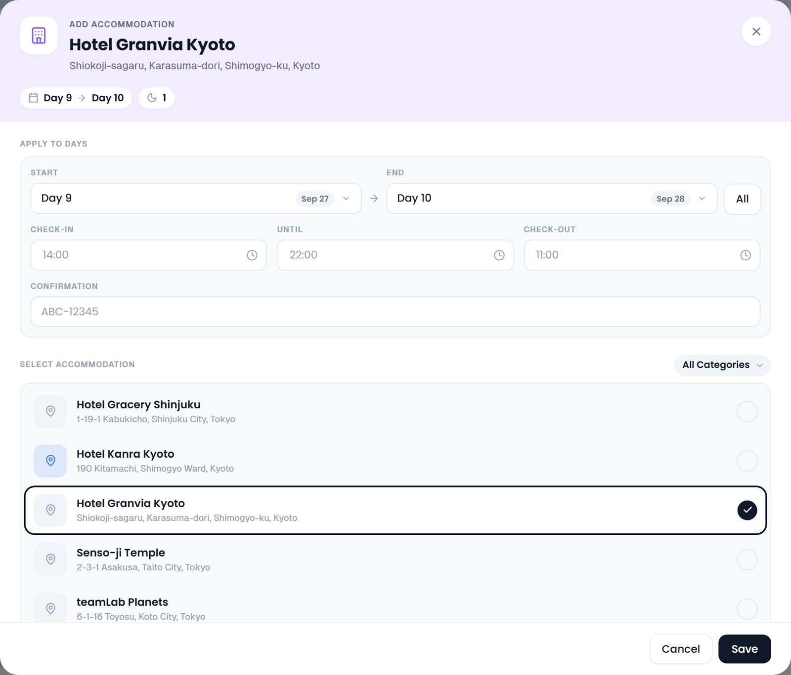
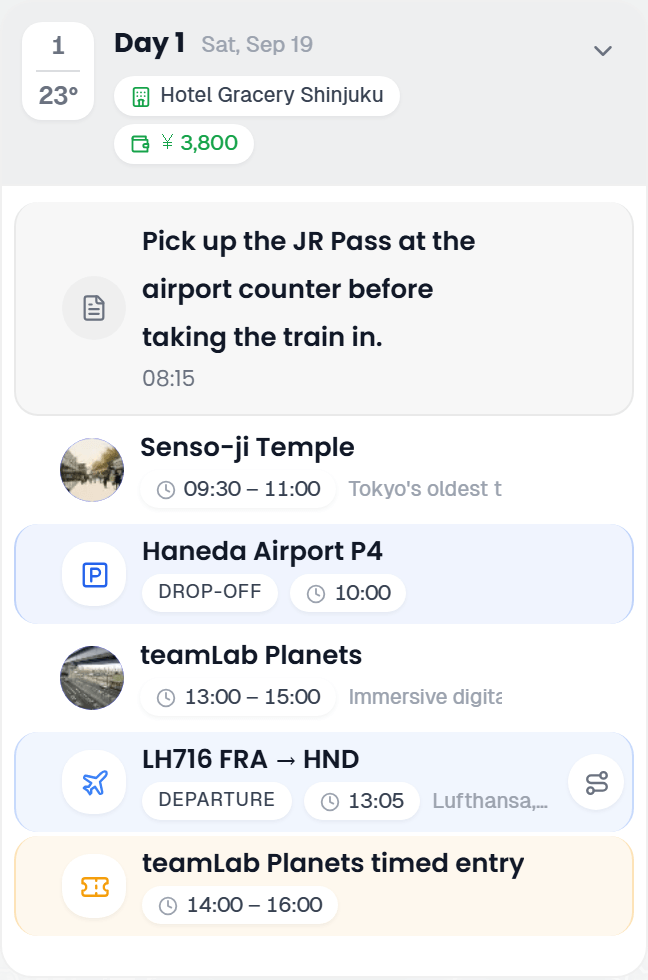

# Accommodations

A stay links a place of the trip to a check-in day and a check-out day, so it shows on every day you sleep there. Stays are a record type of their own, kept in the `day_accommodations` table, and every stay comes with a linked booking of the type **Accommodation**, which appears on the Bookings tab like any other booking.

## Creating an accommodation

There are three ways to create a stay:

- **From a day:** choose **Add accommodation** in a day's **+** menu, or click **Add accommodation** in the [day details panel](#in-the-day-detail-panel). Both open the stay editor, described below.
- **From the Bookings tab:** click **Manual Booking** and pick **Accommodation** in the type pill of the dialog's head band. The date and time fields make way for the stay's own fields, see [Accommodation fields in the booking editor](#accommodation-fields-in-the-booking-editor). Saving creates the booking and the stay at the same time.
- **From the road trip search:** **Add as an overnight stay** books the night and adds the stop in one go. See [Road-Trip](Road-Trip#booked-nights-on-the-drive).

### The stay editor

1. Open it with **Add accommodation** on a day. The stay starts as one night: check-in on that day, check-out on the next (on the last day of the trip, both on that day).
2. Under **Select accommodation**, click the place you will sleep at. The list holds the trip's places (imported tracks aside), and the category filter beside the heading narrows it. The picked place becomes the dialog's title, with its address under it. Until you pick one, the title reads *Select accommodation* and **Save** stays greyed out.
3. Under **Apply to days**, set **Start** (the check-in day) and **End** (the check-out day). **All** stretches the stay over the whole trip. The head band shows the range as a pill (for example *Day 2 → Day 5*) and the number of nights beside a moon.
4. Optionally fill in **Check-in** (the earliest time you can check in), **Until** (the latest time the front desk accepts check-in), **Check-out** and the **Confirmation** code.
5. Click **Save**. TREK creates the stay and its Accommodation booking together.

If the trip has no places yet, the list says *Add places to your trip first*: add the hotel as a place (see [Places and Search](Places-and-Search#adding-a-place)) and come back.

To change a stay later, click the pencil (**Edit accommodation**) on its card in the day details. The dialog opens as **Edit accommodation** with everything filled in. Changes to the times and the confirmation code are copied to the linked booking.

### Accommodation fields in the booking editor

With the type set to **Accommodation**, **New Reservation** and **Edit Reservation** show these fields in place of the date, time and location fields of other bookings:

| Field | Description |
|-------|-------------|
| **Accommodation** | The trip place you stay at. Picking one fills in the title if it is empty, and the address if the place has one. |
| **From** | The check-in day. |
| **To** | The check-out day. |
| **Check-in** | The earliest time you can check in. |
| **Check-in until** | The latest time the front desk accepts check-in. |
| **Check-out** | The latest time you must check out. |
| **Location / Address** | Filled from the place, and editable. |

The title typed into the head band, the status pill (**Pending** or **Confirmed**, click it to switch), **Booking Code**, **Travelers**, **Notes**, the link, the files and the **Costs** block work as they do for every booking. See [Reservations and Bookings](Reservations-and-Bookings).

## In the Day Detail panel

On every day from the check-in day to the check-out day, the **Accommodation** section of the [day details](Day-Plans-and-Notes#day-detail-panel) shows the stay as a card.

- **The head** of the card shows the place's photo or a hotel icon, its name and address. On the check-in day it is tinted green and says **CHECK-IN**, on the check-out day red with **CHECK-OUT**; a stay that starts and ends on the same day says both. The nights in between are untinted.
- **The fields** under it show only the time that matters on that day: **Check-in** (a single time, or the window from the earliest to the latest time) on the check-in day, **Check-out** on the check-out day, and neither on the nights in between. **Confirmation** shows on every day. The code is blurred when **Blur Booking Codes** is on in your [settings](Display-Settings); hovering or clicking it reveals it.
- **Reservation**: the linked booking with its title, its status (**Confirmed** or **Pending**) and code. Click it to open the booking's detail.
- For members who can edit days: the pencil (**Edit accommodation**) opens the stay editor, and the **X** (**Remove**) deletes the stay straight away, together with its booking and the expenses linked to that booking.

**Add accommodation** at the foot of the section adds another stay, for example a second hotel on a transfer day.

## In the day plan sidebar

Stays appear as pills in the head band of each day card in the days column, with a hotel icon:

- **Green icon**: the check-in day.
- **Red icon**: the check-out day.
- **Grey icon**: the nights in between.

Rest the pointer on a pill for *Check-in: Hotel Adler* or *Check-out: Hotel Adler*. Clicking the name opens the place in the [place inspector](Places-and-Search#the-place-inspector). A stay with a booking has a second button at the end of the pill, the ticket (*Open booking*), which opens that booking's detail. The place inspector of the hotel lists its stays under **Bookings** as well, so the booking is one click away from the map too. Stays never appear as rows in the day's timeline; the pill and the day details are where they show.

A stay whose booking is still **Pending** gets a dashed, tinted pill, and its tooltip ends in *(Pending)*. On the map, the hotel's marker is drawn with a dashed ring and a lighter face until the booking is **Confirmed**, see [Map Features](Map-Features#place-markers).

## In the Reservations panel

On the Bookings tab, an Accommodation booking shows up in all three views (**Cards**, **List** and **Timeline**) like any other booking. Its card shows the check-in and check-out times among its fields, and its address. Its detail shows the check-in day, the check-out day and the number of nights as tiles at the top, with the times beside the days, and names the linked stay under **Accommodation**. See [Reservations and Bookings](Reservations-and-Bookings).

## On the route

Booking a night also puts its place on the check-in day, as a stop of its own. That stop is what the map draws a line to and what the [Road Trip](Road-Trip) view builds its route from, so the hotel shows up on the drive without having to be entered a second time as an ordinary place. It works the same way whichever way you book the night: the day details panel, the booking form under Bookings, the phone, the Road Trip view, an MCP client or a plugin.

The two views show the same night differently, and both are the whole picture:

- **Days** keeps it in the day's head band, as the stay pill. The stop itself is hidden there, because the row would be that same hotel a second time.
- **Road Trip** draws it as a service stop in the driving chain, anchored on its check-in the way a pinned time anchors any other stop: the day is built to be there by then, and a drive that cannot make it is reported late.

A few details worth knowing:

- Only the check-in day gets a stop, however many nights the stay runs. That is the day you travel there; the later nights keep showing as pills in the head band.
- The Road Trip view can also start each day after a night at the hotel and end each day before one there, with **Start and end each day at your stay** in its driving settings. The switch is off by default, stores no extra stop and leaves **Days** as it is. See [Road Trip](Road-Trip#starting-and-ending-the-day-at-the-stay).
- The stop leads its check-in day. It is seated first, behind only a stop whose own time is at or before the check-in, and the stops that carry no hour follow it. A night without a check-in is seated first too, a new check-in seats the stop afresh, and two nights booked on one day settle by their check-ins. When those match, or neither night has one, the booking made first leads.
- That also means a night booked for the end of a driving day heads that day when its stops carry no time of their own. To put the hotel back at the end, drag it down the day in the Road Trip rail, where an edit to the booking that leaves the check-in alone will not move it back. A start time at or before the check-in does it as well, as long as it goes on the first stop after the hotel: the day re-sorts by time and the untimed stops behind that one follow it. On the last stop alone it is not enough, because the untimed stops in front of it keep counting as being at the check-in and stay behind the hotel.
- The place is marked as a **hotel** stop, which is why it carries no number in the Road Trip rail and does not count towards the day's stop total. If you had already given the place a stop type of your own, that one is kept.
- If the place was already planned for that day, nothing is added. You keep the stop you placed, and the booking simply rides along with it.
- Moving the booking to a different check-in day moves its stop with it. Deleting the booking removes the stop it created, and leaves a stop you placed yourself standing.
- Hotels count as service stops on the drive, so **Show in Days too** under **Service stops** in the Road Trip settings decides whether the hotel's stop shows in the day list. The hotel itself always stays in the places list, on the Days map and in the booking forms, whatever the switch says.

Nights booked before this existed are given their stop when the server upgrades, so trips you already have show their hotels on the drive without anyone re-saving anything. Trips planned before 4.3.1 are seated the same way on upgrade, see [Upgrading to 4.3.1](Updating#upgrading-to-431).

## When a check-in or check-out day goes

A stay is tied to its check-in and check-out day, so it cannot outlive either of them. What happens to its booking depends on how the day goes:

- **Deleting the day** in the **Reorder days** dialog cancels the stay cleanly, together with its Accommodation booking and the expenses of that booking. The question before the delete shows this line in red. See [Deleting a day](Day-Plans-and-Notes#deleting-a-day).
- **Shortening the trip** removes the whole stay, also its nights that are still part of the trip, but leaves its booking under Bookings and its expense under Costs. The trip dialog shows the stay in red before it saves. See [Shortening a trip](Day-Plans-and-Notes#shortening-a-trip).

A stay that only runs across a deleted day, with its check-in before and its check-out after it, is kept, one night shorter: its check-out day moves up with the days after the deleted one. The question before the delete names the stay and its new check-out date. Its booking is not changed, so a booking made with the hotel itself may need the same change there.

---

**See also:** [Reservations-and-Bookings](Reservations-and-Bookings) · [Day-Plans-and-Notes](Day-Plans-and-Notes) · [Transport-Flights-Trains-Cars](Transport-Flights-Trains-Cars) · [Road-Trip](Road-Trip)
