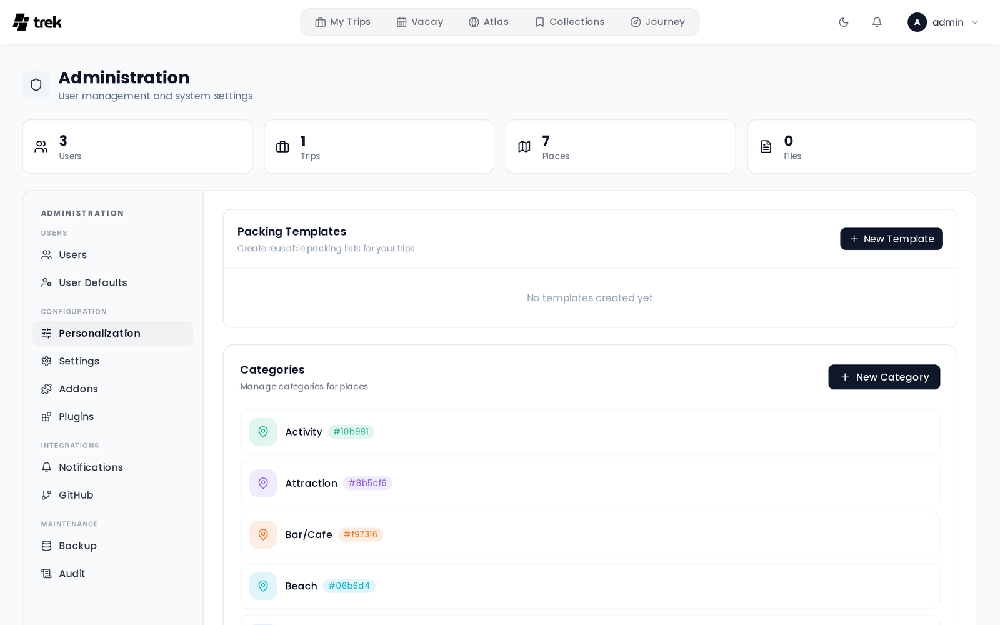

# Admin: Categories

The **Categories** card on **Admin > Personalization** lets you manage global place categories. Categories are shared across all trips and all users on the instance.

## What categories are

A category is a label consisting of a name, a color, and an icon. Users assign categories to places when creating or editing a place. Categories appear:

- In the place form's category selector
- As colored chips on place cards
- In the places filter panel
- As the color of a place's map marker, and in the marker's hover popup

## Creating a category

Click **New Category** (top right of the card). A dialog opens:

1. **Category name**: required. Type it into the dialog's head; **Enter** saves.
2. **Icon**: a grid of 47 curated Lucide icons (Pin, Hotel, Restaurant, Transport, Nature and so on). Click an icon to select it. The default icon is `MapPin`.
3. **Color**: 12 preset swatches plus **Choose custom color** (pipette button). The default color is `#6366f1` (indigo). The 12 presets are:

   `#6366f1` · `#8b5cf6` · `#ec4899` · `#ef4444` · `#f97316` · `#f59e0b` · `#10b981` · `#06b6d4` · `#3b82f6` · `#84cc16` · `#6b7280` · `#1f2937`

4. **Preview**: a chip shows how the category will look to users as you make selections.

Click **Create** to save.

## Editing a category

Click the pencil icon on any category row. The same dialog opens with the existing values filled in. Change any field and click **Update**.

## Deleting a category

Click the trash icon on a category row and confirm in the dialog (**Delete category? Places in this category will not be deleted.**). Deletion sets `category_id` to `NULL` on any places that had the category assigned: the places themselves are not affected, they become uncategorized.

## Category picked automatically

When a user adds a place from the search or from a map POI, TREK picks the matching category for them. It reads what the result says it is (Google types, the OpenStreetMap tag or the TREK Places category), such as hotel, restaurant, cafe or bar, museum, shop, station, beach, park or sports, and looks for a category of that kind. Because categories are named freely, a category is recognised by words in its name first (for example "Hotel", "Accommodation", "Restaurant", "Cafe", "Museum", "Shopping", "Transport", "Beach", "Nature", "Activity") and then by its icon. When nothing matches, the field stays empty. Naming categories plainly, or giving them the obvious icon, makes the guess work.

## List ordering

Categories are always displayed in alphabetical order by name. There is no manual reordering.

## Related pages

- [Places-and-Search](Places-and-Search)
- [Admin-Panel-Overview](Admin-Panel-Overview)
