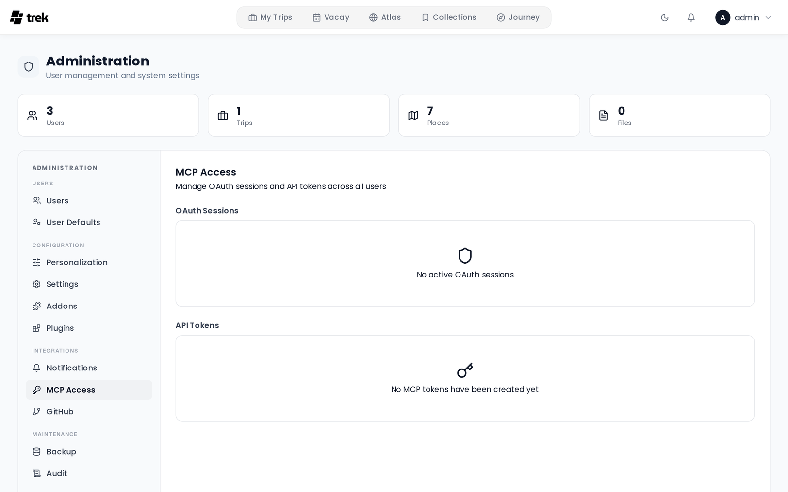

# Admin: MCP Tokens

The **MCP Access** tab (in the **Integrations** group of the admin side navigation) shows all active MCP OAuth sessions and API tokens across every user on the instance. As an admin you can revoke sessions and delete tokens.

This panel is only visible when the **MCP addon** is enabled in the [Admin-Addons](Admin-Addons) panel.

## OAuth Sessions

OAuth sessions are created when a user authorizes an MCP client via the OAuth 2.1 flow. These are the recommended way to connect MCP clients to TREK.

Each row of the **OAuth Sessions** card (the count sits beside its title) shows:

- **Client**: the name of the registered OAuth client, with the granted scopes as badges below it (up to 6 are shown; click **+N more** to expand, **show less** to collapse)
- **Owner**: the user who authorized the session
- **Created**: the date the session was established
- a trash button to revoke it

**Revoking a session:** Click the trash icon on the row and confirm in the **Revoke Session** dialog. The session is invalidated immediately and the revocation is recorded in the audit log. The user's MCP client will need to re-authorize before it can make further requests.

OAuth access tokens use the prefix `trekoa_`.

## API Tokens

API tokens are long-lived tokens that users create in their personal settings. They are identified by the `trek_` prefix.

Each row of the **API Tokens** card shows:

- the name the user gave the token, with its prefix below it
- **Owner**: the user who created it
- **Created**: the date the token was created
- **Last Used**: the date of the most recent API call with this token, or **Never**
- a trash button to delete it

**Deleting a token:** Click the trash icon and confirm in the **Delete Token** dialog. The token is invalidated immediately. The user must create a new token in their settings if they still need access.

## Related pages

- [MCP-Overview](MCP-Overview)
- [MCP-Setup](MCP-Setup)
- [Admin-Panel-Overview](Admin-Panel-Overview)
