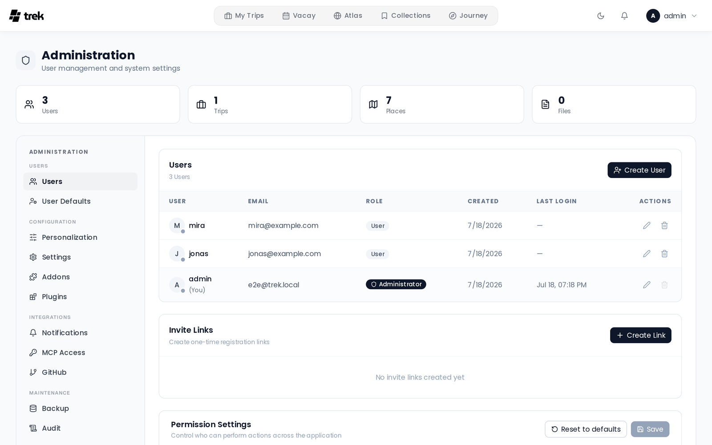

# Admin Panel Overview

The Admin Panel is the central control surface for TREK instance operators. It is only accessible to users with the `admin` role.

## Accessing the Admin Panel

Open the user menu in the top navigation bar (your avatar), then select **Admin**. If the entry is not there, your account does not have admin privileges.



## Layout

On desktop the page opens with a header (**Administration**, *User management and system settings*) whose right side shows four counters: **Users**, **Trips**, **Places** and **Files**. When a newer TREK release exists, an update banner sits below it. Under that, a side navigation on the left lists the tabs in four groups, and the selected tab fills the right side. Every tab is built from cards with toggle rows, and anything that needs confirming (deleting a user, restoring a backup, revoking a token) asks in TREK's own dialog rather than the browser's.

## Tabs

Most tabs are always visible; a few appear only under specific conditions.

| Group | Tab | Purpose | Conditional? |
|-------|-----|---------|--------------|
| Users | **Users** | Manage users and invite links; the permission settings sit at the bottom. See [Admin-Users-and-Invites](Admin-Users-and-Invites) and [Admin-Permissions](Admin-Permissions) | No |
| Users | **User Defaults** | Default settings applied to users who have not picked their own: colour mode, units, time format, currency, week start, blurred booking codes, map engine and the routing services. See [Admin-User-Defaults](Admin-User-Defaults) | No |
| Configuration | **Personalization** | Packing templates, place categories and the manually maintained school holiday catalog (see [Vacay](Vacay#manually-maintained-school-holidays)) | No |
| Configuration | **Settings** | Authentication methods (password and SSO login and registration), passkeys, required MFA, OIDC/SSO configuration, allowed file types, API keys and place providers (Google, Unsplash, Amap, public transit backend, place search provider, the **Daily limit for Google calls**), and **Rotate JWT Secret**. See [Admin-Settings](Admin-Settings) | No |
| Configuration | **Addons** | Enable or disable optional features instance-wide. See [Admin-Addons](Admin-Addons) | No |
| Configuration | **Plugins** | Install, update, and manage plugins; rescan the plugins folder; view each plugin's error log. See [Admin-Plugins](Admin-Plugins) | No |
| Configuration | **Storage** | Storage backends, category assignment, replication, health. See [Admin-Storage](Admin-Storage) | No |
| Integrations | **Notifications** | Email (SMTP), webhook, ntfy and Web Push channels; trip reminders; the admin's own webhook and ntfy; **Defaults for users** (see below). See [Admin-Notifications](Admin-Notifications) | No |
| Integrations | **MCP Access** | OAuth sessions and static API tokens. See [Admin-MCP-Tokens](Admin-MCP-Tokens) | Only when the MCP addon is enabled |
| Integrations | **GitHub** | Release timeline and support links. See [Admin-GitHub-Releases](Admin-GitHub-Releases) | No |
| Maintenance | **Backup** | Manual and scheduled full-instance backups: database, uploads, plugin data and plugin code. See [Backups](Backups) | No |
| Maintenance | **Audit** | Chronological activity log. See [Audit-Log](Audit-Log) | No |
| Maintenance | **Dev: Notifications** | Test notification dispatch | Only in development mode (`NODE_ENV=development`) |

### API keys set through the environment

A Google Maps, Unsplash or Amap key that comes from an environment variable shows in **Settings > API Keys** as a disabled field that reads **Set via** and the variable's name: the variable wins, so a key typed into the panel would have no effect. **Test** still checks the key from the environment. For the Google key the variable is `PLACES_API_KEY`. See [Environment-Variables](Environment-Variables).

### Daily limit for Google calls

In **Settings > API Keys**, the **Google Maps API Key** block has a collapsible section, **What the key may be used for**, whose last row is **Daily limit for Google calls**. Once the limit is reached, TREK stops calling Google until the next day (UTC) and searches with OpenStreetMap instead. Leave the field empty for no limit. A pill beside the name shows today's usage (**Today: 120** or **Today: 120 of 500**) and turns amber (**Limit reached (120), Google paused until tomorrow**) once the day is used up. **Save** appears only while the number has changed.

### Notification defaults

At the bottom of **Notifications**, **Defaults for users** is a matrix of every notification event against every channel. Each cell cycles through **On**, **Off** and **Blocked** when clicked and is saved right away; an event a channel cannot deliver shows a dash. **On** and **Off** are only where a user's settings start: each user may still change them. **Blocked** turns that event off on that channel for everyone, and it shows as locked in their settings. The defaults apply to every user who has not changed that cell themselves. See [Notifications](Notifications).


The **Week starts on** default decides which day opens each row of every date picker for users who have not picked their own (Monday unless set).

### Routing services

On desktop and mobile, **User Defaults** includes optional **Own routing engine** and **Own Valhalla instance** fields in the map section. Changes save when you leave the field; **reset** restores the built-in default.

With both fields empty, TREK uses public OSRM servers for routing and the public FOSSGIS Valhalla for avoiding toll roads, motorways and ferries. Configuring only a custom routing instance disables the public Valhalla fallback. After entering a custom server URL, restart TREK and reload the page. See [Road-Trip](Road-Trip#routing-engines).

> **AI / MCP:** These fields configure the routing services the planner and the road trip MCP tools use, and do not change stored trip data.

### Routing usage counters

Every route is calculated in the browser against the routing hosts, so the server never sees a routing request itself. To still know how much routing an instance does, the browser reports its tally in batches and the server keeps **daily counters**: how many requests, of what kind (route, segments, legs, alternatives), for which profile (driving, walking, cycling), how many waypoints, roughly how many kilometres, how many came back without a route, and whether a self-hosted engine answered. Counters only: no query, no coordinate, no route, no user and no trip is stored, and nothing leaves the instance. A day's row is kept for 400 days.

Counting is **on by default** and has no switch in the admin panel. To turn it off, set the `route_usage_enabled` key to `false` in the `app_settings` table; reports are then acknowledged but nothing is written. There is no admin screen for the totals either: an admin reads them at `GET /api/route-usage/summary` and wipes them with `DELETE /api/route-usage`.

### Linking to a tab directly

Every panel is reachable by URL, so a bookmark, an onboarding mail or a support reply can point at the one tab it is about instead of at the top of the page:

```
/admin?tab=audit
```

Unlike the trip planner's `tab` parameter, this one stays in the address bar and is rewritten as you switch tabs, so the URL always says which panel you are looking at. It replaces the current history entry instead of adding one, so the back button still leaves the admin page rather than walking back through the tabs you visited.

| Tab | Id |
|-----|-----|
| Users | `users` (the default, carries no `?tab=`) |
| Personalization | `config` |
| User Defaults | `defaults` |
| Addons | `addons` |
| Plugins | `plugins` |
| Storage | `storage` |
| Settings | `settings` |
| Notifications | `notifications` |
| Backup | `backup` |
| Audit | `audit` |
| MCP Access | `mcp-tokens` |
| GitHub | `github` |
| Dev: Notifications | `dev-notifications` |

An id with no panel behind it opens **Users**. The two conditional tabs behave differently: `mcp-tokens` and `dev-notifications` open their panel even when the MCP addon is off or the instance is not in development mode, with nothing highlighted in the sidebar, because the entry is missing from it.

## Plugin activity and audit

Plugins that are granted data-access capabilities have every host-mediated action they take recorded in a tamper-evident, hash-chained log. This log is separate from the instance **Audit** tab described above.

- **Admins** can review the per-plugin capability audit: every core-data read, broadcast, notification, and AI call a plugin made, with the acting user, the resource touched, and the outcome. It is served by `GET /api/admin/plugins/<id>/audit`; the admin plugin view itself currently surfaces only each plugin's error log (**View error log**).
- **Every user** (not just admins) can see the plugin actions taken in their own name under **Settings → Plugins**. This is what keeps a plugin's broad read grants accountable to the person whose data was read.

See [Audit-Log](Audit-Log) for details on the hash chain and how the two logs differ.

## Related pages

- [Admin-Users-and-Invites](Admin-Users-and-Invites)
- [Admin-User-Defaults](Admin-User-Defaults)
- [Admin-Settings](Admin-Settings)
- [Admin-Addons](Admin-Addons)
- [Admin-Categories](Admin-Categories)
- [Admin-Packing-Templates](Admin-Packing-Templates)
- [Admin-Permissions](Admin-Permissions)
- [Admin-Storage](Admin-Storage)
- [Admin-Notifications](Admin-Notifications)
- [Admin-MCP-Tokens](Admin-MCP-Tokens)
- [Admin-GitHub-Releases](Admin-GitHub-Releases)
- [Backups](Backups)
- [Audit-Log](Audit-Log)
