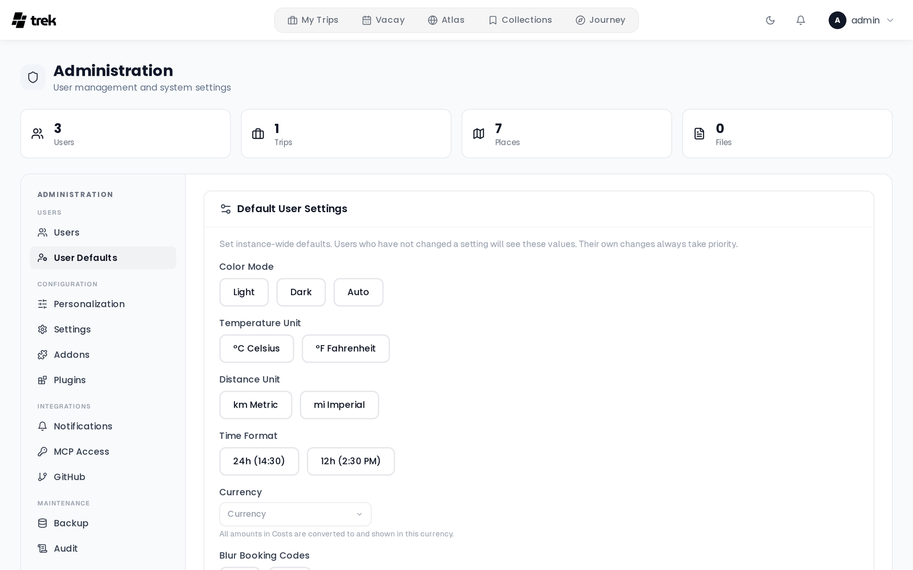

# Admin: User Defaults

The **User Defaults** tab (in the **Users** group of the admin side navigation, `/admin?tab=defaults`) sets instance-wide defaults for user settings. Users who have not changed a setting see these values; their own changes always take priority. The defaults are merged in every time a user's settings load, so a default you change later reaches everyone who never picked their own value.

On a wide screen the tab has two cards side by side: **Default User Settings** on the left, **Map** on the right. On a narrow screen the map card follows below.

## Saving and resetting

Every choice saves the moment you pick it, and a toast confirms **Default saved**. Text fields save when you leave the field.

Once a default is set, a small **reset** link appears next to its name. It removes the default, so users without their own value fall back to TREK's built-in one. While no default is set, none of the choices in a row is highlighted.

## Default User Settings

| Row | Choices | Built-in value when no default is set |
|-----|---------|------------------------------|
| **Color Mode** | **Light**, **Dark**, **Auto** | Light |
| **Temperature Unit** | **°C Celsius**, **°F Fahrenheit** | Celsius |
| **Distance Unit** | **km Metric**, **mi Imperial** | Metric |
| **Time Format** | **24h (14:30)**, **12h (2:30 PM)** | 24h |
| **Week starts on** | Monday, Sunday, Saturday (named in your language) | Monday |
| **Display currency** | A searchable list of currencies | None (Costs shows each trip's own currency) |
| **Blur Booking Codes** | **On**, **Off** | Off |

**Week starts on** decides which day opens each row of every date picker. Vacay keeps its own week start per plan.

**Display currency**: amounts in Costs are shown converted to this currency for display only; the original amounts are unchanged. A user without a display currency of their own gets this one. See [Display-Settings](Display-Settings) and [Currencies](Currencies).

**Blur Booking Codes** blurs confirmation codes and reference numbers until the user hovers or taps them. See [Display-Settings](Display-Settings#blur-booking-codes).

## Map

The map card configures the map users see and the routing services behind it, from top to bottom:

### Map Template

The tile source for the standard map. Pick a preset from **Select template...** or type any XYZ tile URL or MapLibre style URL into the field below it. The presets are **OpenStreetMap**, **OpenStreetMap DE**, **OpenFreeMap Positron**, **OpenFreeMap Bright**, **CartoDB Light**, **CartoDB Dark** and **Stadia Smooth**. Leave the field empty to keep TREK's built-in default. See [Map-Settings](Map-Settings) for what each preset looks like.

### Shared CARTO key

Used for every user who has not entered their own key, so the whole instance gets CARTO tiles without a watermark. The two CartoDB presets need it. Stored encrypted. See [Map-Settings](Map-Settings#carto-api-key).

### Own routing engine

The address of an OSRM instance of your own, for example `https://osrm.example.org`. Empty uses the public servers, which allow about one request a second: enough for a day plan, tight for a road trip.

### Own Valhalla instance

The address of a Valhalla instance of your own, for example `https://valhalla.example.org`. TREK uses the public FOSSGIS Valhalla by default to avoid toll roads, motorways and ferries. If only **Own routing engine** is set, the public Valhalla is not used.

Both routing fields save when you leave them (or press **Enter**), and only an admin can set them. After changing either one, **restart the server and reload the page**: the browser only talks to routing hosts the server names in its security policy, and that policy is built once at start. There is no environment variable for either engine. See [Road-Trip](Road-Trip#routing-engines) for what each combination does and what your own instances need.

### Preview

A small map centred on Paris shows the current **Map Template** (with the CARTO key applied), so you can check a tile source before users see it.

### Map engine

The default map for everyone on this instance; each user can still override it in their own settings.

- **Standard (free)**: the Leaflet map, using the **Map Template** above. This is the built-in default.
- **Mapbox (3D)**: Mapbox GL with 3D buildings and terrain. Needs a Mapbox token.
- **MapLibre (OpenFreeMap)**: MapLibre GL with OpenFreeMap vector tiles. No token needed.

Depending on the engine, more rows appear below it:

| Row | Shown for | Notes |
|-----|-----------|-------|
| **Shared Mapbox token** | Mapbox (3D) | Used for every user who has not entered their own token, so the whole instance gets Mapbox without sharing the key one by one. Stored encrypted. |
| **Map style** | Mapbox (3D), MapLibre (OpenFreeMap) | Pick a style from **Choose a style…** or type a style URL. Each engine keeps its own style, so switching engines does not overwrite the other one. |
| **3D buildings & terrain** | Mapbox (3D) | **On** or **Off**. On unless set otherwise. |
| **High-quality mode** | Mapbox (3D) | **On** or **Off**. Off unless set otherwise. |

See [Map-Settings](Map-Settings) for the styles and what the two Mapbox switches do.

## See also

- [Admin-Panel-Overview](Admin-Panel-Overview) - all admin tabs
- [Display-Settings](Display-Settings) - the same settings from the user's side
- [Appearance-Settings](Appearance-Settings) - colour mode and the rest of the look
- [Map-Settings](Map-Settings) - map engines, tile sources, styles and keys
- [Road-Trip](Road-Trip#routing-engines) - routing engines in detail
- [Currencies](Currencies) - display and trip currencies
