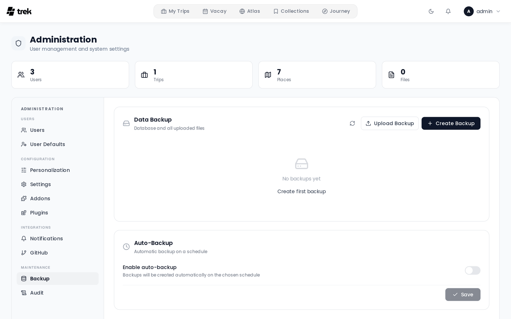

# Backups

TREK stores all data in a single SQLite database (`travel.db`) plus an `uploads/` directory of attachments, cover photos, and avatars. The Backup panel lets you create, download, restore, and schedule backups of both.

## Where to find it

**Admin Panel → Backup** tab.

## What a backup contains

A backup is a ZIP archive with these entries:

| Entry | Contents |
|---|---|
| `travel.db` | The full SQLite database |
| `uploads/` | All uploaded attachments, covers, and avatars |
| `plugins-data/` | Each installed plugin's own database + files (present only if plugins are installed) |
| `plugins-code/` | The installed plugin code, so a restore is self-contained (dev-linked plugins are skipped) |

**Not included:** the encryption key. Store your `ENCRYPTION_KEY` separately from the backup ZIP — for example, in a password manager. See [Encryption-Key-Rotation](Encryption-Key-Rotation).

## Manual backup

Click **Create Backup** in the Backup tab. The server creates the ZIP and makes it available for download. Up to 3 manual backups can be created per hour per IP address (rate-limit window: 1 hour).

You can also download or delete any existing backup from the list.

## Restoring a backup

You can restore from:

- **A stored backup** — click **Restore** next to any backup in the list.
- **An uploaded ZIP** — click **Upload & Restore** and select a backup file from your computer (maximum upload size: 500 MB by default, configurable with the `BACKUP_UPLOAD_LIMIT_MB` environment variable — see [Environment-Variables](Environment-Variables)).

Before restoring, TREK runs integrity checks on the uploaded database:

1. **SQLite `PRAGMA integrity_check`** — verifies the database file is not corrupt.
2. **Required tables present** — confirms the file contains `users`, `trips`, `trip_members`, `places`, and `days`. Files missing any of these are rejected as not being a valid TREK backup.

> **Warning:** Restoring replaces all current data. Back up your current state first if you want to keep it.

> **Plugins & restart:** `travel.db` and `uploads/` are swapped in immediately. Plugin data and code are **staged** and applied on the **next server restart** — the running plugins hold their databases open, so they can't be swapped live (the same reason the bundled encryption key only takes effect on restart). Restart the server after restoring an instance that uses plugins.

## Auto-backup

Enable scheduled backups in the **Auto-Backup** section of the Backup tab.

**Interval** options:

- Hourly
- Daily
- Weekly
- Monthly

**Retention** (`Keep last … days`) — enter a number of days. Backups older than that many days are pruned after each auto-backup run. Set to **0** to keep all backups indefinitely (no pruning).

**Schedule** options (depend on interval):

- **Hour** — time of day for daily, weekly, and monthly backups (0–23).
- **Day of week** — Sunday through Saturday (for weekly backups).
- **Day of month** — 1–28 (for monthly backups). Day 29–31 is excluded to avoid months with fewer days.

Auto-backup files are named `auto-backup-<timestamp>.zip` (manual backups use `backup-<timestamp>.zip`).

After each auto-backup run, **all** backup files (manual and auto) older than `keep_days` are pruned. Set `keep_days` to `0` to disable pruning entirely.

## External backup target (S3-compatible)

A backup that only ever lives on the same volume as the data it protects is one disk failure away from being useless.
The **External backup target** section of the Backup tab mirrors every backup — manual *and* automatic — to an
S3-compatible bucket.

Works with AWS S3, MinIO, Garage, Supabase Storage, Backblaze B2, Wasabi and anything else speaking the S3 API.

**The local archive is always kept.** The remote copy is pushed *in addition*, so a target that is unreachable at backup
time costs you the off-box copy, never the backup itself. Failures are logged, written to the audit log, and reported in
the UI rather than disappearing behind a success message.

### Setting it up

1. Enter the **endpoint URL**, **bucket**, **region** and optionally a **path prefix** (e.g. `trek/backups/`) to
   namespace within a shared bucket. Leave the endpoint empty for real AWS S3.
2. Enter the **access key ID** and **secret access key**. The secret is encrypted at rest with the same
   `ENCRYPTION_KEY`-derived key as every other stored credential and is never sent back to the browser — it shows as
   `••••••••` and saving the form unchanged keeps it.
3. Turn on **path-style addressing** for MinIO, Garage, Supabase Storage and most self-hosted gateways.
4. Press **Test connection**, then **Save target**.

**Endpoints with a path work as-is.** Plenty of S3 services do not serve the API at the host root — Supabase Storage
uses `https://<project-ref>.storage.supabase.co/storage/v1/s3`, and any Ceph RGW, SeaweedFS, Zenko or MinIO sitting
behind a reverse proxy or Kubernetes ingress is typically mounted under a path such as `https://nas.example.com/s3`.
Paste the endpoint exactly as your provider gives it to you; TREK passes it to the S3 client unchanged instead of
reducing it to a bare origin.

### The backup list spans both locations

The backup list merges what is on disk with what is at the target. Each entry is
badged with where it lives — **S3** when both copies exist, **S3 only** when the
local file is gone. An S3-only archive is fully usable: **Restore** fetches it
back and runs the same integrity, zip-slip and zip-bomb checks a local restore
does, and **Delete** removes it from the bucket. Download is local-only, since it
streams the file from disk.

If the bucket is unreachable the list falls back to local entries and says so,
rather than hiding backups you still have.

### Uploading the backups you already have

Enabling the target only affects backups made from then on. **Upload all existing
backups** pushes everything already in `data/backups` to the target. Archives
already present are skipped rather than re-transferred, so re-running it after an
interrupted upload is cheap and safe.

### Deleting removes both copies

Deleting a backup in the admin panel removes the local file **and** the mirrored
copy. If the target refuses the delete, the UI says so instead of reporting plain
success — otherwise a deleted backup would quietly remain restorable, and keep
costing storage.

### Test connection checks writes, not just reachability

The button runs `HeadBucket`, then writes and deletes a small probe object. A key with read-only permissions therefore
**fails** the test rather than passing it and then breaking every subsequent backup silently. If the probe uploads but
cannot be deleted, the test reports success with a warning: backups will work, remote pruning will not.

### Reaching a self-hosted bucket

The endpoint is checked against TREK's SSRF guard before any request.

- **Loopback is always blocked.** A MinIO or Garage container next to TREK must be addressed by its service name
  (`http://minio:9000`) or LAN address — never `http://localhost:9000`.
- **Private/LAN addresses need `ALLOW_INTERNAL_NETWORK=true`**, the same switch a self-hosted Ollama needs.
- **Plain `http://` requires turning off "Require HTTPS"**, which the UI warns about: backups contain your whole
  database and every upload.

### Configuring it through environment variables

Setting `BACKUP_S3_BUCKET` puts the target under environment control — the `BACKUP_S3_*` values take priority and the
admin form becomes read-only, matching how `SMTP_PASS` overrides the stored SMTP password. See
[Environment-Variables](Environment-Variables) for the full list. Leave them unset to manage the target from the UI.

## Before updating TREK

Always create a manual backup before updating. See [Updating](Updating).

## Audit log

The following actions are recorded in the [Audit-Log](Audit-Log):

| Action key | When |
|---|---|
| `backup.create` | Manual backup created |
| `backup.restore` | Restore from stored backup |
| `backup.upload_restore` | Restore from uploaded ZIP |
| `backup.delete` | Backup deleted |
| `backup.auto_settings` | Auto-backup settings saved |
| `backup.target_settings` | External backup target saved (never records the secret key) |
| `backup.target_test` | External backup target connection tested |
| `backup.target_backfill` | "Upload all existing backups" run |
| `backup.target_deleted` | A backup was removed from the external target |
| `backup.restore_remote` | Restore from an archive held only at the external target |
| `backup.target_uploaded` | Backup mirrored to the external target |
| `backup.target_failed` | Mirroring a backup to the external target failed |

## See also

- [Encryption-Key-Rotation](Encryption-Key-Rotation)
- [Admin-Panel-Overview](Admin-Panel-Overview)
- [Security-Hardening](Security-Hardening)
- [Updating](Updating)
