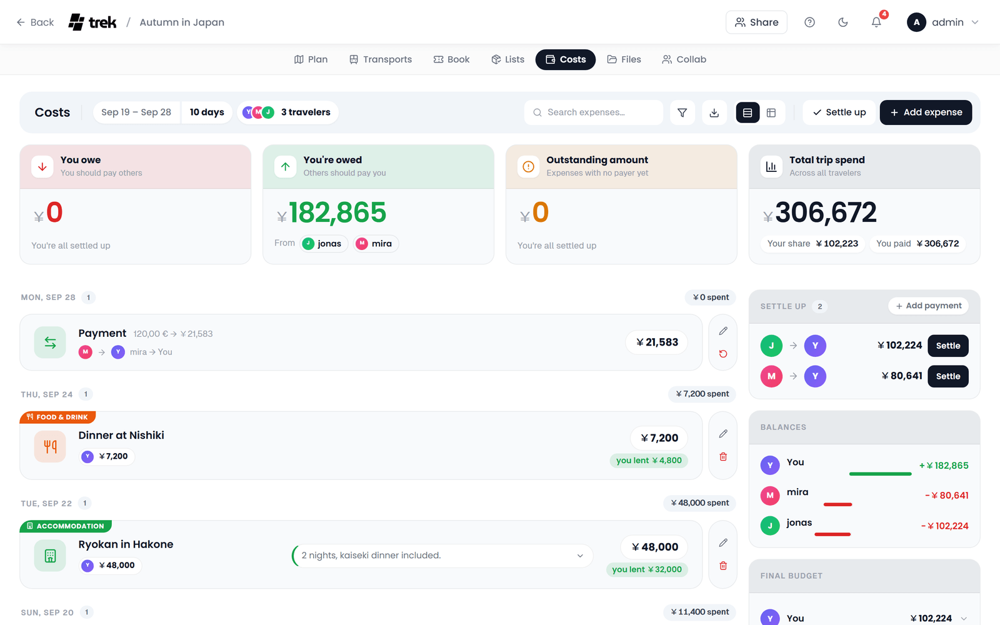
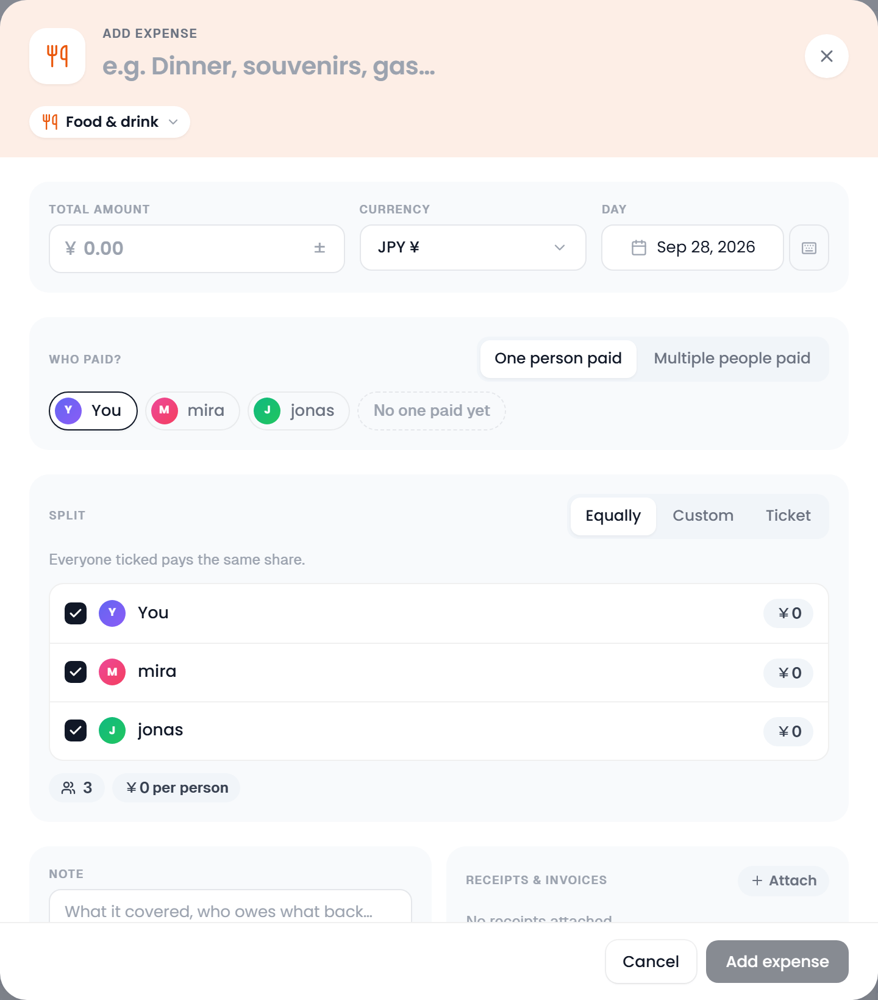
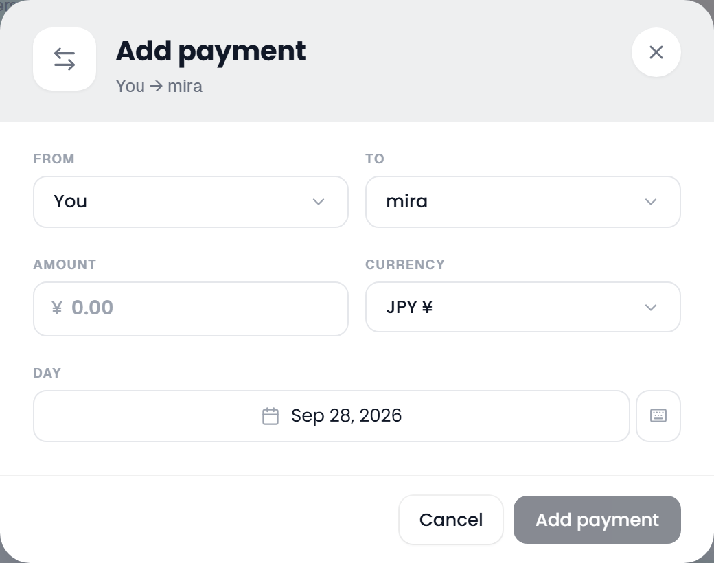
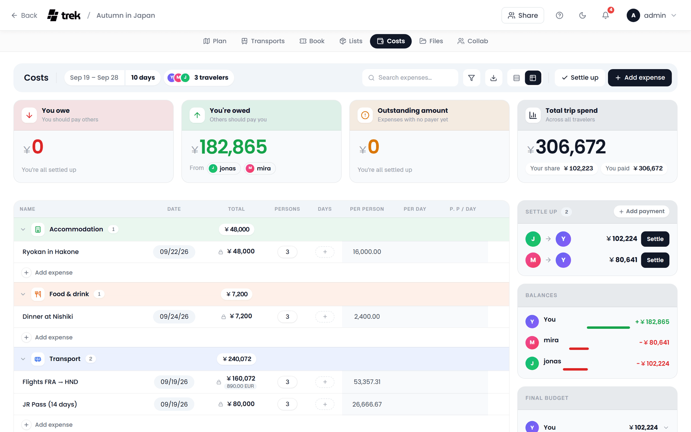

# Costs (Budget Tracking)

Record what the trip costs, who put the money down and who it is shared with, and let TREK work out who owes whom at the end.

> **Renamed to Costs (v3.3.0, #1464):** the feature is called **Costs** everywhere in the UI: the planner tab reads **Costs**, and so does its entry in Admin → Addons. Its internal addon id is still `budget`, which is why the permission is `budget_edit` and the MCP scopes are `budget:read` and `budget:write`.

## Where to find it

Open the **Costs** tab inside the trip planner. The tab is only there when the Costs addon is enabled.

> **Admin:** Costs is an addon. Enable it in [Admin-Addons](Admin-Addons).

The tab opens with the same bar as Transports, Bookings, Lists and Files. From left to right it holds:

- **Costs** and the trip's dates with the number of days, then the travelers the costs are shared between, as avatars with the count.
- **Search expenses…**, which narrows the ledger by name as you type. Esc clears it.
- The **Filter** button (funnel). Its popover holds the **All / Paid by me / I'm owed** switch, a **Category** list and a **Day** list with the days that have expenses. The button shows how many filters are on, and **Reset filters** at the foot of the popover switches them all off.
- **Export CSV** (download icon), see [Exporting](#exporting).
- **List** and **Table** (two icons), which switch the tab between the expense ledger and the [Table view](#table-view). The list is where Costs opens; the choice is remembered in this browser.
- For members who may edit costs: **Settle up**, **Scan receipt** (only with the AI Parsing addon, see [Scanning a receipt](#scanning-a-receipt)) and **Add expense**.

In a window narrower than 1024 px the tab stacks into one column: the total on a dark card with **Add expense** under it, then the summary cards, the settle-up list and the ledger with its own search and filters.

## Currency

Costs is **multi-currency** (#551). Three settings are involved, and they do different jobs:

- The **trip currency** (Trip → Edit trip) is the trip's accounting base. Every balance and settle-up is calculated in it.
- Each **expense** carries **its own currency**. Pick it in the expense dialog and enter what the receipt says (a $100 dinner on a rouble trip is `100 USD`). It is converted into the trip currency at a rate **frozen when you save it**, so a settled debt does not reopen when the market moves.
- Your **display currency** (Settings → General → Language & region → **Display currency**) converts what you *read* (totals, balances, the ledger) into one currency. It changes nothing that is stored. Left on **Trip currency** (the default), each trip is shown in its own currency.

165 currencies are supported, with rates from [Frankfurter](https://frankfurter.dev) (no API key needed). When an expense's currency differs from the one you read in, the dialog shows the original beside the converted amount (`$100.00 ≈ 7 668,71 ₽`, marked *live rate* until the expense is saved and its rate frozen), and the ledger row shows both (`$100.00 → 7 668,71 ₽`).

> **Read [Currencies](Currencies) for the full picture:** how the three interact, what happens when you change a trip's currency, and which currency a public share link is shown in.

## Categories

Every expense sits in one of **14 fixed categories**. You cannot add, rename, reorder or delete them; you pick one from the category pill in the head of the expense dialog. Each category has its own icon and colour, which is what the tab on the corner of an expense row and the bars under **By category** show:

**Accommodation**, **Food & drink**, **Groceries**, **Transport**, **Flights**, **Activities**, **Sightseeing**, **Shopping**, **Fees & tickets**, **Health**, **Tips**, **Fuel**, **Parking**, **Other**.

Expenses written before the Costs rework carried free-text categories. Those are matched onto the fixed keys where the stored label is recognisable (a booking saved as `Flight` reads as **Flights**, `gas` as **Fuel**) and fall back to **Other** otherwise. Nothing is rewritten in the database, only how the row is displayed.

## Expense items

On a wide screen the ledger fills the left three quarters of the tab. It is grouped by **day**, with the newest day first and undated expenses last under **No date**. Each day's header carries the date, how many entries it has and what was spent on it. Recorded settle-up payments sit in the same list, so the ledger reads as everything that happened to the trip's money in order.

An expense row shows:

- the **category** as a coloured tab on the card's corner and as a tile on the left,
- the **name**, with an amber **Unfinished** chip when nobody has paid it yet (see [Who paid](#who-paid)) and a **Receipts** chip when files are attached,
- the original and the converted amount under the name, when it was entered in another currency,
- the **payers** as chips with what each of them put in (the name is in the tooltip),
- a **Split** line under the payers with every member the expense is shared between, each as an avatar with their share and a tick once their share is marked paid. The tooltip names the person; past six members the rest fold into a **+N** chip whose tooltip lists them,
- the **note** as a pill; click it to read the whole note, click again to fold it,
- the **total**, and under it a green **you lent** or red **you borrowed** chip when the split leaves you up or down on it.

Beside the row, members who may edit costs find a pencil that opens the expense and a bin that deletes it straight away, without asking. A payment row has a pencil and **Undo** instead.

The filters work together: pick a day and a banner above the list names the day in full, with the number of expenses and their total. Payments carry no name or category, so a search or a category filter hides them; **I'm owed** hides them too, and **Paid by me** keeps only the transfers you are part of.

### Adding an expense

1. Click **Add expense**. The dialog opens dated today, in your display currency (the trip's own unless you picked another in Settings), paid by you and split equally between everyone.
2. Type what it was for into the head band, where it reads *e.g. Dinner, souvenirs, gas…*. The name is required. The pill beside it is the category, **Food & drink** until you pick another; the head band takes on its colour.
3. Enter the **Total amount**, and change **Currency** and **Day** if they differ. The **±** beside the amount turns the expense into a refund: a negative total gives money back instead of taking it, and the split runs the other way.
4. Set **Who paid?** and **Split** (both below).
5. Add a **Note** if you like, and attach receipts under **Receipts & Invoices** with **Attach**.
6. Click **Add expense**. When you edit an expense, the button reads **Save**.

| Field | Notes |
|---|---|
| What was it for? | The name, typed into the head band. Required. |
| Category | One of the 14 fixed categories, as a pill in the head band. |
| Total amount | What the receipt says. In **Ticket** mode it is summed from the items and cannot be typed. |
| Currency | The expense's own currency. |
| Day | The expense date the ledger groups it under. |
| Who paid? | Who actually put the money down. See [Who paid](#who-paid). |
| Split | How the total is shared out. See [Splitting costs](#splitting-costs). |
| Note | Free text, shown as a pill on the row. |
| Receipts & Invoices | Images and PDFs attached to the expense, several per expense. See [Receipts and invoices](#receipts-and-invoices). |

The dialog closes with Esc, a click beside it, the cross or **Cancel**, and keeps nothing you typed.

### Expenses linked to a booking or a place

An expense can hang off a **booking** (reservation or transport) or off a **place**. Their editors carry a **Costs** block with two controls: **Create expense** saves the record first and then opens the expense dialog for it, and, once the record is saved, **Link existing expense** is a searchable list of the expenses in Costs that belong nowhere yet. A record can carry several expenses, say the flight and the seat upgrade bought for it later. A linked expense is an ordinary expense: it takes a payer, a split, a date and a currency like any other, and it counts in the settlement.

Once something is linked, the block is headed **Linked expenses** and lists each one with its category and amount and three buttons: the pencil edits it, **Unlink, keep the expense** lets go of it and leaves it in Costs, and the bin (**Remove expense**) deletes only the expense. The record stands either way. Deleting the booking or the place deletes all of its linked expenses with it.

The booking's detail popup lists its linked expenses under **Costs** as well; click one to open it in the expense dialog. A booking's price follows its expenses: it shows their sum when they share one currency, otherwise the first one, and it is cleared once nothing is linked any more.

On the phone the booking, transport and place sheets carry the same block. Tap a linked expense to edit it, and **Link** opens the unlinked expenses right under the buttons, with a search once there are more than a handful.

> **AI / MCP:** `update_budget_item` takes `reservation_id` and `place_id`; `null` unlinks. An id from another trip is refused. See [MCP-Tools-and-Resources](MCP-Tools-and-Resources).

### Receipts and invoices

An expense can carry the receipt or invoice behind it. **Attach** in the **Receipts & Invoices** block of the expense dialog opens the file picker for images and PDFs, and several files can go on one expense. They are uploaded when the expense is saved, land in the trip's Files with a link to the expense, and are listed in the block from then on; click a name to view it. If the save fails after the upload, the uploaded files are taken back out again; any that could not be removed are reported, so you can delete them in the Files tab.

A row with receipts shows a **Receipts** chip beside the name, with the count when there is more than one. Click it to open the viewer: it shows one receipt at a time, pages through them with the **arrow keys**, and offers a download for a PDF.

The bin beside a receipt (**Remove receipt**) only unlinks the file from the expense. The file itself stays on the trip, because editing an expense (`budget_edit`) does not carry the file permission: to get rid of the file, delete it in the Files tab, which needs `file_delete`. Uploading a receipt goes through the trip's file upload, so it needs `file_upload` on top of `budget_edit`. A file that is also linked to a place or a booking keeps those links. See [Documents-and-Files](Documents-and-Files).

### Scanning a receipt

With the [AI Parsing](AI-Booking-Import) addon on and a model that reads images (see *Model reads images* there), **Scan receipt** sits beside **Add expense**, and on a phone the Costs header carries a scan icon. It is offered to whoever may add expenses.

1. Click **Scan receipt**. The **Scan a receipt** dialog takes one photo of the receipt (JPG, PNG or WEBP, up to 10 MB; a photo over 40 megapixels or a WEBP over 3.5 MB is refused): drop it on the box, or click the box to pick one or, on a phone, take one. Then click **Scan**.
2. The dialog closes and the model reads the photo in the background: the **background tasks** widget shows *Reading the receipt…*, and you can keep using TREK meanwhile. On a local model running on CPU this takes from a few seconds to a couple of minutes.
3. When it is done, **Review expense** opens the expense dialog filled in with what was read: the merchant as the name, the total, the currency and the day. The split stays **Equally**; switch it to **Ticket** and the receipt's lines are already listed, each shared by everyone. Discount and free lines are left out, since a Ticket line needs a price. If you may upload files (`file_upload`), the photo is already under **Receipts & Invoices**, uploaded when you save like any receipt you attach yourself. Without that permission the dialog opens filled in all the same, just without the photo.
4. Check everything, pick the category, who paid and the split, and save. Nothing is stored before that.

The scan reads one photo per expense and does not guess the category. A photo nothing could be read from ends on *No receipt could be read from this photo.*, with the reason under it. Scan jobs are kept for about 10 minutes after they finish, like [booking imports](AI-Booking-Import#good-to-know).

## Who paid

**Who paid?** in the expense dialog records who actually put the money down. It is the other half of the settlement: the split says who owes for the expense, this says who is out of pocket for it. The switch beside the heading picks one of two modes:

- **One person paid**: every member is a chip, and the one you click is the payer. A new expense starts with you picked.
- **Multiple people paid**: every member gets a box to tick, and each ticked one an amount field for what they put in. The amounts have to add up to the total; until they do, the dialog shows *Payer amounts must add up to …* and will not save.

**No one paid yet**, the dashed chip after the members, is for an expense you are only planning. The amount still counts toward **Total trip spend**, but it creates no debt: with nobody out of pocket for it there is nothing to pay back, so it stays out of **Balances** and out of the settle-up suggestions until you fill in who paid.

An expense with no payer is flagged **Unfinished** on its row and counted into the **Outstanding amount** card, which is where to look for spending that is recorded but not yet settled between anyone.

## Splitting costs

**Split** decides who owes for the expense. The switch beside the heading has three modes, and a line under it says what the current one does. Every member is listed with a box to tick; an unticked member owes nothing.

- **Equally**: everyone ticked pays the same share, shown beside each name, with the head count and *{amount} per person* under the list. Remainder cents from rounding are handed out deterministically and rotated by the expense, so over a trip nobody is always the one who pays the extra cent.
- **Custom**: type each person's share. Together they have to make the total: under the list, a green *Split matches total* or a red *Sum of splits: … (under by …)* / *(over by …)* says where you stand, and the dialog will not save until it matches. A small switch next to the hint (**Enter shares as**) picks between the currency symbol and **%**. In percent, each person gets a percentage instead, they have to add up to 100 % (a red *… % of 100 % assigned* says when they do not), and TREK turns them into amounts that add up to the total exactly.
- **Ticket**: list what was on the receipt. Each line has an **Item name**, a price and, under *Splitting:*, a chip per member to tick who had it. **Add item** adds a line, the bin removes one. The total is summed from the lines, **Individual shares** shows what each person comes to, cent-exact, and the lines are kept, so the list is still there the next time you open the expense.

## Settlement calculator

Costs works out the smallest number of transfers that settles every debt (a greedy matching) and shows the answer in the right-hand column, in four cards:

- **Settle up**: the transfers, who pays whom and how much. Their number sits in the card's head. Each transfer shows the two avatars with an arrow (the names are in the tooltip), the amount and a **Settle** button that records it as done. With nothing left it reads *Everyone's square*.
- **Balances**: each member's overall surplus (green, to the right) or deficit (red, to the left).
- **Final budget**: what the trip costs each member once every reimbursement is accounted for: *Expenses paid* minus *Net reimbursements* minus *Pending reimbursements*. Click a name to open that breakdown, with the expenses the member paid, the payments already recorded and the transfers still open on their side. The server works those rows out in the currency you are reading in, at the rate each expense was booked at, so every list adds up to the line above it even before live rates have loaded.
- **By category**: see [Costs summary](#costs-summary).

The final budget comes to each member's share of the paid expenses (exact in the trip's own currency; in another display currency, rounding can leave a single figure a cent off while the column still adds up), so recording a payment moves an amount from *pending* to *net reimbursements* without changing it. An expense nobody has paid yet stays out of it, as it stays out of the balances.

**Settle up** in the bar at the top of the tab records every open transfer at once, without asking. **Add payment** in the head of the Settle up card records a single transfer by hand, for a repayment that did not follow a suggested one. Recorded payments then appear in the ledger as their own rows, with the pencil and **Undo** beside them.

The **Add payment** dialog has **From** and **To** (the head band reads *You → Anna* as you pick), **Amount**, **Currency**, **Day** and **Note**. The note is free text, such as *Paid in cash, by bank transfer…*; in the ledger it sits on the payment's row as a pill that opens on a click, like an expense's note. A payment carries **its own currency**: settling a rouble debt with a euro transfer is normal, and its rate is frozen when you record it. A payment made in another currency shows both amounts in the ledger (`$30.00 → 27,00 €`). The day is the day it happened, so a transfer you only get round to recording three days later still lands on the right day; payments recorded before this field existed stay on the day they were recorded.

Balances are always netted in the **trip currency** and converted to your display currency once, at the end, so they stay stable even when the trip mixes currencies. An expense or payment in a foreign currency for which no exchange rate is known yet is left out of the balances and totals rather than counted 1:1; see [Currencies](Currencies#expense-currency).

## Costs summary

Four cards sit above the ledger:

- **You owe**: what you still have to transfer, with the members you owe it to.
- **You're owed**: the same in the other direction.
- **Outstanding amount**: the total of the expenses that have no payer yet, and how many of them there are.
- **Total trip spend**: the grand total across all travelers, with **Your share** and **You paid** under it.

The right-hand column ends with **By category**: spending per category as a ranked list of bars in the category colours. Only categories with spend on them appear, sorted by amount, and the bars are scaled against the biggest category rather than the trip total, so the ranking stays readable.

### Costs in the day plan

With Costs on, the cost pills on the days of the plan and **Total Cost** at its foot (and the same figures in the trip PDF) add up the expenses from Costs, each one once: on the day its booking starts, otherwise the first day its place is planned, otherwise its own date; one without any day still counts in the total. A foreign expense counts at its frozen rate and a refund nets against its day, so **Total Cost** matches **Total trip spend**, and deleting an expense lowers both. With Costs off, a place's own price counts instead, once per place.

## Table view

The table is a second way to read and plan the same expenses, close to the categorized budget sheet TREK had before Costs was rebuilt. Switch to it with the **Table** icon in the bar; **List** brings the ledger back. Search and filters apply to the table as well.

- Expenses are grouped by **category**, in the order of the category pill, each group with how many entries it has and its subtotal. Click a category's header to fold it.
- The columns are **Name**, **Date**, **Total**, **Persons** and **Days**, followed by the worked-out **Per Person**, **Per Day** and **P. p / Day** on their own grey ground. An expense with a custom (uneven) split leaves the per-person columns empty, since it has no single share per person.
- Members who may edit costs change a **name**, a **total**, **persons** or **days** right in the cell: click it, type, then press **Enter** or click elsewhere to keep it, or **Esc** to leave it as it was. The **date** opens the calendar. **Add expense** under a category adds an empty row there, dated like the latest entry of that category, with its name ready to type.
- A total with a **lock** cannot be changed in the table: someone is set as its payer, or it was entered in another currency. Clicking it opens the expense instead, so the balances and the frozen rate stay right. Payers, the split, the note and receipts are always edited in the expense dialog; open it from a row's **More options** menu, which also deletes the row.
- In the right-hand column, **By category** gives way to a **Summary** with four views: **Category**, **Day**, **Payer** (expenses nobody has paid yet under **No payer yet**) and **Status** (**Paid** against **Open**).

## Exporting

**Export CSV** (the download icon in the bar) saves every expense as a spreadsheet (restored in v3.3.0, #1500). The file is semicolon-delimited with a UTF-8 byte-order mark (so Excel opens it cleanly), sorted by date, and named `costs-<trip>.csv`. The columns are **Date, Name, Category, Amount, Currency, Amount (<display currency>), Note**: each expense shows its original amount in its own currency and the converted amount in your display currency. When you read the trip in another currency than its own, an **Amount (<trip currency>)** column sits before the display one, since that is the figure every sum is built from. A cell that would start with `=`, `+`, `-` or `@` gets a leading apostrophe, so a spreadsheet never runs it as a formula. The button is greyed out while there are no expenses.

## Permissions

Every write (adding, editing and deleting expenses and payments, and an expense's currency) needs the `budget_edit` permission. Without it the tab is read-only: the bar keeps search, filter and export, and the edit buttons are gone. The **trip** currency lives on the trip itself, so changing it needs `trip_edit` instead.

## See also

- [Currencies](Currencies)
- [Reservations-and-Bookings](Reservations-and-Bookings)
- [AI-Booking-Import](AI-Booking-Import)
- [Admin-Addons](Admin-Addons)
- [Trip-Planner-Overview](Trip-Planner-Overview)
