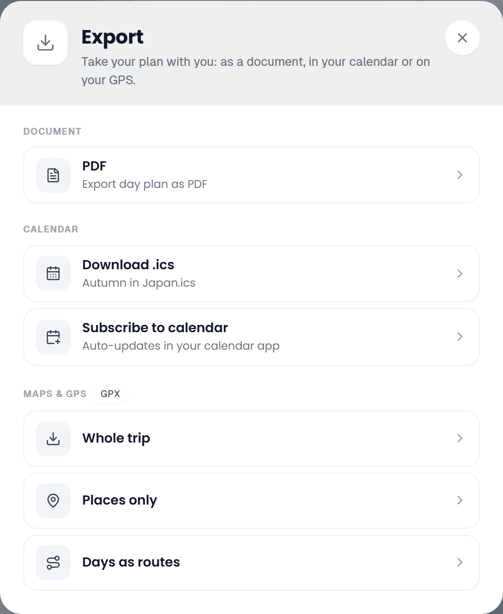
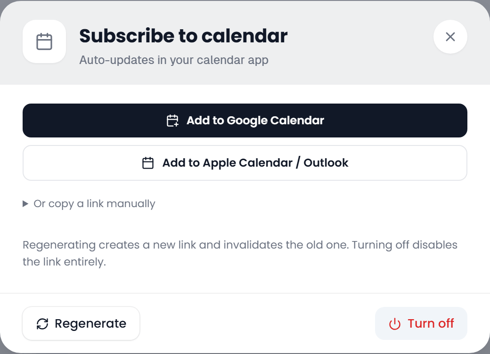

# Calendar Feeds

Subscribe your calendar app to a trip, and it keeps up with every change you make in TREK instead of holding a copy from the day you imported it.

> **Not the same as the ICS download.** **Download .ics** in the Export dialog saves a one-off `.ics` file that never changes after you import it. A calendar *feed* is a live address your calendar app fetches again on its own. Use the download for a frozen copy and a feed for something that follows your edits.

## Where to find it

There are two feeds, each with its own way in:

- **Per-trip feed**: in the trip planner, click **Export** at the top of the days column. Under **Calendar**, pick **Subscribe to calendar** (*Auto-updates in your calendar app*). The row above it, **Download .ics**, is the one-off file. The subscribe row only appears if you may manage the trip's share links, see [Permissions](#permissions).
- **All-trips feed**: on the **My Trips** dashboard, click the calendar-plus button in the toolbar, **Subscribe to all trips**.

Both open the same dialog.

## Per-trip vs. all-trips

|                     | Per-trip feed                     | All-trips feed                                              |
|---------------------|-----------------------------------|-------------------------------------------------------------|
| Covers              | One trip                          | Every trip you own **or** are a member of                    |
| Calendar name       | The trip title                    | Your username followed by *All Trips*                        |
| Leaves out          | Nothing                           | Archived trips, and trips that ended more than 90 days ago   |
| URL                 | `/api/feed/trip/{token}.ics`      | `/api/feed/user/{token}.ics`                                 |
| Token belongs to    | The trip                          | Your user account                                            |

The all-trips feed merges every trip that qualifies into one calendar, sorted by start date, and keeps each time zone definition only once, so every event still lands at the right local time.

## Turning a feed on

1. Open **Subscribe to calendar** (or **Subscribe to all trips**). Opening the dialog only reads the current state; it never creates a link on its own.
2. Click **Enable calendar subscription** at the foot of the dialog. TREK creates a random token, and the dialog shows the ways to subscribe.
3. Hand the feed to your calendar app with one of the buttons:
   - **Add to Google Calendar** opens Google's add-by-URL page with the feed filled in.
   - **Add to Apple Calendar / Outlook** is a `webcal://` link that your system passes to its default calendar app.
   - **Or copy a link manually** unfolds both addresses with a copy button each: the `https://` one for a *From URL* field, and the `webcal://` one.

The address is built from `APP_URL` when it is set; otherwise TREK uses the host you are browsing from. Behind a reverse proxy, set `APP_URL` so the link is one your calendar app can reach. See [Environment-Variables](Environment-Variables) and [Reverse-Proxy](Reverse-Proxy).

## The token, and who can read the feed

The random token in the address **is** the key. The feed needs no login: anyone who has the link can read the whole trip, every event, note, address and booking detail, without an account. The dialog says so before you enable it: *Creates a secret link anyone with it can read without logging in. You can turn it off anytime.*

Treat the address like a password. Do not post it in a shared document or a public issue.

## Rotating and revoking

Once a feed is on, the foot of the dialog holds two buttons:

- **Regenerate** issues a new token. The old address stops working at once, so every calendar still subscribed to it goes quiet and has to be added again.
- **Turn off** removes the token. The address answers with *not found*, and there is no feed until you enable one again.

Use **Regenerate** when a link has leaked, and **Turn off** when you no longer want a feed at all.

## What appears in the feed

The feed carries the same events as the `.ics` download:

- **The trip itself**: an all-day event from the trip's start to its end date, with the trip description.
- **Timed stops**: one event per place in the day plan that has a time, titled with the place name, with its address as the location and its notes as the description. Times follow the place's own time zone.
- **A summary per day**: an all-day event for every day with untimed places or notes, titled with the day's title (or *Day N*), listing those places and notes.
- **Bookings** of every type, transport included. Flights and other rides take their start and end from the departure and arrival points, each in its own time zone. A booking with no date that can be placed is left out.
- **Connections**: a flight, train or cruise with several legs becomes one event per leg, titled *{title}: FRA → BER*, with each leg's own departure, arrival and segment reference, each in the time zone of its own stops, so the layover (or the stay in a port of call) shows as the gap between them. This needs a departure date and time on every leg; otherwise the booking stays one event.
- **Accommodations**: an all-day event covering every night of the stay, from the arrival day to the departure day, so the hotel sits above those days rather than showing up once on the day you check in. The dates come from the trip days the stay is attached to, so reordering days moves the event with them.
- **Check-in and check-out**: separate timed events on the arrival and departure days whenever the stay has those times. If you entered a check-in window, its end becomes the event's end time.
- **Car pickup and drop-off**: a booking of type *Car* also gets two timed events of its own, *Pickup: {title}* and *Drop-off: {title}*, next to the rental's own event, both with the booking's location. Each side prefers its own endpoint (the pickup point for the pickup, the return point for the drop-off) and takes that endpoint's local time and time zone. Otherwise it falls back to the booking's own times and to the time zone of the linked place. A side with no usable date and time from either source is left out, so a rental imported with only one located endpoint can end up with a single event.

Feeds are sent with headers that tell clients not to cache them, plus a hint to refresh every hour (`REFRESH-INTERVAL` and `X-PUBLISHED-TTL`). Most calendar apps treat that as a suggestion. Google in particular refreshes on its own schedule, often far less often, so an edit can take a while to show up there.

## Permissions

Managing a trip's feed needs the **`share_manage`** permission, the same right that covers invite and share links. By default only the trip owner has it; an instance can open it up to trip members in [Admin-Permissions](Admin-Permissions). A member without it never sees **Subscribe to calendar** in the Export dialog and gets *No permission* from the token endpoint, while someone with no access to the trip at all gets *Trip not found*.

**Download .ics** stays open to every member: it is a file of things they can already read, while a feed creates a link that works without an account.

The all-trips feed needs no permission, since it only ever covers your own account.

Because the token grants read access without a login, enabling a feed shares that trip with whoever holds the link, whatever their role in the trip. [Public-Share-Links](Public-Share-Links) describes the same trade-off for share links.

## See also

- [PDF-Export](PDF-Export), for the other exports in the same dialog
- [Day-Plans-and-Notes](Day-Plans-and-Notes#toolbar-actions)
- [Reservations-and-Bookings](Reservations-and-Bookings)
- [Public-Share-Links](Public-Share-Links)
- [My-Trips-Dashboard](My-Trips-Dashboard)
- [Environment-Variables](Environment-Variables)
