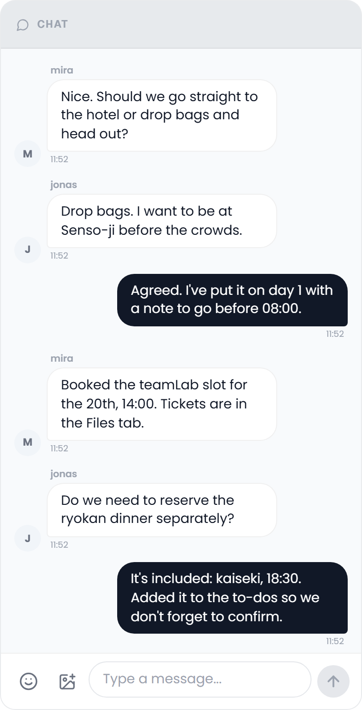

# Collab Chat

Talk with everyone on the trip in real time, without leaving the planner.

## Where to find it

Open the trip planner and select the **Collab** tab. With the Chat sub-feature on, the chat is the column on the left of the tab, a card headed **Chat** like the Notes, Links, Polls and What's Next cards beside it. When Chat is the only sub-feature that is on, it takes the whole width. In a window narrower than 1024 px the Collab tab turns into a tab bar with one panel at a time, and Chat is the first tab.

The Collab addon must be enabled by an admin and the Chat sub-feature must be turned on. See [Real-Time-Collaboration](Real-Time-Collaboration).

## Sending messages

Type into the field at the bottom (*Type a message...*) and press **Enter**, or click the round send button, to post. **Shift + Enter** starts a new line without sending. The field grows with the text up to a few lines and scrolls after that.

The chat opens on the latest messages and loads them in pages of 100. When older messages exist, **Load older messages** appears at the top. Messages are grouped under date separators (**Today**, **Yesterday**, or the date).

### Images

A message can carry up to **four images**. Click the image button in the composer, paste them from the clipboard, or drop them onto the composer. JPEG, PNG, GIF and WebP are accepted, up to **10 MB** each; TREK checks the file type and the extension, and anything else is refused with *Only JPEG, PNG, GIF and WebP images up to 10 MB are allowed*. Each picked image shows as a thumbnail above the field with an **×** to drop it again, and a message can consist of images alone, with no text. While they upload, the composer shows the progress. Sending an image needs the `file_upload` permission on top of `collab_edit`.

## Emoji

The smiley button in the composer opens the emoji picker. It has three groups:

- **Smileys**: faces and gestures
- **Reactions**: hearts, fire, thumbs, stars and similar
- **Travel**: planes, maps, suitcases, food, cameras and places

Emoji are drawn with Twemoji, so they look the same on every platform.

## Reactions

**Right-click** a message on a desktop, or **double-tap** it on a touch screen, to open the quick reactions: ❤️ 😂 👍 😮 😢 🔥 👏 🎉. Click one to add it, and click it again to take it back. Reactions from everyone gather as badges under the message; hover a badge to see who reacted, and click it to add or remove your own.

## Replies

Hover a message to bring up its buttons. **Reply** (the arrow) quotes that message: a preview with a bar in the accent colour appears above the field, with an **×** to cancel. Once sent, the quoted text sits inside your bubble above your answer.

## URL link previews

When a message contains a web address, TREK fetches an Open Graph preview (site, title, description and image) and shows it under the text. Only the first address in a message gets a preview.

The fetch runs on the server, so it is kept on a short leash: only trip members can ask for one, the target must be a public HTTP(S) address (addresses on your own network are refused), a preview is remembered for ten minutes, and a member can trigger sixty new fetches a minute. A preview that is refused or runs over that budget is simply not shown; the message itself is unaffected.

## Message styling

Your own messages sit on the **right**, in your **accent colour** (see [Appearance-Settings](Appearance-Settings)). Everyone else's sit on the **left** as white cards, dark in dark mode. The name is shown above the first message of a run from the same person, the avatar beside the **last** one, and the time under it.

A message of just one to three emoji is shown larger, without a bubble.

## Deleting messages

Hover one of your own messages and click the bin beside **Reply** to delete it. The bin is only there with the `collab_edit` permission. A deleted message is replaced, for everyone, by a line in italics with your name, *deleted a message*, and the time.

## Read-only viewers

Members without the `collab_edit` permission can read every message, but the field is greyed out and the send, image and emoji buttons are gone, so they cannot post, react or delete. The **Reply** button still appears on hover, but a reply cannot be sent without `collab_edit`.

## Related pages

[Real-Time-Collaboration](Real-Time-Collaboration) · [Collab-Notes](Collab-Notes) · [Collab-Polls](Collab-Polls) · [Whats-Next-Widget](Whats-Next-Widget)
