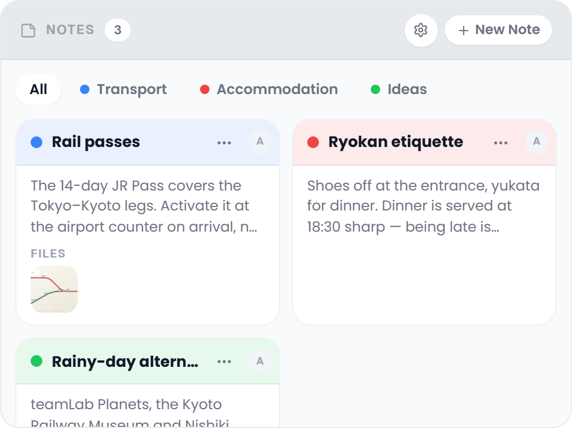

# Collab Notes

Shared notes for the whole group: the restaurant tips, the door code, the plan B for a rainy day. Notes are sorted into colour-coded categories, written in Markdown, and can carry a link and files.

## Where to find it

Open the trip planner, select the **Collab** tab and look for the card headed **Notes**. The Collab addon must be enabled and the Notes sub-feature must be turned on. See [Real-Time-Collaboration](Real-Time-Collaboration).

The card's head band carries the number of notes and, for members with the `collab_edit` permission, the gear for **Manage Categories** and **New Note**. Under it sit the category filter and the notes, two to a row.

## Reading a note card

Each note is a compact card. Its head band is tinted in the category colour and holds, from left to right:

- a **dot** in the category colour (the category's name is in its tooltip),
- the **title**,
- a **pin** when the note is pinned,
- a round **link** button when the note has a website; it opens the page in a new tab, and its tooltip shows the site's address,
- **More options** (**⋯**), the note's menu,
- the avatar of whoever wrote it.

Under the head band the card shows the first three lines of the text and, under **Files**, up to three attachments as thumbnails, with **+N** for the rest. A pinned note keeps a frame in its category colour.

The **⋯** menu holds **Expand** (when the note has text), and for members with `collab_edit` also **Pin** or **Unpin**, **Edit** and **Delete**.

## Categories

Every note can belong to a category, which gives it its colour. The colours are six swatches: **Indigo**, **Red**, **Amber**, **Emerald**, **Blue** and **Violet**. A new category takes the next colour in that row.

To manage them, click the gear (**Manage Categories**) in the Notes head band. The dialog lists every category with its colour dot, its name, the six swatches and a bin:

- **Add** a category: type the name into *New category...* at the bottom and press Enter or click **+**.
- **Rename** one: click its name, type the new one and press Enter (Esc drops the change).
- **Recolour** one: click a swatch.
- **Remove** one with the bin. A category that notes still use stays in the list until those notes are moved to another one.

Nothing is applied until you click **Save**; **Cancel** throws the changes away. Saving a new colour or name updates every note in that category, for everyone.

A category without any notes yet is remembered only in the browser it was created in. It reaches the other members once the first note is filed under it.

## Creating a note

1. Click **New Note** in the Notes head band. The dialog opens with the cursor in the head band.
2. Type the title where it reads *Note title*. It is the only required field; Enter in the title saves the note straight away.
3. Write the text under **Content**, in Markdown (see below).
4. Pick a **Category** from the pills. The head band takes on its colour. The pills only appear once the trip has a category; a new note starts in the first one.
5. Add a **Website** if the note is about a page (`https://...`).
6. Under **Attach files**, click **Attach** to pick files, or paste an image or PDF anywhere into the dialog. Each file shows as a chip with an **×** to drop it again.
7. Click **Create**.

The dialog closes only with its cross or **Cancel**: a stray click beside it or Esc does not throw away what you wrote.

| Field | Required | Notes |
|-------|----------|-------|
| Title | Yes | Plain text, typed into the head band. |
| Content | No | Markdown. |
| Category | No | One of the trip's categories. |
| Website | No | An address shown as the link button on the card. |
| Attach files | No | Files up to the upload limit (50 MB by default), see [Attachments](#attachments). Needs `file_upload`. |

## Markdown support

The text of a note is rendered as GitHub Flavored Markdown with soft line breaks: headings, bold and italic, links, ordered and unordered lists, task lists, tables, code blocks and quotes. Links open in a new tab.

## Expanding a note

**Expand** in a note's **⋯** menu opens the whole note in a dialog: the title and the category in the head band, then the full **Content**, the **Website** as a chip with the site's address, and the **Files** as thumbnails. Members with `collab_edit` find **Edit** at the foot of the dialog, which switches straight to the editor.

## Pinning

**Pin** in a note's **⋯** menu moves it to the top of the list, above all unpinned notes whatever their category, and marks it with a pin and a coloured frame. **Unpin** puts it back among the others. Unpinned notes are sorted with the most recently changed first.

## Attachments

A note can carry images, PDFs and other files (with the `file_upload` permission), up to **50 MB** each. An admin can change that limit with the `FILE_UPLOAD_LIMIT_MB` environment variable, which also sets it for the Files tab (see [Environment-Variables](Environment-Variables)).

These file types are refused:

- Markup a browser would render: `.svg`, `.svgz`, `.html`, `.htm`, `.shtml`, `.shtm`, `.xml`, `.xhtml`, `.xht`
- Scripts: `.js`, `.jsx`, `.ts`, `.tsx`, `.mjs`, `.cjs`, `.php`, `.py`, `.rb`, `.pl`
- Executables: `.exe`, `.bat`, `.sh`, `.cmd`, `.msi`, `.dll`, `.com`, `.vbs`, `.ps1`, `.app`

An attachment is also refused when its MIME type contains `svg`, `html` or `javascript`, whatever its extension says. The same blocklist guards the trip's Files tab (see [Documents-and-Files](Documents-and-Files)), where uploads must also match the admin's **Allowed File Types** setting (video files are exempt from that list); note attachments are not held to that list at all.

Click an image thumbnail to open it full size. A PDF or a text file opens in a viewer, any other file offers a download, and both have **Open in new tab**. Every attachment also shows up in the Files tab, marked **From Collab Notes** and listed under its **Collab Notes** filter.

## Editing a note

**Edit** in the **⋯** menu opens the same dialog with everything filled in. Existing attachments are chips with a red **×**, which deletes the file at once, before you save, and without passing through the trash. New ones are added with **Attach** as before. **Save** keeps the changes.

## Deleting a note

**Delete** in the **⋯** menu asks *Delete note?* first. Confirm and the note is gone for everyone, together with its attachments, which do not go to the trash.

## Filtering

The pills under the Notes head band filter by category: **All**, then one pill per category with its colour dot. Click a category to show only its notes, and click it again, or **All**, to show everything.

## Related pages

[Real-Time-Collaboration](Real-Time-Collaboration) · [Collab-Chat](Collab-Chat) · [Collab-Polls](Collab-Polls) · [Whats-Next-Widget](Whats-Next-Widget)
