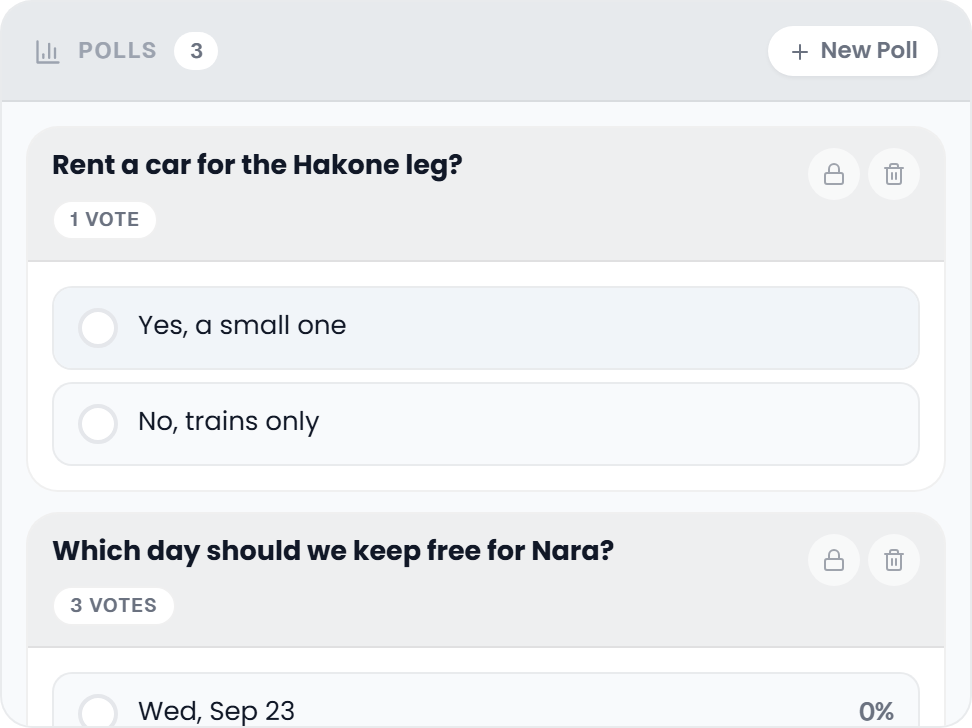

# Collab Polls

Let the group decide together: where to eat, which hotel to book, what to do on the free afternoon.

## Where to find it

Open the trip planner, select the **Collab** tab and look for the card headed **Polls**. The head band carries the number of polls and, for members with the `collab_edit` permission, **New Poll**. The Collab addon must be enabled and the Polls sub-feature must be turned on. See [Real-Time-Collaboration](Real-Time-Collaboration).

## Creating a poll

1. Click **New Poll** in the Polls head band.
2. Write the **Question**. It takes Markdown, so it can carry a heading, a list or a link (*Markdown supported* under the field says so).
3. Fill in the **Options**. Two fields are there to start with; **Add option** adds another, and the **×** beside an option removes it once there are more than two. An option can run over several lines.
4. Turn on **Multiple choice** if people may vote for more than one option.
5. Click **Create Poll**. The poll appears for every connected member at once.

**Create Poll** stays greyed out until there is a question and at least two filled options; empty option fields are left out.

| Field | Required | Notes |
|-------|----------|-------|
| Question | Yes | Markdown. |
| Options | Yes | At least two. |
| Multiple choice | No | A switch; off means one vote per person. |
| Deadline | No | Only on the phone, see [Deadline](#deadline). |

## The poll card

Each poll is a card. Its head band holds the question and, under it, small chips: **Closed** when voting has ended, the time left while a deadline runs (for example `2d 5h`), **Multiple choice** for such a poll, and the number of votes. Members with `collab_edit` find two round buttons on the right: the lock (**Close**) while the poll is open, and the bin (**Delete**).

Below the head band every option is a bar you can click.

## Voting

Click an option to vote for it. Your choice gets a filled check circle and a frame in your accent colour.

- In a **single-choice** poll, clicking another option moves your vote there.
- In a **multiple-choice** poll, each click adds another option.
- In both, clicking an option you already voted for takes that vote back.

Who voted and the percentages only show **after you have voted**, or once the poll is closed. The bar behind each option is always drawn, in a faint neutral tint until you vote, and the number of votes is in the head band for everyone, so the rough outcome can be read before you vote.

## Results

Each option shows:

- a **bar** filling the option in proportion to its votes, in your accent tint on the options you picked,
- up to **three voter avatars**, with the name in each avatar's tooltip,
- the **percentage** of all votes at the right edge.

Once the poll is closed or expired, the option with the most votes is set in bold, on a green bar unless it is one you picked; with a tie, every top option is.

## Deadline

A poll can carry a deadline. On the **phone** the new-poll sheet has a **Deadline** field, a date and time picker with a button to clear it. The desktop dialog has no deadline field; set one from the phone, or through the API or MCP. While a deadline runs, its chip on the card counts down in days and hours, or hours and minutes, and updates every **30 seconds**.

When the deadline passes, the poll counts as closed: voting stops and everyone sees the results.

## Closing a poll manually

Members with `collab_edit` can click the lock on an open poll to close it at once. A closed poll cannot be voted on again, and its results are shown to everyone.

## Deleting a poll

Members with `collab_edit` can delete a poll with the bin on its card. On the desktop it goes at once, without asking; on the phone TREK asks *Delete poll?* first. Either way it is gone for every member.

## Active and closed sections

Open polls come first, newest on top. Closed and expired polls follow under a **Closed** heading.

## Related pages

[Real-Time-Collaboration](Real-Time-Collaboration) · [Collab-Chat](Collab-Chat) · [Collab-Notes](Collab-Notes) · [Whats-Next-Widget](Whats-Next-Widget)
