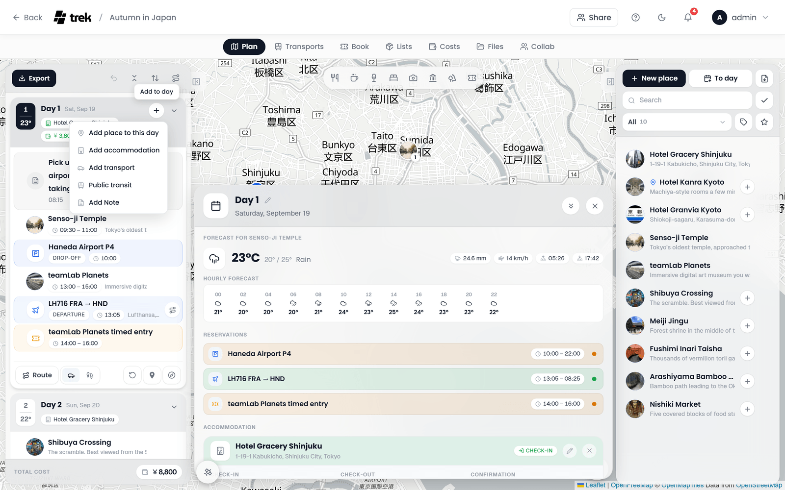

# Day Plans and Notes

The days column on the left of the Plan tab holds the itinerary: one card per day, with the places, bookings, transports and notes of that day in order.

## The Day Plan sidebar

Every day of the trip is a card. Click a day's head band to select it: its number tile turns to the accent colour, the [Day details panel](#day-detail-panel) opens over the map, and the map draws that day's places. Click the head band again to deselect the day.

Which days are expanded is saved per trip in `localStorage` (key `day-expanded-{tripId}`), so the column looks the same after a reload on that device.

### The head band

From left to right, the head band of a day shows:

- **The day tile:** the day's number, and under it the forecast temperature when the day has a date and a place to take the weather from. A reading that starts with **Ø** is a climate estimate, not a forecast. Rest the pointer on it for the weather and the place it is for. See [Weather Forecasts](Weather-Forecasts).
- **The title and the date.** A day without a title of its own reads **Day 1**, **Day 2** and so on. Rename a day in the [Day details panel](#day-detail-panel). With **Date first in day headings** on (Settings > General > Travel & map), the date leads and the day's title or number follows it, here and in the day details.
- **Pills** for what the day holds:
  - the stay, with a hotel icon: green on the check-in day, red on the check-out day, grey for the nights in between. Rest the pointer on it for *Check-in: Hotel Adler* or *Check-out: Hotel Adler*, and click the name to open the place. A stay with a booking has a ticket at the end of the pill (*Open booking*) that opens the booking's detail. A stay whose booking is not confirmed yet has a dashed pill, and its tooltip adds *(Pending)*. See [Accommodations](Accommodations).
  - a rental car that runs across the day, with a car icon. Click it to open the booking.
  - a label a plugin gives the day, for example the leg of the trip it belongs to.
- **+** (*Add to day*): the menu of everything a day can be given, see below. Shown to members who can edit days.
- **The chevron** expands or collapses the day.

Right click the head band for the same entries as **+**, and, on a day with places on it, **Clear day**. See [Clearing a day](#clearing-a-day).

### Adding to a day

| Entry | What it does |
|---|---|
| **Add place to this day** | Opens **Add Place/Activity**. The new place is saved onto this day. See [Places and Search](Places-and-Search#adding-a-place). |
| **Add accommodation** | Selects the day, opens its day details and the stay editor. See [Accommodations](Accommodations#creating-an-accommodation). |
| **Add transport** | Opens **Add transport** for this day, with the form filled in by hand. See [Transport: Flights, Trains, Cars](Transport-Flights-Trains-Cars). |
| **Public transit** | Opens the same dialog on **Automated**, the public transit search for this day. Only on a trip with dates. |
| **Add Note** | Opens the note dialog, see [Day notes](#day-notes). |

An empty day shows a dashed **Add place to this day** button instead of an empty list.

## Day timeline

An expanded day lists its places, bookings, transports and notes in one merged order: by time where they have one, and by their position otherwise.

### Places

A place row shows:

- **The photo** of the place, or its category tile. Click it to lock the place (*Keep position during route optimization*): a lock covers the picture and the row takes a faint red tint. Click again to unlock. See [Route Optimization](Route-Optimization#optimize-route).
- **The category icon and the name.** A stop left out of the route carries an **Off route** pill next to its name, see [Leaving a stop out of the route](#leaving-a-stop-out-of-the-route). Under them the time as a white badge (a start, or a start and an end) and the description or the address.
- **Notes for this day**, when the stop has a note of its own, after a small note icon.
- **Bookings pinned to this stop** as white badges: the type icon with the status (*Reservation confirmed* or *Reservation pending*), the time, and the carrier such as the airline and flight number. A booking with a start and an end point has a route button that draws it on the map (*Show booking routes*), and members who can edit days get a pencil that opens the editor. The place inspector shows the same bookings as cards that open their detail.
- **Participants**, as small avatars, when not everybody joins this stop.

On hover the row shows a ticket button, **Add booking**, which opens a new reservation already linked to this stop, and two arrows that move the row up or down. Clicking the row selects the place and opens its inspector.

### Bookings and transports

A booking with a day that is not pinned to a stop gets a row of its own, tinted in the colour of its type: flights, trains, buses, cars, ferries, restaurants, events and the rest. The row shows the type tile, the title and a second line with:

- the phase of a booking that runs over several days, in capitals: **START**, **ONGOING**, **END**, and for the types with their own words **DEPARTURE**, **IN TRANSIT**, **ARRIVAL**, **PICKUP**, **RETURN** and **DROP-OFF**. See [Multi-day reservations](#multi-day-reservations).
- the time as a white badge. On the departure or arrival day of a booking with a time zone, a small globe follows it; rest the pointer on the globe for the time zone.
- the airline and flight number, the train number, platform and seat, or the route.

A public transit journey shows its lines as coloured chips, and its chevron unfolds the itinerary stop by stop. The route button on the right switches the booking's route on the map on and off.

Clicking the row opens the booking's detail, see [Bookings on the plan](Trip-Planner-Overview#bookings-on-the-plan). Stays are not rows: they show as pills in the head band and as cards in the day details.

### Notes

A note row shows its icon in the note's colour, the title and, under it, the text, rendered as Markdown. Click a note to edit it. See [Day notes](#day-notes).

### The row menu

Every place and note row has a **…** button (*More options*) at its right end, which offers the same actions as a right-click on the row:

- **For a place:** **Edit**, **Remove from day**, **Leave out of route** (or **Add back to route**) for a place with coordinates, **Open Website**, **Save to Collection** with the [Collections](Collections) addon, and **Delete**. Map apps are not in this menu: navigation goes through the **Navigation** button in the place inspector, see [Opening a place in a map app](Places-and-Search#opening-a-place-in-a-map-app).
- **For a note:** **Edit** and **Delete**.

Which entries appear depends on your permissions and on what the place has, such as a website or coordinates.

## Assigning places to a day

- **Drag and drop:** drag a place from the places column onto a day's head band, or between two rows of an expanded day.
- **The + button:** with a day selected, every place that is not on it yet shows a **+** (*+ Day*) in the places column. Click it and the place goes onto the selected day. The same entry is in the place's **…** menu.
- **The place inspector:** **Add to Day** in its footer puts the selected place on the selected day.
- **A new place:** **To day** in the places column, or **Add place to this day** in a day's **+** menu, creates a place straight onto that day.
- **Mobile:** tap **Add Place** inside an expanded day to open a search of the trip's places, and tap one to assign it.

To move a row within a day or to another day, drag it, or use the up and down arrows that appear on hover. Notes and bookings move the same way. A booking that runs over several days can be dragged by its first or last row, which moves its start or its end; the rows in between stay put.

A place with a time keeps the day in time order. Dragging it to a spot that breaks that order asks **Remove time?** first: confirming removes the time and moves the place.

To take a place off a day, choose **Remove from day** in the row's **…** menu, or **Remove from Day** in the footer of the place inspector. On mobile, switch the plan screen to **Plan** and tap the **X** next to the place. **Delete** in the same menu deletes the place itself, from every day.

### Clearing a day

To take every place off a day at once, right click the day's head band and choose **Clear day**. On a phone, **Clear day** sits in the day's sheet. TREK asks first (*Clear Day 3?*): every place comes off the day and stays in the trip, and the day keeps its notes and bookings. **Undo** brings the places back (*Day cleared*). The entry is only there on a day with places on it, for members who can edit days.

### Leaving a stop out of the route

**Leave out of route** in a place's **…** menu keeps the place on the day and on the map, but the day's route skips it and runs from the stop before it straight to the one after. Use it for a place you only visit on foot from somewhere nearby, or one that is just a point of interest. The row then carries an **Off route** pill, and **Add back to route** in the same menu undoes it. On a phone, the route icon on the day's chip in the place sheet does the same. The setting belongs to that one visit, so the same place on another day is still routed.

## Multi-day reservations

A booking that spans several days shows on each of them with its phase:

| Booking type | First day | Days in between | Last day |
|---|---|---|---|
| Flight | Departure | In transit | Arrival |
| Car | Pickup | a pill in the day's head band | Return |
| Parking | Drop-off | not shown | Pickup |
| Other | Start | Ongoing | End |

The rows of the days in between are shown dimmed. A multi-day parking booking is left out of the days in between entirely: it appears on its drop-off day and its pickup day only, with no pill in the head band. A flight or train with several legs shows one row per leg instead.

## Day notes

Choose **Add Note** in a day's **+** menu to add a note. The note dialog has:

- **Note** (required): the title, typed into the head band of the dialog. It is what the timeline shows.
- **Daily Note**: the text under the title, up to 2,000 characters, in Markdown with a formatting bar (bold, italic, strikethrough, code, link, lists and quote). A preview of the rendered text appears under the field.
- **Icon**: one of 32 icons, from a document, a clock or a pin to a plane, a train, a coffee cup, a camera or a mountain.
- **Colour**: no colour, red, orange, amber, green, cyan, blue or purple. It tints the note row.
- **Preview**: the row the note will become, next to the icons.

Notes sit between places and transports in the timeline. Drag one to another position or another day, or move it with its up and down arrows. Click a note to open it again; **Delete** in the dialog's footer removes it after a confirmation.

## Day detail panel

Click a day's head band to open its details. The panel floats over the map, between the two columns.

- **The head band** carries the day's title and date. Members who can edit days rename the day with the pencil next to the title. The chevron folds the panel to a slim bar (clicking the band does the same), and **X** closes it.
- **The weather** for the day, with the hourly forecast. See [Weather Forecasts](Weather-Forecasts).
- **Reservations**: the day's bookings apart from stays, each with its type tile, title, the place it is pinned to, the time and a status dot. Click one to open its detail.
- **Accommodation**: the stay of the night, with the confirmation code, its booking and **Add accommodation**. It shows only the time that matters on this day: the check-in on the arrival day, the check-out on the departure day, both for a stay that starts and ends on the same day, and neither on the nights in between. See [Accommodations](Accommodations#in-the-day-detail-panel).
- Cards and panels that [plugins](Plugins) add to a day.

## Toolbar actions

The head band of the days column holds, from left to right:

- **Export**: one dialog with every way a trip leaves TREK, in three groups. **Document** is the **PDF** of the whole plan and, once some stop has participants or some booking has travelers, **My plan as PDF**: the plan you go on, without the stops and bookings that name only other people (see [PDF-Export](PDF-Export)). **Calendar** offers **Download .ics** and, for members who can manage share links, **Subscribe to calendar** (see [Calendar Feeds](Calendar-Feeds)). **Maps & GPS** offers GPX files: **Whole trip**, **Places only** and **Days as routes** (see [Exporting a trip as GPX](Map-Features#exporting-a-trip-as-gpx)).
- **Undo**: reverses the last action. See [Undo](Trip-Planner-Overview#undo).
- **Expand all days** / **Collapse all days**.
- **Reorder days**: move, add and delete days. Shown to members who can edit days. See [Adding a day](#adding-a-day) and [Deleting a day](#deleting-a-day).
- **Show all booking routes** / **Hide all booking routes**: draws every booking route on the map at once, or none. Shown once the trip has a booking with a route. See [Map Features](Map-Features#reservation-and-transport-overlay).

With the [Road trip](Road-Trip) addon on, the **Days** / **Road trip** switch sits above this band.

At the foot of the column, **Total Cost** adds up every expense of the trip with Costs on, the same figure as *Total trip spend* in Costs, so deleting an expense lowers it. With Costs off it adds up the prices of the planned places, each place once.

### The route bar

The selected day ends in its route bar, as long as the day can be routed: two or more places, one located place that the day's accommodation can frame, or a transfer day from one hotel to another. On a phone the same controls sit in the **Daily Overview** sheet.

- **Route** draws the day's route on the map and puts the travel time between each pair of stops into the timeline.
- **The travel mode**: Driving, Walking, Cycling, and any mode a plugin adds.
- **Optimize** reorders the day's free places into a shorter route.
- **Open in Google Maps** and **Open in CoMaps** hand the day to a map app.

All four are explained on [Route Optimization](Route-Optimization).

## Adding a day

The **Reorder days** dialog adds a day at its foot. On a phone the same choice sits below the list of the **Reorder days** sheet, which opens from the calendar icon next to the day title above the plan. On a trip with dates there are two buttons. A line above them explains the dated one, and switches to explain **Without date** while the pointer or the keyboard focus rests on it:

- **Without date** puts a day without a date at the end. The trip dates stay as they are, which suits a buffer day you have not placed yet.
- **Add** followed by the next date (for example **Add Tue, Oct 13**) adds the calendar day after the last date of the trip and extends the trip to it. The new day goes right behind the last dated day, so days without a date move one place back and keep their plans. No existing day or booking changes its date. A message confirms the new end of the trip, and fellow travellers see it straight away.

A trip without dates has a single **Add day** button. Adding a day needs a connection. Once a trip spans the most days a trip can have (999), the button with the date is greyed out and the line above it says why.

## Deleting a day

Members who can edit days find a delete button at the end of every row of the **Reorder days** dialog; on a phone it sits next to the arrows in the **Reorder days** sheet. Nothing is deleted straight away. The dialog first asks, in place of the day list, and lists what goes with the day:

- **Planned places** stay in the place list of the trip. Only their spot on this day goes.
- **Notes**, the day title and the day description are deleted.
- **Bookings** on the day stay under Bookings, without a day, and keep their date.
- **A stay that checks in or out on the day** is cancelled, together with its booking and the expense of that booking. The list shows it in red, since this is the line that costs money, and names the booking and the amount of its expense. A booking without an expense is named alone.
- **A stay that only runs across the day**, with its check-in before and its check-out after it, is kept, but one night shorter: its check-out day moves up with the other days. The list names the stay and its new check-out date. The booking behind it is not changed.
- **The days after it** move up one place. On a trip with dates the dates stay where they are, so every later day, and the bookings on it, takes the date one slot earlier; the list says how many days and bookings move. The first day without a date takes over the last date, and the list names that day and the date it gets. From then on it counts as a dated day, also when the trip is shortened later. When there is no day without a date, the trip ends one day earlier, and the list names the new end date.

A day with nothing on it gets a single line that says so. **Delete day** confirms, **Cancel** goes back to the list. Deleting needs a connection, and the last day of a trip cannot be deleted; in both cases the button is greyed out and its tooltip says why. There is no undo, which is why the question spells out the consequences first. An open panel of the deleted day closes, and earlier undo steps that acted on that day are dropped, since they could no longer be taken back. Fellow travellers see the day go, and a new end date, straight away.

## Shortening a trip

New dates lay the days of a trip out again. Plans follow their position: the first day of the plan takes the new start date, the second the date after it, and so on. When the new dates hold fewer days than the plan, the last days go, also when it was the start that moved. Empty days without a date that are left over go as well, with any change of dates.

Before such a save, TREK asks first: in the trip dialog as a step before the save. Editing the trip from the phone's dashboard asks in a sheet over the trip sheet instead; editing it from inside the planner shows the same step as on desktop, also on a phone. Escape in that step goes back to the form and keeps what you typed. It names the days that go, the first six by name and the rest as a count, and lists what is on them:

- **Planned places** stay in the place list of the trip.
- **Notes**, day titles and day descriptions are deleted.
- **Bookings** on those days stay under Bookings. With **Keep bookings on their dates**, a booking whose date is still part of the trip goes back onto that day; with **Shift everything** it stays without a day. The sheet on the phone's dashboard does not offer the choice and keeps bookings on their dates.
- **A stay that checks in or out on one of those days** is removed as a whole, also for nights that are still part of the trip. Unlike when you delete a single day, its booking stays under Bookings and its expense, if it has one, under Costs. The list shows the stay in red.
- **The last days go, not the first** closes the list when the start moved, as a reminder that plans follow their position.

The save button then reads **Remove days and save**. When the start moved, the same step also asks how bookings follow the new dates, as before. When the days that go hold nothing, nothing extra is asked. Should TREK fail to read the days of the trip, it warns in general terms instead of listing them. There is no undo.

On a trip without dates, a lower **Day count** only takes away days with no places, notes or stay on them, starting from the end. A day with plans on it stays.

**See also:** [Trip Planner Overview](Trip-Planner-Overview) · [Places-and-Search](Places-and-Search) · [Map-Features](Map-Features) · [Route-Optimization](Route-Optimization) · [Weather-Forecasts](Weather-Forecasts) · [Accommodations](Accommodations) · [Reservations-and-Bookings](Reservations-and-Bookings)
