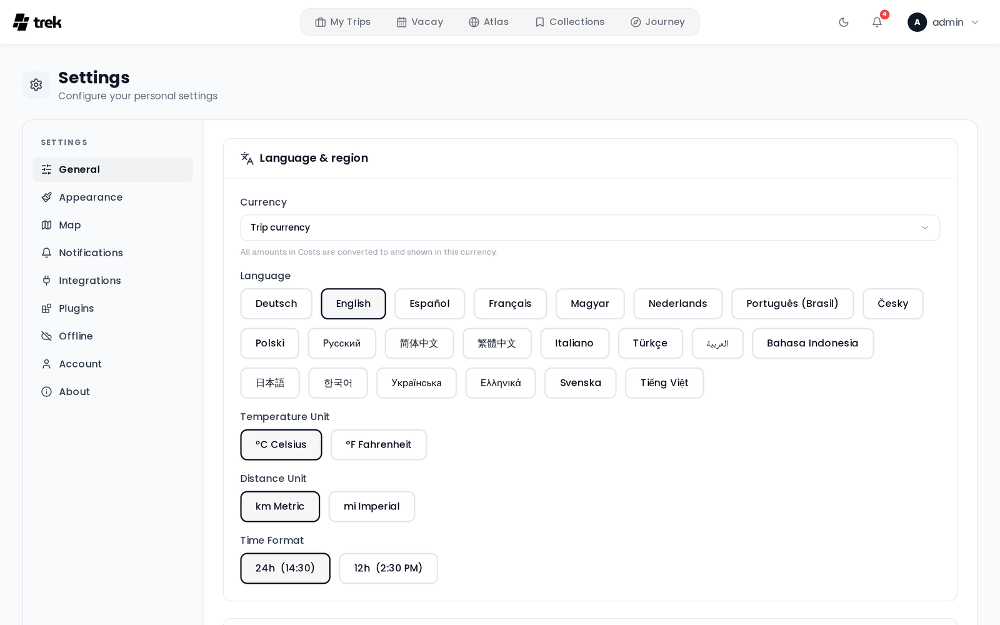

# General Settings

The General tab (Settings → General) controls your locale preferences and a few map-related display options. All changes save immediately to your account and persist across devices.

<!-- TODO: screenshot: appearance settings panel -->

## Where to find it

Open the user menu in the top navigation bar, select **Settings**, and stay on the **General** tab — it is the tab the page opens on.

The tab is split into two sections: **Language & region** (currency, language, temperature, distance, time format) and **Travel & map** (booking route labels, POI pills, blur booking codes).

> Color mode (Light / Dark / Auto) is **not** here — it lives on the **Appearance** tab. See [Appearance-Settings](Appearance-Settings).

## Currency

Your **display currency** — the currency you want to *read* amounts in on the Costs tab (totals, the category chart, balances, settle-up). It is presentation only: it never changes what is stored, and two members of the same trip can read it in different currencies and both see correct balances.

| Option | Behaviour |
|--------|-----------|
| **Trip currency** (default) | Each trip is shown in **its own** currency — a Tokyo trip in yen, a Moscow trip in roubles. |
| A specific currency (e.g. `USD`) | **Every** trip is converted into that currency for you, whatever its own currency is. |

165 currencies are available. Conversion uses live rates, so a converted total can shift slightly from day to day while the trip's actual balances stay fixed.

> This is **not** the trip's currency, which is set on the trip itself and is the base its balances are calculated in. The distinction matters — see [Currencies](Currencies).

An administrator can set the instance-wide default for new users in Admin → Default User Settings. Choosing **Trip currency** yourself overrides it.

## Language

Select your preferred language from the button grid (desktop) or dropdown (mobile). The change takes effect immediately without a page reload. See [Languages](Languages) for the full list of supported languages.

## Temperature unit

Affects the weather widget on trip days.

| Option | Display |
|--------|---------|
| °C Celsius | Metric |
| °F Fahrenheit | Imperial |

## Distance unit

| Option | Display |
|--------|---------|
| km Metric | Kilometres |
| mi Imperial | Miles |

## Time format

Affects all time displays throughout the app.

| Option | Example |
|--------|---------|
| 24h | 14:30 |
| 12h | 2:30 PM |

## Booking route labels

Shows or hides station / airport names on the endpoint markers of booking routes on the map. When off, only the icon is shown. Set to **On** or **Off**.

## Explore places on the map

Shows a category pill on the trip map for finding nearby restaurants, hotels and more from OpenStreetMap. Set to **On** or **Off**.

## Blur booking codes

When enabled, confirmation codes and reference numbers are blurred until you hover or tap. Set to **On** or **Off**.

## See also

- [Currencies](Currencies)
- [Languages](Languages)
- [Appearance-Settings](Appearance-Settings)
- [User-Settings](User-Settings)
