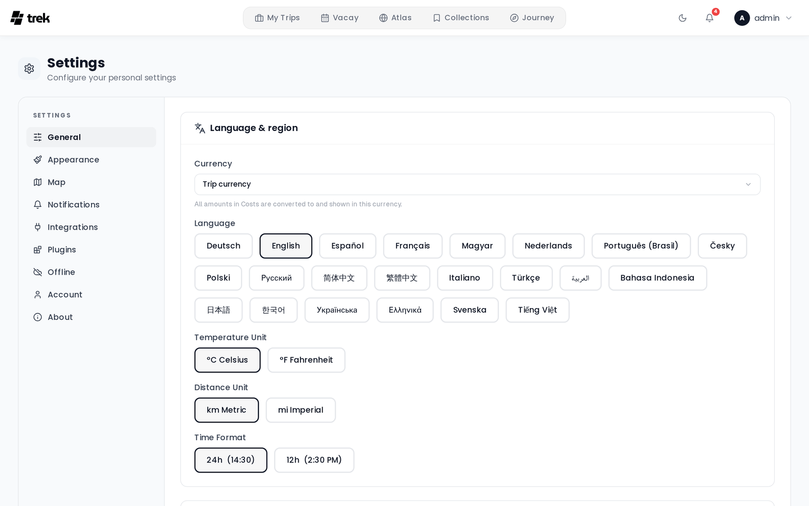

# General Settings

The General tab (Settings → General) controls your locale preferences and a few map-related display options. All changes save immediately to your account and persist across devices.

## Where to find it

Open the user menu in the top navigation bar, select **Settings**, and stay on the **General** tab — it is the tab the page opens on.

The tab is split into two sections: **Language & region** (currency, language, temperature, distance, time format) and **Travel & map** (booking route labels, POI pills, blur booking codes).

> Color mode (Light / Dark / Auto) is **not** here — it lives on the **Appearance** tab. See [Appearance-Settings](Appearance-Settings).

## Currency

Your **display currency** — the currency you want to *read* amounts in on the Costs tab (totals, the category chart, balances, settle-up). It is presentation only: it never changes what is stored, and two members of the same trip can read it in different currencies and both see correct balances.

| Option | Behaviour |
|--------|-----------|
| **Trip currency** (default) | Each trip is shown in **its own** currency — a Tokyo trip in yen, a Moscow trip in roubles. |
| A specific currency (e.g. `USD`) | **Every** trip is converted into that currency for you, whatever its own currency is. |

165 currencies are available. Final display conversion uses the current server snapshot, so a converted total can shift after a snapshot update while the trip's actual balances and frozen item values stay fixed.

> This is **not** the trip's currency, which is set on the trip itself and is the base its balances are calculated in. The distinction matters — see [Currencies](Currencies).

An administrator can set the instance-wide default for new users in Admin → Default User Settings. Choosing **Trip currency** yourself overrides it.

## Common currencies

The **common currency list** is an ordered set of up to 10 shortcuts. When it is not empty, every currency menu is split into **Common currencies** and **Other currencies**. Common currencies keep the order you choose; the remaining currencies are sorted by ISO code. Currency names follow your selected language and are searchable along with their ISO codes.

Use the search menu to add a currency, then move entries up or down, remove individual entries, or clear the list. Each change saves immediately. Clearing saves an explicit empty list and returns currency menus to their ungrouped layout. **Reset** removes your personal override and resumes using the administrator's current instance default; if no administrator default exists, the list is empty.

This list only changes menu organization. It is separate from the **display currency** above and never changes a trip, expense, or payment currency. **Trip currency** remains a special display-currency option above the groups and cannot be added to the common list.

## Language

Select your preferred language from the button grid (desktop) or dropdown (mobile). The change takes effect immediately without a page reload. See [Languages](Languages) for the full list of supported languages.

## Temperature unit

Affects the weather widget on trip days.

| Option | Display |
|--------|---------|
| °C Celsius | Metric |
| °F Fahrenheit | Imperial |

## Distance unit

| Option | Display |
|--------|---------|
| km Metric | Kilometres |
| mi Imperial | Miles |

## Time format

Affects all time displays throughout the app.

| Option | Example |
|--------|---------|
| 24h | 14:30 |
| 12h | 2:30 PM |

## Booking route labels

Shows or hides station / airport names on the endpoint markers of booking routes on the map. When off, only the icon is shown. Set to **On** or **Off**.

## Explore places on the map

Shows a category pill on the trip map for finding nearby restaurants, hotels and more from OpenStreetMap. Set to **On** or **Off**.

## Always show booking routes

When **On**, every booking that has a route (flight, train, car leg, etc.) shows its route line on the map automatically, on every trip, without needing the per-booking toggle. Set to **On** or **Off** — off by default.

This only sets the *default* for a trip you haven't touched before. If you've already used the per-booking toggle or the trip's "show all / hide all" button (in the day-plan toolbar) on a given trip, that choice is remembered for that trip and isn't overridden by changing this setting afterwards.

## Blur booking codes

When enabled, confirmation codes and reference numbers are blurred until you hover or tap. Set to **On** or **Off**.

## See also

- [Currencies](Currencies)
- [Languages](Languages)
- [Appearance-Settings](Appearance-Settings)
- [User-Settings](User-Settings)
