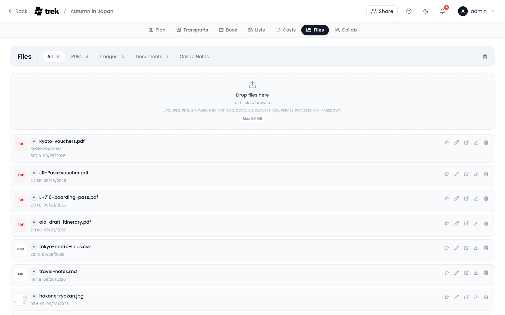
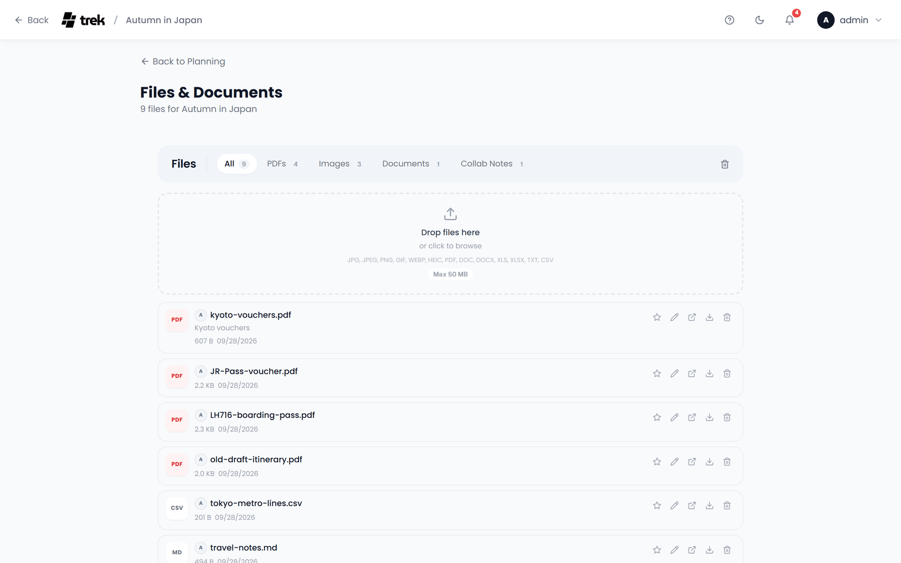

# Documents and Files

Keep tickets, confirmations, vouchers and photos with the trip, and tie each one to the places and bookings it belongs to.

## Where to find it

Open the **Files** tab inside the trip planner, or go straight to `/trips/:id/files`.

> **Admin:** The Files tab belongs to the **Documents** addon. Enable it in [Admin-Addons](Admin-Addons).

The tab opens with the same bar as Transports, Bookings, Lists and Costs: **Files**, the type filters (see [Browsing and filtering](#browsing-and-filtering)), then on the right **Document sync** when a document store is available (see [Document sync](#document-sync)) and the trash icon (see [Trash](#trash)).

## Uploading

Drop files onto the dashed upload area under the bar, click it to open the file picker, or paste an image straight into the tab (Ctrl+V). Several files can go up at once.

When the upload is done and the trip has places or bookings, the **Assign File** dialog opens for the last file you uploaded, so you can tie it to a place or a booking right away (see [Linking files](#linking-files-to-places-reservations-or-assignments)). Close it if the file belongs nowhere in particular.

- **Maximum file size:** 50 MB per file by default. Videos (mp4, m4v, webm, mov) have their own cap of 500 MB.
- **Blocked file types:** renderable documents (`.svg`, `.svgz`, `.html`, `.htm`, `.shtml`, `.shtm`, `.xml`, `.xhtml`, `.xht`), scripts (`.js`, `.jsx`, `.ts`, `.tsx`, `.mjs`, `.cjs`, `.php`, `.py`, `.rb`, `.pl`) and executables (`.exe`, `.bat`, `.sh`, `.cmd`, `.msi`, `.dll`, `.com`, `.vbs`, `.ps1`, `.app`). These are always refused, as is any file whose MIME type contains `svg`.
- **Allowed types by default:** jpg, jpeg, png, gif, webp, heic, pdf, doc, docx, xls, xlsx, txt, csv, pkpass, pkpasses, md, markdown. The upload area lists the types your instance allows. An admin can change the list under **Admin → Settings → Allowed File Types**: comma-separated extensions, or `*` to allow everything except the blocked types above.

- **Videos:** mp4, m4v, webm and mov files are accepted even when they are not on the allowed list.

> **Admin:** The 50 MB limit is set with the `FILE_UPLOAD_LIMIT_MB` environment variable (see [Environment-Variables](Environment-Variables)); it also applies to booking attachments and collab note attachments, and the upload dialogs refuse a larger file before it is sent. Behind a reverse proxy, raise the proxy's upload limit as well.

Uploading needs the `file_upload` permission; without it the upload area is not shown.

Files also reach this tab from elsewhere: **Attach file** in a booking or transport editor, **Upload** in the Files section of the place inspector, **Attach** in the place dialog, receipts on an expense (see [Budget-Tracking](Budget-Tracking#receipts-and-invoices)) and attachments on a collab note. They all land here.

An AI assistant connected through MCP can add files too: the `upload_trip_file` tool uploads a document to a trip (and can attach it to a booking or a place in the same call) under the same type rules and the `file_upload` permission as the upload area, up to 10 MB per file (or the upload limit, if that is lower). See [MCP-Tools-and-Resources](MCP-Tools-and-Resources).

## Browsing and filtering

The filter tabs in the bar are, in this order: **All**, a star for **Starred** (only once a file is starred), **PDFs**, **Images**, **Documents** (Word, Excel and text files) and **Collab Notes** (only once a note has an attachment). Each tab carries its count.

Each file is a row with:

- a thumbnail for an image, or the file's extension on a tile (red for a PDF),
- the avatar of whoever uploaded it, a gold star when it is starred, and the file name,
- the note, when the file has one (see [Linking files](#linking-files-to-places-reservations-or-assignments)),
- its size and upload date,
- a badge for everything it is tied to: **Day Plan** with the place's name, **Booking** or **Transport** with the booking's title, **From Collab Notes** for a note's attachment.

At the end of the row sit the actions, each named in its tooltip: **Star**, **Assign** (pencil), **Open**, **Download** and **Delete**.

## Previewing files

Click a file's name or thumbnail to open it:

- A **PDF** opens in a preview dialog with the file name in the head band and **Open in new tab** and **Download** beside it. If the browser cannot show the PDF inline, a **Download PDF** link takes its place.
- A **Markdown** file opens rendered, in the same kind of dialog.
- Any other document (Word, Excel, plain text) opens in that dialog too; what the browser cannot show inline is one click away through **Open in new tab** or **Download**.
- An **image** or **video** opens full screen in a lightbox. Move between them with the arrow buttons or the left and right arrow keys, swipe on a touch screen, or jump with the thumbnail strip at the bottom (a video shows a play placeholder there). **Open in new tab** and **Download** are in the lightbox's corner.
- A `.pkpass` or `.pkpasses` Wallet pass is not previewed: clicking it downloads it straight away, so the operating system can hand it to Apple Wallet.

**Open** in the row's actions does the same as clicking the name.

## Starring

Click the **star** on a row to mark a file, and click it again (**Unstar**) to take the mark off. The star belongs to the file, not to you, so everyone on the trip sees it. Starred files can be listed on their own with the star tab in the bar.

Starring needs the `file_edit` permission.

## Trash

**Delete** on a row moves the file to the trash; nothing is lost yet. The trash icon at the right end of the bar switches to the trash view, and the bar's title reads **Trash** while it is open. Click the icon again to go back.

In the trash each file has two actions:

- **Restore** puts the file back where it was, links included.
- **Delete** removes it for good, after one confirmation.

**Empty Trash**, on the bar while the trash is open, permanently deletes every file in it after one confirmation.

Moving to the trash, restoring and deleting for good need the `file_delete` permission.

## Linking files to places, reservations, or assignments

A file can be tied to several places and bookings at once. The **Assign** pencil on a row opens the **Assign File** dialog, with the file name in the head band:

- **Note** at the top takes a short description of the file. It is saved when you leave the field or press Enter, and shows under the file name in the list.
- **Place** lists the trip's places grouped under the days they are planned on, with the day's title and date, then the places on no day under **Unassigned**.
- **Booking** and **Transport** list the trip's bookings.

Click an entry to tie the file to it, and click it again to untie it; a tied entry is highlighted with a check mark. Every click is saved at once, so the dialog has no save button: close it when you are done.

From the other side, the booking and transport editors have **Attach file** for a new file and **Link existing file** for one the trip already has. On the phone it is the **Link** pill in the Files row of the booking and transport sheets. The files of a booking appear in its detail popup, where **Show in files** brings you here, and the files of a place appear in the place inspector.

Linking needs the `file_edit` permission.

## Downloading

**Download** on a row, in the preview dialog or in the lightbox saves the file. `.pkpass` files (Apple Wallet passes) are served as `application/vnd.apple.pkpass`, so Safari on iOS and macOS offers to add the pass to Wallet instead of saving it as a plain download.

## Document sync

A trip's documents can be kept in step with a self-hosted document store: Paperless-ngx, Papra, Nextcloud, OpenCloud or a Synology NAS. Once a store is available, **Document sync** sits in the bar next to the trash icon; on the phone it is at the top of the Files tab. The trip owner connects the store there once, and from then on what someone uploads here appears in the store, and what someone files in the store appears here.

Synced documents are ordinary files in this tab. Preview, starring, links, trash and download work as described on this page, and a document deleted here is only removed in the store when the binding is set to do so.

See [Document-Sync](Document-Sync) for setup per store, the delete and conflict rules, and troubleshooting.

> **Admin:** Each store is switched on separately under the **Documents** addon in [Admin-Addons](Admin-Addons). They ship switched off.

## Permissions

| Permission | Controls |
|---|---|
| `file_upload` | Uploading new files, and the upload area itself. |
| `file_edit` | Starring files, the note on a file and linking files to places and bookings. |
| `file_delete` | Moving files to the trash, restoring them and deleting them for good. |

## See also

- [Reservations-and-Bookings](Reservations-and-Bookings)
- [Document-Sync](Document-Sync)
- [Budget-Tracking](Budget-Tracking)
- [Collab-Notes](Collab-Notes)
- [Admin-Addons](Admin-Addons)
- [Trip-Planner-Overview](Trip-Planner-Overview)
