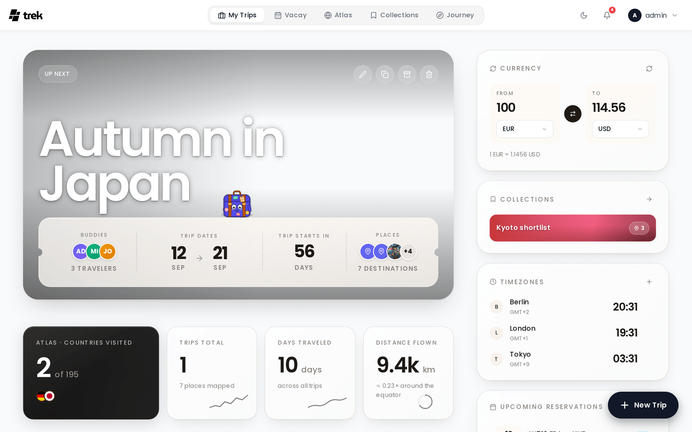

# TREK Wiki

TREK is a self-hosted, real-time collaborative travel planner licensed under AGPL-3.0.

## Features

### Planning
- **Drag & Drop Planner**: organize places into day plans with reordering and cross-day moves
- **Interactive Map**: Leaflet map with photo markers, clustering, route visualization, customizable tile sources, category buttons (plugins can add their own) and a lock that keeps the view where it is
- **Place Search**: TREK's own place index and OpenStreetMap, asked together, with no API key and no quota; Google or Amap answer only where both come up empty (see [TREK Places API](TREK-Places-API))
- **Day Notes**: notes between a day's stops, each with a title, Markdown text, an icon and a colour
- **Route Optimization**: auto-optimize place order, draw the day for driving, walking or cycling, leave single stops out of the route, and hand the day to Google Maps or CoMaps (see [Route Optimization](Route-Optimization))
- **Weather Forecasts**: 16-day forecasts via Open-Meteo (no API key required), historical climate averages as fallback

### Travel Management
- **Reservations & Bookings**: hotels, restaurants, tickets and every other booking with its confirmation code, travelers, costs and files, shown as cards, as a list or on a timeline; flights, trains and cars have their own Transports tab
- **Budget Tracking**: an expense ledger with who paid and itemised splits, settle-up, receipts (scanned into an expense with **Scan receipt** when AI Parsing is on), expenses linked to bookings, transports and places, a table view with per person and per day figures, multi-currency support (see [Budget Tracking](Budget-Tracking) and [Currencies](Currencies))
- **Packing Lists**: category-based checklists with user assignment, templates, quantities and weights, progress tracking, and print, PDF, Markdown and CSV export (see [Packing Lists](Packing-Lists))
- **Document Manager**: attach documents, tickets, and PDFs to trips, places, or reservations (up to 50 MB per file by default, set with `FILE_UPLOAD_LIMIT_MB`)
- **Document Sync** _(admin-enabled)_: keep a trip's documents in step with a self-hosted Paperless-ngx, Papra, Nextcloud, OpenCloud or Synology NAS, in both directions, under one connection the trip owner sets up for every member (see [Document Sync](Document-Sync))
- **PDF Export**: export complete trip plans as PDF with cover page, images, and notes, or only your own activities with **My plan as PDF** (see [PDF Export](PDF-Export))

### Collaboration
- **Real-Time Sync**: WebSocket-based live sync; changes appear instantly for all connected users
- **Multi-User**: invite members with role-based access
- **Invite Links**: registration links with configurable max uses (1 to 5, or unlimited) and expiry
- **OIDC SSO**: sign in with Google, Apple, Authentik, Keycloak, or any OIDC provider
- **Two-Factor Authentication**: TOTP-based 2FA with QR code setup
- **Passkeys** _(admin-enabled)_: passwordless WebAuthn sign-in with Touch ID, Windows Hello, Android screen lock, or a hardware key; owning one also satisfies the require-2FA policy (see [Passkeys](Passkeys))
- **Public Share Links**: share a read-only view of any trip, in full, as **Travel & stays only** or **Without photos** (see [Public Share Links](Public-Share-Links))
- **Notifications**: in-app, email, webhook and ntfy, and Web Push to a phone or computer even while TREK is closed (see [Notifications](Notifications))

### Addons _(admin-toggleable)_
- **Lists**: packing lists and to-dos with templates, member assignments, optional bag tracking
- **Costs**: expense tracker with category breakdown, splits, multi-currency
- **Documents**: file manager for trips, places, and reservations
- **Collab**: group chat, shared notes, polls, day-by-day attendance
- **Road trip**: plan a trip as one continuous drive, with search along the route, driving limits, daily travel times and avoidance of toll roads, motorways and ferries (see [Road Trip](Road-Trip))
- **Vacay**: personal vacation day planner with calendar view, public holidays, company holidays (also as half days), and carry-over tracking
- **Atlas**: interactive world map with visited countries and regions, bucket list (countries or regions), travel stats, continent breakdown
- **Collections**: a personal place library that saves places across trips into named lists, copies them into any trip, and shares them with per-member roles (see [Collections](Collections))
- **Journey**: magazine-style travel journal with entries, drafts, photos (via Immich/Synology Photos) shown on the journey's map when geotagged, and moods
- **Naver List Import**: import places from shared Naver Maps lists
- **MCP**: expose TREK to AI assistants via the Model Context Protocol (OAuth 2.1)
- **AirTrail**: sync flights from your self-hosted AirTrail instance into trips
- **Dawarich**: read the stays and routes your self-hosted Dawarich instance recorded, offered as suggestions you confirm; nothing is written back (see [Dawarich](Dawarich))
- **AI Parsing**: LLM fallback that extracts bookings from confirmation files KDE Itinerary cannot read, and, with a model that reads images, from photos and scanned PDFs and receipts (see [AI-Booking-Import](AI-Booking-Import))

> Dashboard widgets (currency converter and timezone clock) are per-user preferences, not an admin-toggleable addon; see [Dashboard-Widgets](Dashboard-Widgets).
>
> The full addon table, with type and per-addon notes, lives in [Addons-Overview](Addons-Overview).

### Plugins
- **Sandboxed Plugin Runtime**: third-party plugins run in a forked child process with permission-gated RPC, install-time manifest and signature checks, and an egress allowlist (see [Plugins](Plugins))
- **Plugin SDK**: build and publish plugins with the `trek-plugin-sdk` npm package, with dev server, preflight, signing and submit (see [Plugin-Development](Plugin-Development))

### AI / MCP Integration
- **MCP Server**: built-in Model Context Protocol server with OAuth 2.1 authentication
- **300+ Tools**: create trips, plan itineraries, manage budgets, upload files, search places near a point, send messages, and more
- **30 Resources**: read-only `trek://` URIs for trips, days, places, budget, packing, journeys, and more
- **35 OAuth Scopes**: granular permissions across 17 permission groups
- **Pre-built Prompts**: `trip-summary`, `packing-list`, and `budget-overview` context loaders

### Help
- **Help Center**: the `?` in the navbar opens guides for the screen you are on, with a picture of every step and search across guides and the wiki, in every language TREK speaks (see [Help Center](Help-Center))
- **In-App Help**: the whole wiki, bundled with your install and read inside TREK at `/help` (see [In-App Help](In-App-Help))

### Admin
- User management, invite links, packing templates, global categories
- Addon management, API key storage with a daily limit for Google calls, scheduled auto-backups
- Notification defaults: each event and channel on, off or blocked for every user (see [Notifications](Notifications))
- System notices for onboarding and announcements, including a release notes notice every user sees once after each update (see [Admin-GitHub-Releases](Admin-GitHub-Releases#release-notes-notice))

> **Admin:** Most configuration lives in the Admin Panel. On first boot TREK seeds an admin account automatically: credentials come from `ADMIN_EMAIL` / `ADMIN_PASSWORD` if set, otherwise a random password is printed to the container log.

## Get Started

| | |
|---|---|
| [Quick Start](Quick-Start) | Install in minutes with a single Docker command |
| [My Trips Dashboard](My-Trips-Dashboard) | Start planning your first trip |
| [Help Center](Help-Center) | The `?` in the navbar: guides for the screen you are on |
| [Admin Panel](Admin-Panel-Overview) | Configure your instance |
| [MCP / AI Integration](MCP-Overview) | Connect Claude, Cursor, or any MCP client |
| [Contributing](Contributing) | Guidelines for submitting pull requests |
| [Development Environment](Development-environment) | Set up a local dev environment |
