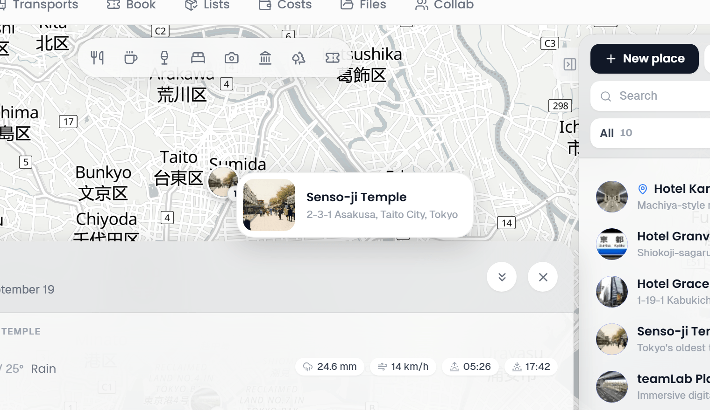

# Map Features

The map in the middle of the Plan tab shows your places, the route of the selected day, the booking routes you switched on, imported tracks and, on a phone, your own position.

## Map renderer

TREK uses **Leaflet** by default. The renderer is picked in Settings → Map under **Map provider**: **Leaflet** for raster tiles, **MapLibre GL** for OpenFreeMap vector tiles (no token required), or **Mapbox GL** for vector tiles with 3D buildings and terrain, which additionally needs a Mapbox access token. If Mapbox GL is selected but no access token is present, TREK falls back to Leaflet automatically so the map is never blank.

The scopes required for Mapbox GL are:
- STYLES:TILES
- STYLES:READ
- FONTS:READ
- DATASETS:READ
- VISION:READ

On MapLibre GL and Mapbox GL the map can be rotated and tilted. A round compass button shows where north is; click it to turn the map back to north and flat. On the phone it sits above the satellite switcher.

## Map lock

On the desktop, a lock button sits on top of the satellite switcher in the bottom-left corner. Click it (*Lock the map view*) and the map stays where you put it: picking a day or a place no longer zooms or pans it, so you can keep one part of the map in view while you click through the plan. Click it again (*Let the map follow the selection*) to unlock. Opening a trip still fits the map once, and your browser remembers the lock for every trip.

## Satellite view

A round button in the bottom-left corner of the map flips the base layer between the normal map tiles and **satellite** imagery (ESRI World Imagery, no API key needed, usable up to zoom 19). The icon always shows the layer it switches to. The button is on all three renderers: Leaflet swaps its tile layer for the imagery, while MapLibre GL and Mapbox GL put the same imagery on as a raster layer of their own beneath everything TREK draws, so the route, the pins and the tracks stay on top of it. Your choice is stored on your account (`map_base_layer`), the same setting whichever renderer you use, so it carries over to every trip and survives a reload.

## Place markers

Each place is a round marker:

- **Photo marker:** the place's photo fills the circle, your own uploaded picture first, otherwise the photo TREK found for it.
- **Icon marker:** without a photo, the category's icon in the category's colour.
- **Selected place:** the active place has a larger marker.
- **Order badge:** while a day is open, a small badge at the bottom right shows the stop's position in that day's plan, and a place that comes up twice in the day carries both numbers. Without an open day the badge shows the place's rating instead, where it has one.
- **Rating:** a place that members rated and that carries no order badge shows its average as a small disc in its corner.
- **Unplanned places, compact:** with **Compact markers for unplanned places** switched on under **Settings > General > Travel & map**, places that no day holds are drawn as small markers without their photo, so the planned stops stand out. It is off by default, and the selected place always shows in full.
- **Pending stay:** the place of an [accommodation](Accommodations) whose booking is still **Pending** is drawn with a dashed ring and a lighter face until the booking is confirmed.

Click a marker to open the [place inspector](Places-and-Search#the-place-inspector).

When zoomed out, nearby markers are grouped into clusters. Clicking a cluster zooms the map to fit its members; at maximum zoom the cluster fans out to show the individual markers. Several stops at the very same spot, such as a hotel and the museum inside it, fold into one marker on MapLibre GL and Mapbox GL.

In the [Road trip](Road-Trip) view, results of the search along the route group into count badges when zoomed out; click a badge to zoom into its stations, and stations that still overlap at close zoom appear in a list to pick from. Planned stops, photo markers included, group the same way. Day endings stay separate.

## Hover card

Rest the pointer on a place marker and a card follows the cursor with the place's photo (or its category tile), its name, the average member rating, the category and the address. It is the same card on every renderer and in [Collections](Collections), and it never gets in the way of a click.

Markers that [plugins](Places-and-Search#categories-from-plugins) put on the map show their own name and up to six rows of the plugin's facts instead.

## Route lines

A day's route is drawn as a solid blue line, a bright core over a darker casing in the look Apple Maps uses, through that day's stops in the order you arranged them. It is not on automatically: switch it on with **Route** in the route bar of the selected day (see [Day Plans and Notes](Day-Plans-and-Notes#the-route-bar)), or in the day sheet on a phone. The choice is remembered per trip in your browser, and the phone's map turns it on by default the first time you open a trip you have not decided on.

A straight line is drawn immediately, then upgraded to real road geometry from a public OSRM router (or from a plugin route profile), each leg routed in the travel mode that leg carries: driving, walking or cycling. If routing fails, that leg stays a straight line between the two stops.

A leg you walk is drawn as a dotted line in the same colour, without the casing, so the drive stands apart from the stretches on foot.

**Leave out of route**, in the right-click or **…** menu of a stop in the day plan, keeps the place on the day but takes it out of the route: the route runs from the stop before it to the stop after it, as if it were not there. **Add back to route** in the same menu undoes it. On the phone the same switch is in the stop's place sheet.

### The whole trip at once

The **Show whole trip** button in the bottom-right corner of the map swaps the single day for every travel day of the trip, each drawn in its own colour over a darker casing of the same colour, so neighbouring days stay apart on any basemap. It is on desktop and on the phone, and your choice is remembered per trip for the rest of the session. **Hide whole trip** goes back to the single day.

A card above the button lists the days: each one by its title, or by its number when it has none, with an icon per travel mode it is actually driven or walked in and the distance covered that day. The trip's **Total distance** sits at the top. Picking a day in the list selects it, the same as picking it anywhere else.

The total is real routed distance summed over every leg (road geometry from the router, not straight lines between stops), which is what makes it worth building a fuel estimate on. It arrives a few legs at a time: while they are still coming in, the total is followed by an ellipsis to say it is a partial sum, and it settles once every leg has answered. A leg the router refuses keeps its straight line on the map and adds nothing to the total. The card then says how many legs could not be routed, and a warning sign marks each day that is short, so you know which figure reads low. Days with fewer than two located stops have no route and are left out of the list.

[Road trip mode](Road-Trip) already draws the whole trip its own way, so the button is not offered while it is on.

## GPX tracks

Tracks and routes imported from a `.gpx`, `.kml` or `.kmz` file are drawn as lines on the map. Each track imported into a trip is given its own colour automatically, so several walks in the same area stay distinguishable without any setup.

To change a track's colour, open the place and use the **Track color** row in the place inspector: pick one of the presets, choose your own with the colour picker, or pick the dashed cell to go back to the automatic colour, which is the category colour if the place has one and the default blue otherwise. The inspector also shows the track's statistics.

Any track that carries a colour, assigned at import or picked by you, is drawn with a thin white casing so it stays readable on satellite imagery and dark basemaps. Tracks imported before this existed keep their previous look until you give them a colour.

Clicking a line on the map selects that track and opens its details, which helps when the start markers are still clustered together. In the places column, each track shows a short stroke in the colour it is drawn in, which is how you tell which line belongs to which entry, and **Tracks** in the **Show** filter lists only them.

### Exporting a trip as GPX

**Export** in the head band of the days column opens one dialog with every way a trip leaves TREK: the plan as a PDF under **Document**, the bookings under **Calendar**, and under **Maps & GPS** the trip as a `.gpx` file for offline maps such as Organic Maps, for a handheld GPS, or for any other tool that reads the format. On a phone the same downloads sit in the trip's **Export** sheet, under "More".

Three scopes:

- **Whole trip:** every place as a waypoint, every imported track as a track, and every planned day as a route.
- **Places only:** the same without the day routes, for when you just want the pins on an offline map.
- **Days as routes:** only the planned days, each one a route through its stops in the order you arranged them. This is the one that puts a day's plan on a device you can follow.

Places carry their description and address, and their category travels along as the GPX symbol, so devices that support it can show a different icon per kind of stop. Elevation is written back for tracks that were imported with it. Exporting is a read, so every trip member can do it, not only those who may edit.

## Travel times between stops

Travel times are not drawn on the map; they sit in the day plan. Switch a day's **Route** on and a slim connector row appears between each pair of consecutive stops with that leg's travel time and distance, and an icon for the mode it was routed in: a car for driving, a foot for walking, a bicycle for cycling, a bolt for a plugin route profile. On a phone the same rows sit in the day's plan timeline, where they are always shown and need no toggle. If the day has an accommodation and **Optimize route from accommodation** is on, two extra connectors frame the day, naming the hotel with the drive out in the morning and back in the evening.

Each leg carries its own mode, so a day routed by car can still have one leg you walk. If you may edit the day, clicking a connector (*Change travel mode*) opens the mode menu for that leg alone, with **Public transit** on a trip with dates. See [Route Optimization](Route-Optimization#route-calculation).

Car, foot and bicycle times come from a public OSRM router, so they follow real roads, footpaths and cycle routes instead of straight-line estimates. A plugin route profile is answered by the plugin's own route provider instead, which is what lets it fold in things like charging stops; those legs can add a short note next to the distance. When routing is unavailable the leg falls back to a straight line and shows no time.

## Reservation and transport overlay

Flights, trains, cars, cruises and other bookings with a start and an end point can be drawn as routes between those points. Booking routes are **off by default**. Switch one on with the route button of its row in the days column (*Show booking routes*), or on its badge under the place it is pinned to, or use one of the bulk options below. **On map** in the booking's detail does the same and opens the plan on the booking's day; pressed again, it switches the route off. The selection is remembered per trip in your browser.

- **Flights, cruises and ferries:** geodesic great-circle arcs.
- **Cars, buses, taxis and bicycles:** real routed lines that follow actual roads, fetched on demand from a public OSRM router (driving for car, bus and taxi, cycling for bicycle). A straight line is shown while the route loads, and kept if routing fails or the trip is very long (about 2,000 km or more).
- **Trains:** a straight line between the endpoints; a multi-leg train draws its whole station chain (from, stop, to).
- **Cable cars and gondolas**, and bookings of the type **Other**: a straight line between the endpoints.
- **Automated public transit:** a journey added from the transit search draws its real rail and bus alignment instead of a straight line: each ride leg in its line's own colour over a white casing, walking transfers as a dotted grey line. A journey whose provider sent no shape falls back to a straight line. Unlike every other type it has no route button of its own in the days column. It is drawn when the day's own **Route** is on and the journey runs on that day, and independently of that by the bulk button, the account-wide default, or **On map** in its detail. Because those are two separate gates, **Hide all booking routes** does not clear a transit journey while that day's **Route** is still on.
- **Antimeridian crossings:** routes that cross the date line draw as one continuous arc instead of splitting at the edges of the map.
- **Endpoint markers:** pill-shaped labels with the transport icon and the endpoint code (for example the IATA airport code) or the location name. Click one to open the booking's detail.
- **Confirmed** bookings draw a solid line, **Pending** ones a dashed line.

**Bulk options**, alongside the per-booking button:

- **Show all booking routes** / **Hide all booking routes**: the route button in the head band of the days column flips the whole trip between showing every routable booking and showing none. It is a clean slate rather than a layer on top: whatever you had set per booking is discarded, so pressing it twice leaves you with all routes on or all off, not back where you started. (Automated public transit journeys have a second gate of their own, see above.)
- **Always show booking routes** (Settings → General → Travel & map): an account-wide default that shows every booking's route automatically on any trip you have not touched before. It sets the *default* only: a trip where you have already used the per-booking button or the bulk button keeps its own choice even if you change this setting afterwards.

On a phone the plan map shows one day at a time, so a booking you have switched on is drawn there only on the days it runs on, the arrival day of an overnight journey included, and in the all-days view. **On map** in a booking's detail sheet reads as on only where the route is drawn; from any other day it takes the map to the booking's own day instead of hiding the route. The desktop map and the road trip stage keep drawing a switched-on booking on every day.

> **Tip:** Whether endpoint text labels appear on the endpoint markers is your own choice: the **Booking route labels** setting in Settings → General → Travel & map (`map_booking_labels`). It is off by default; with it off, the endpoint markers show only the transport icon.

## Category buttons

With **Explore places on the map** switched on (Settings > General > Travel & map), the trip map carries a row of category buttons such as **Restaurants**, **Sights** or **Nature & parks**, and [plugins](Plugins) can add buttons of their own, such as trailheads, EV chargers or drinking water. Click one to show that kind of place around the part of the map you are looking at, and click a marker to add it as a place. See [Exploring the map by category](Places-and-Search#exploring-the-map-by-category).

## Plugin map markers

Installed plugins can add their own markers to the trip map, for example to show bookings on the map (#587). A plugin implements the `mapMarkerProvider` hook and returns marker specs (`id`, `lat`, `lng`, and optional `label`, `popupText`, `url`, `icon`, `tone`); TREK range-checks the coordinates, length-caps the text, allows only http, https and mailto links, and draws them itself. Markers are additive and fail-safe: a plugin never runs code on the map canvas, and one that errors or is slow simply contributes nothing.

Plugins can also draw bounded vector overlays (a computed route, a reachable-range corridor, a zone) through the `mapLayerProvider` hook: polylines, polygons and metric circles, styled with the same tone palette. TREK clamps every styling value, enforces per-plugin vertex budgets, and always draws its own day route on top. Both hooks work on the Leaflet and the Mapbox or MapLibre GL renderer, on desktop and mobile.

> **Plugins:** requires the `hook:map-marker-provider` permission (markers) or `hook:map-layer-provider` (overlays). See [Plugin-Development](Plugin-Development) for the hook contracts.

## Location button

The location button sits in the bottom-right corner of the map on mobile devices and cycles through three states:

| State | Icon | Behavior |
|---|---|---|
| Off | Outline locate | Location not tracked |
| Show | Solid blue locate | Your position is shown as a dot |
| Follow | Solid blue arrow | Map re-centers as you move |

If geolocation is denied or unavailable, the button turns red.

## Right-click / middle-click to create a place

Right-click anywhere on the **Leaflet** map to open the place form with the clicked coordinates and a reverse-geocoded address already filled in.

The **Mapbox GL** and **MapLibre GL** maps take the same right-click, and additionally **middle-click** and a **long-press** on touch. A right-button drag that rotates or pitches the map is not mistaken for a click, so the gesture and the shortcut coexist.

**See also:** [Places-and-Search](Places-and-Search) · [Day-Plans-and-Notes](Day-Plans-and-Notes) · [Route-Optimization](Route-Optimization) · [Map-Settings](Map-Settings) · [Reservations-and-Bookings](Reservations-and-Bookings) · [Road-Trip](Road-Trip)
