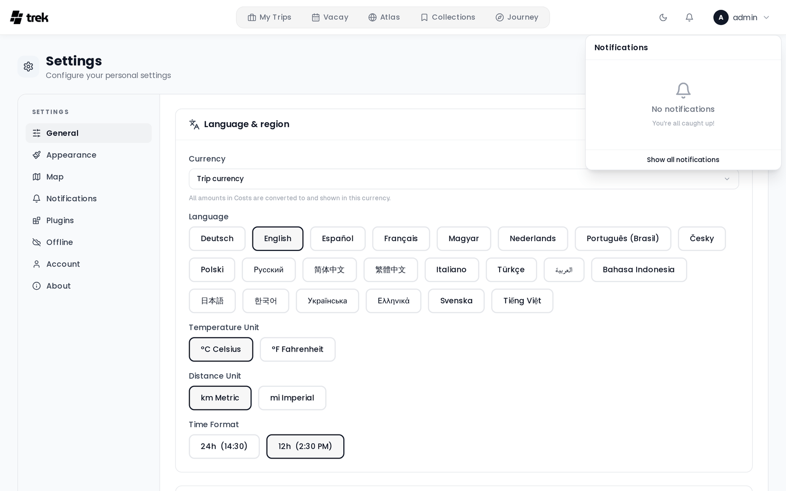
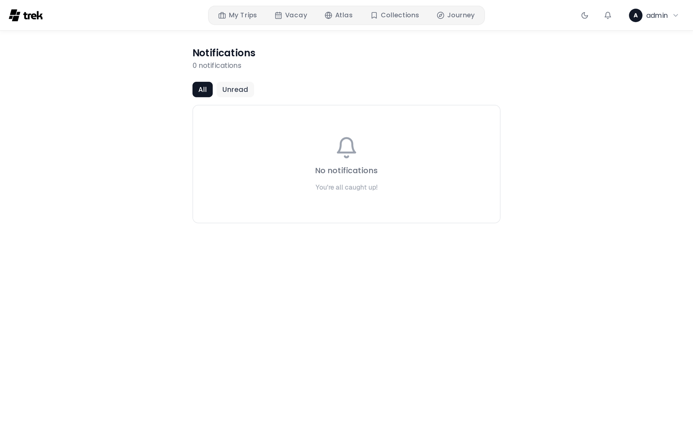

# Notifications

The Notifications tab (Settings → Notifications) lets you choose which events notify you and through which channels. Each toggle saves immediately.

## Notification channels

TREK ships five delivery channels, and a plugin can add more. Which channels appear depends on what the admin has enabled server-side.

| Channel | Description |
|---------|-------------|
| **In-app** | Bell icon in the navigation bar. Always available. Delivered in real time via WebSocket. |
| **Email** | Delivered to your account email. Requires the admin to configure SMTP. |
| **Webhook** | TREK POSTs a JSON payload to a URL you specify. Discord and Slack webhook URLs are auto-detected and receive a natively formatted payload. |
| **ntfy** | Push notifications via [ntfy.sh](https://ntfy.sh) or a self-hosted ntfy server. |
| **Push** | Web Push: notifications from the browser, or the Home Screen app, on each device you turn it on for, even while TREK is closed. See [Web Push](#web-push). |

### Plugin channels

A plugin can register an **additional channel** — Gotify, Pushover, Telegram, anything that
takes a message — by implementing the `notificationChannel` hook. See
[Plugin-Development](Plugin-Development#notification-channels).

Once the admin installs the plugin and switches its channel on, it appears as a new column in
the preferences matrix beside Email and In-App, and behaves like any other channel: each user
supplies their own credentials (in the plugin's own settings) and picks per-event which
notifications they want on it.

Two things are true of plugin channels specifically:

- **They are user-scoped.** Admin-only events (like `version_available`) always go out over the
  built-in admin channels, never a plugin's.
- **The plugin never sees your trips.** The notification is rendered by TREK — in your language,
  with the deep link already built — before the plugin is handed it. The plugin gets that message
  and your own credentials for its service, and nothing else.

## Notification events

The following events are configurable in user settings:

| Event | Description |
|-------|-------------|
| `trip_invite` | Someone invited you to a trip |
| `booking_change` | A booking was added, updated, or removed in a trip you're part of |
| `trip_reminder` | Reminder before a trip starts |
| `todo_due` | A to-do assigned to you, or in a trip you're part of, is due soon |
| `vacay_invite` | You were invited to fuse vacation plans |
| `vacay_share` | Someone shared their vacation calendar with you (view only) |
| `collection_invite` | Someone invited you to share a collection |
| `photos_shared` | Photos were shared with a trip |
| `collab_message` | A new message in a collaborative trip |
| `packing_tagged` | You were assigned to a packing category in a trip |
| `plugin_notification` | An installed plugin sent you a notification (only plugins granted the `notify:send` capability can do this) |

All user-facing events support all five channels (in-app, email, webhook, ntfy, push). A dash in the matrix means that channel/event combination is not implemented.

### Admin-only events

The following events are shown in the admin panel (Admin → Notifications) and are not configurable per user:

| Event | Description | Channels |
|-------|-------------|---------|
| `version_available` | A new TREK version is available | in-app, email, webhook, ntfy |
| `replica_failure` | A write to a storage replica failed (repeats within the hour are suppressed and counted) | in-app, email, webhook, ntfy |

Admin-only events are never sent as Web Push, so the admin matrix has no Push column.

### In-app-only events

The following event is fired automatically and can only be delivered in-app — it appears in the preferences matrix with an In-app toggle and a dash in every other column:

| Event | Description | Channels |
|-------|-------------|---------|
| `synology_session_cleared` | Your Synology account or URL changed, clearing your Photos session | in-app only |

## Configuring the matrix

The preferences panel shows a grid of events × channels. Toggle each intersection independently. Changes are saved automatically.

## Webhook configuration

Enter a URL that TREK will POST to when a notification fires. Once saved, the URL is displayed as `••••••••`. Use the **Test** button to send a test payload to the saved URL.

TREK auto-detects the webhook destination and adjusts the payload format:

- **Discord** (`discord.com/api/webhooks/…`) — sends a rich embed with title, description, and a timestamp.
- **Slack** (`hooks.slack.com/…`) — sends a formatted Slack message block.
- **Generic** — sends a plain JSON object with `event`, `title`, `body`, `tripName`, `link`, `timestamp`, and `source` (`"TREK"`) fields.

## ntfy configuration

Enter your ntfy **topic** and optionally a custom **server URL** (defaults to the server-wide ntfy server set by the admin) and an **access token** for private topics. The token is stored encrypted and displayed as `••••••••` after saving. Use the **Test** button to verify delivery.

## Web Push

Web Push shows TREK notifications on your phone or computer the way other web apps do, even while TREK is closed. No
app store and no third-party account are involved: your TREK server hands each message to the push service your
browser uses (Google for Chrome and most Chromium browsers, Mozilla for Firefox, Apple for Safari and iOS, Microsoft
for Edge on Windows), encrypted so that only your browser can read it.

### Turning it on

1. **The admin** switches the **Web Push** channel on in **Admin → Notifications**, like email or ntfy.
2. **Each user, on each device**, opens **Settings → Notifications** and presses **Turn on for this device** in the
   **Push notifications on this device** card. The browser asks for permission once. Every phone, tablet or computer
   is registered on its own, so repeat this wherever you want notifications. **Turn off for this device**, or logging
   out, removes only that device; after logging back in, turn it on there again.
3. The **Push** column of the matrix decides which events arrive. Every event starts switched on, and the column
   applies to all of your devices at once.

**Send test** in the same card sends a short test message to every device you turned push on for.

### Requirements

- TREK has to be opened over **HTTPS**. Browsers only offer push to secure pages (a plain `http://` address works on
  `localhost` only); on any other `http://` address the card says that push needs HTTPS.
- On **iPhone and iPad** (iOS and iPadOS 16.4 or later) push only works in the Home Screen app: open TREK in Safari,
  choose **Share → Add to Home Screen**, then open TREK from the new icon and turn push on there.
- If notifications are blocked for TREK in the browser or the system settings, allow them there first.
- The browser has to use one of the push services named above. TREK refuses a subscription to any other push service,
  so turning push on fails in such a browser.

### What arrives

The same title and text as the email or ntfy message, in your language (a very long text is shortened); tapping it
opens the trip or page it is about. Chat messages are the one exception to "one notification each": a newer message in
the same trip replaces the older one and still alerts you, so a busy chat shows up as one notification that keeps
updating. Everything else (to-dos, bookings, invites, plugin notices) arrives as its own notification and never
replaces another one. Notifications you also receive in-app stay in the in-app notification center.

A device that is switched off or offline receives what was sent in the last 24 hours once it is back online; the push
service drops anything older.

A device the push service reports as gone (HTTP 404 or 410: browser uninstalled, site data cleared, subscription
expired) is removed at once, and turning push on again there registers it anew. A refusal (HTTP 403) is not taken as
proof: Apple also answers it when it rejects the server's signature (`BadJwtToken`), which is a server problem, not the
device's. TREK logs the push service's reason every time and removes the device only when a 403 is its third failed
send in a row or later. A successful send in between starts the count over, and so does registering the device again.
Other failures (a timeout, an error at the push service) are logged and counted, but never remove a device on their
own.

Changing your password, resetting it, or an admin setting a new one for you removes every push device of your account
on the server, along with your other sessions. A device where push was on registers again on its own as soon as you are
signed in there: right away on the device you changed the password on, after the next sign-in everywhere else.

### Server keys

Push messages are signed with a VAPID key pair. Unless `VAPID_PUBLIC_KEY` and `VAPID_PRIVATE_KEY` provide one, TREK
generates a pair on first start and keeps it in the database, the private half encrypted with `ENCRYPTION_KEY`, so it
survives backups and restores and there is nothing to set up. A new pair is only ever generated while neither half is
stored and neither variable is set. Operators who want to bring their own pair can set the variables; see
[Environment-Variables](Environment-Variables#web-push). Every subscription belongs to the key it was made with: after
the key pair changes, each device has to subscribe again. TREK does that on its own the next time it is opened on the
device, where the browser allows it; elsewhere, turn push on again.

Each message also names a contact for the push services: `VAPID_SUBJECT` when it is set, otherwise the instance's
`APP_URL` when it is an `https://` address other than `localhost`, otherwise the TREK project page
(`https://github.com/liketrek/TREK`). `ALLOWED_ORIGINS` never stands in for `APP_URL` here, and no email address is sent
unless you put one in `VAPID_SUBJECT`.

TREK never overwrites a stored pair it cannot use. When the private key does not decrypt with the current
`ENCRYPTION_KEY` (after a restore under a different key, for example), push is off until TREK runs with the original
key again: the server log says why, the Push card and column disappear from **Settings → Notifications** and nothing
is sent, but every device stays registered and receives again afterwards without anyone doing anything. The same
holds when the two stored halves do not belong together or one of them is missing; only starting over with a new pair
fixes that (see [Environment-Variables](Environment-Variables#web-push)). Push is off the same way while
`VAPID_PUBLIC_KEY` and `VAPID_PRIVATE_KEY` do not belong together or only one of them is set: TREK does not fall back
on a pair stored in the database, which would drop every device registered with your key, and every device receives
again once both variables hold your pair. See also [Encryption-Key-Rotation](Encryption-Key-Rotation).

## In-app notification center

The bell icon in the navigation bar shows your unread notification count. Click it to open the notification panel where you can:

- Mark individual items read or unread.
- Mark all notifications read at once.
- Delete individual notifications or clear all at once.
- Answer **boolean notifications**, which ask a yes-or-no question, with their two buttons directly in the panel.

In-app notifications are pushed in real time via WebSocket so the badge and panel update without a page refresh.

## Per-trip preferences

Notification preferences are configured globally in Settings → Notifications. There are no per-trip overrides — the same toggle applies across all trips.

## See also

- [Environment-Variables](Environment-Variables)
- [User-Settings](User-Settings)
