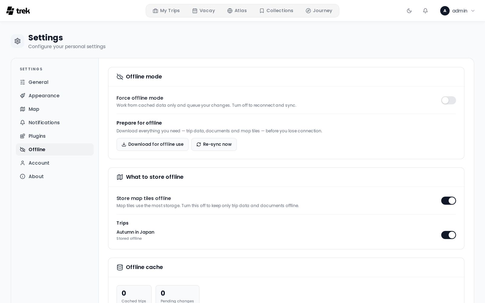

# Offline Mode and PWA

TREK can be installed as a Progressive Web App (PWA) and used without an internet connection for previously synced trips.

## Install as an app (PWA)

TREK must be served over **HTTPS** — the install prompt does not appear on plain HTTP.

**iOS (Safari):**
1. Open TREK in Safari.
2. Tap the Share button.
3. Select **Add to Home Screen**.

**Android (Chrome / Edge):**
1. Open TREK in the browser.
2. Tap the browser menu.
3. Select **Install app** or **Add to Home Screen**.

Once installed, TREK launches in **standalone** mode (fullscreen, no browser UI) using the TREK icon.

The installed app starts at the app root, so the **Start page** setting decides what you see when you tap the icon: the dashboard, or straight into your active trip on a tab of your choice. See [Display-Settings](Display-Settings).

### The app reopens where it was

Phones close an installed app in the background soon after you switch away from it, for example to a map app for directions. When you open TREK again within six hours, the installed app goes back to where you were instead of the start page: the same trip, on the same tab and the same day of the plan, or the Journey, Collections, Vacay, Atlas or Files page you had open. After six hours, or after logging out, it starts at the start page again. This only happens in the installed app; in a browser tab, opening the address starts as usual.

### Push notifications

Web Push shows TREK notifications on a phone or computer even while TREK is closed. It needs two things from the setup above:

- **HTTPS everywhere.** Browsers only allow push on a secure origin. On plain `http://` (for example a LAN address) the card under **Settings → Notifications** says that push needs HTTPS.
- **The installed app on iPhone and iPad.** iOS and iPadOS 16.4 or later deliver push only to TREK added to the Home Screen. Install it as described above, open it from the Home Screen icon, and switch push on there. In a Safari tab the card asks you to add TREK to the Home Screen first.

Push is switched on per device: each phone, tablet or browser you want to receive notifications on needs its own **Turn on for this device**. Logging out switches it off for that device. The admin has to enable the Web Push channel first, and which events arrive follows the **Push** column. See [Notifications](Notifications).

## What works offline

TREK uses Workbox service-worker caching plus an IndexedDB database (Dexie) for structured trip data. The following content is available offline after the first sync:

**Service-worker cache (Workbox)**

| Content | Cache name | Strategy | Duration | Max entries |
|---------|------------|----------|----------|-------------|
| Raster map tiles (OpenStreetMap, CartoDB, custom XYZ) | `map-tiles` | CacheFirst | 30 days | 12 288 |
| Mapbox GL and OpenFreeMap style documents | `gl-map-styles` | NetworkFirst (5 s timeout) | 30 days | 20 |
| Mapbox GL glyphs, sprites and vector tiles | `mapbox-tiles` | StaleWhileRevalidate | 30 days | 3 000 |
| OpenFreeMap glyphs, sprites and vector tiles | `gl-map-offline` | CacheFirst | 90 days | 6 000 |
| Cover images and avatars (`/uploads/covers`, `/uploads/avatars`) | `user-uploads` | CacheFirst | 7 days | 300 |
| App shell and every page of the app (HTML / JS / CSS) | precache | Precached | Until next deploy | — |

> **Note:** API responses are **never** stored in the service-worker cache. Workbox keys its entries by URL and cannot vary them on the session cookie, so on a shared device one account's cached data could be served to the next. Offline reads come from the per-user IndexedDB cache described below instead.

> **Note:** The precache covers every page, not just the one you happen to open first. A page you have never visited still works after you lose connectivity — at the cost of a larger initial install.

**IndexedDB (Dexie) — structured trip data**

On login, when the browser comes back online, and when you lift **Force offline mode**, TREK runs a background sync that writes full trip bundles into IndexedDB — you can also start one by hand with **Re-sync now**, with **Download for offline use** for a progress-tracked run, or by re-enabling a trip's offline toggle:

- Trips, days, places, packing items, to-dos, budget items, reservations, accommodations, trip members, tags, and categories.
- With the Tours addon on, each trip's tours, so a tour still reads as a tour offline. A tour you opened in the route editor while online keeps its control points, so it opens there offline too.
- File attachments that are neither photos nor videos (PDFs, documents, etc.) are downloaded and stored as blobs in IndexedDB. Videos are deliberately skipped — a single clip can be hundreds of megabytes and would evict the trip's real documents.
- Map tiles are pre-fetched into the service-worker `map-tiles` cache for zoom levels 0 to 16 across each trip's bounding box, stopping at the zoom level that would push the total past 12 288 tiles (roughly 180 MB). If the browser refused persistent storage, prefetching stops at zoom 12 so the app shell cannot be evicted.
- The places around each trip, up to 3000 from the [TREK Places API](TREK-Places-API) in one request (about a megabyte for a city), so place search and suggestions still answer offline. They are downloaded whether or not **Store map tiles offline** is on, refreshed only when the trip's area changes, and removed with the trip. See [Searching offline](Places-and-Search#searching-offline).

> **Note:** A WebSocket reconnect does *not* run this sync. It replays your queued changes and then re-reads the trip you currently have open — days, places, packing items, to-dos, budget items, reservations and files — which refreshes that one trip's cached rows. It never re-downloads the bundles for your other trips, the file blobs or the map tiles; skipping the full sync there is deliberate, so a dropped socket on an otherwise online device doesn't run into the server's rate limiter.

**Sync scope and eviction**

- Ongoing and future trips are cached (trips whose `end_date` is today or later, or has no end date).
- Trips that ended more than 7 days ago are automatically evicted from IndexedDB on the next sync.
- A trip that was deleted, or that you were removed from, is cleared from the device on the next sync. Archiving a trip does not count as either: an archived trip stays on the device as it was last synced, until the 7-day rule above applies to it or you switch it off under what to store offline.
- Evicting or clearing a trip never throws away a change that has not reached the server. Queued changes and conflicts stay, and failed changes stay under **Failed changes** in Settings → Offline until you try them again or discard them.
- A finished trip is cached too when you switch it on yourself under **Settings → Offline → What to store offline**, and it is then kept regardless of its dates.

## Settings → Offline

The **Offline** tab gives you control over what is stored on this device and lets you go offline deliberately.

### Offline mode

- **Force offline mode** — a switch that first downloads everything you need (see *Prepare for offline* below) and then routes the whole app to the local cache, queueing every change you make. Flip it back off to reconnect: queued changes are replayed and the cache is refreshed. The override is remembered across app restarts, so a session forced offline before a flight stays offline when the PWA relaunches.
- **Prepare for offline** → **Download for offline use** — a one-tap, progress-tracked download of trip data, documents and map tiles for every trip you keep offline. Unlike a background sync it *waits* for the downloads to finish, so the completion state means you really have everything.
- **Re-sync now** — refreshes the cache from the server. Disabled while offline.

### What to store offline

- **Store map tiles offline** — map tiles use the most storage by far. Turn this off to keep only trip data and documents on the device; the pre-downloaded tile cache is cleared immediately.
- **Trips**: each trip has its own switch, with **Stored offline** or **Not stored** under its name. Turning a trip off evicts its cached read data from the device (your unsynced edits are kept and still sync). A finished trip is marked *Finished. Only stored if you switch it on.*: it is left out by default, and switching it on keeps it on the device.

### Sync conflicts

If a change you made offline collides with a newer change on the server, it is surfaced as a **conflict** instead of silently overwriting anything. The conflict list lets you **keep mine** or **keep theirs** per item. A default rule (*Ask me each time* / *Always keep my version* / *Always keep the server version*) is configurable under **When a conflict happens**. Conflict detection covers places and packing items.

### Stats & cache

The stats panel shows cached trips, pending changes, conflicts and failed changes. A change the server keeps refusing with a server error is retried with growing gaps (from 30 seconds up to about two hours) and only holds back the other changes of its own trip; after eight attempts it counts as failed. Later changes you make on this device to the same item (the same place, packing item, visit, tour or driving settings) wait behind a failed change or an open conflict instead of overtaking it, so they reach the server in the order you made them; for visits, tours and driving settings that includes changes you make while online. Places and packing items remember which version you edited, so trying a failed change again never overwrites a newer version saved in the meantime, on this device or by another member of the trip: it turns into a conflict for you to decide. Visits, tours and driving settings carry no such version, so trying again overwrites what another member changed on the same item in the meantime, the same as any change sent after being offline. Failed changes come with **Try again** and **Discard**: trying again sends them first and then the changes that waited behind them; discarding keeps the server's version, sends the changes that waited, and the next sync puts the server's version back on the device. **Clear cache** removes all offline data from IndexedDB after you confirm it in TREK's dialog (you can re-sync any time while online). Each cached trip entry shows its date range, place/file count and last successful sync.

Changes waiting to sync remember which version of TREK queued them. After an update, a browser tab that still runs the previous version leaves changes queued by the newer version alone instead of sending them in a form it does not know: they stay under pending changes, together with the later changes to the same item, until a tab on the current version (reload the page) sends them. Nothing is lost. The same applies after an install is rolled back, but only to a release that already has this check; an older release sends such changes anyway. After a rollback no tab on the newer version comes back, so these changes stay under pending changes and keep holding back the later changes to the same item, including online changes to visits, tours and driving settings. They cannot be tried again or discarded one by one: **Clear cache** is the way out, and it also drops every other change that has not synced yet.

## Limitations

- Offline **editing** is supported for places and packing items (with conflict detection), plus a visit's start and end time, its **End the day here** flag and the road trip **Driving settings** (queued, without conflict detection). A tour can be saved or edited offline as well (queued, without conflict detection), but drawing a new route needs a connection, since routing and elevation come from the routing server, and the GPX import is an upload. Other entities — budget, to-dos, reservations, days — require connectivity to edit; while forced offline those edits still go to the live server when a connection is actually present.
- A change you made offline that **deletes** an item wins over a concurrent server edit of that same item ("delete wins"); only edit-vs-edit conflicts are surfaced for resolution.
- The conflict token has one-second resolution, so two edits to the same field within the same second can't be told apart and fall back to last-write-wins (only relevant to sub-second races; normal offline windows are unaffected).
- Creating a trip requires connectivity. Trip creation is not queued, so a new trip cannot be started while offline.
- Photo uploads require connectivity. Photo and video attachments are not pre-cached; every other file attachment is pre-cached automatically during sync.
- Real-time collaboration features require an active WebSocket connection.
- The Leaflet basemap is pre-downloaded, whether it is an OpenFreeMap vector style (style, sprite, glyphs and the vector tiles for the trip's area) or a raster template. Mapbox GL tiles are not pre-downloaded. With map-tile storage off, individually viewed tiles may still be cached opportunistically by the service worker.

## See also

- [User-Settings](User-Settings)
- [Display-Settings](Display-Settings)
- [Notifications](Notifications)
