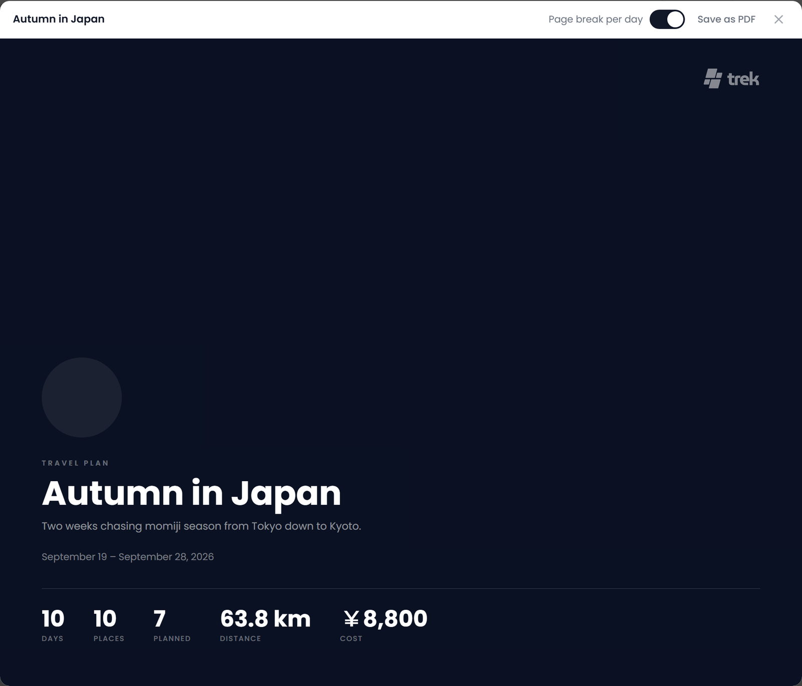

# PDF Export

TREK turns a trip into a printable **Trip Plan PDF**: a cover, a map of the whole route, and a page for every day. The document is built in your browser and saved through the browser's own print dialog; the server does no PDF work. Journey entries have their own designer for printing, **TREK Studio** (see [below](#journey-photo-books)).

---

## Trip Plan PDF

### How to generate

1. In the trip planner, click **Export** at the top of the days column. The Export dialog opens with three groups: **Document**, **Calendar** and **Maps & GPS**.
2. Under **Document**, click **PDF** (*Export day plan as PDF*). The row shows a spinner while the document is put together, then the dialog closes and a preview opens.
3. In the preview, click **Save as PDF**. Your browser's print dialog opens; pick *Save as PDF* as the destination, or send it to a printer.

### My plan as PDF

When some activities or bookings of the trip name who takes part (participants on a day plan entry, travelers on a booking), the **Document** group also offers **My plan as PDF** (*Only the activities and bookings you take part in*). It builds the same document with only your part of the plan: an entry or booking that names its people stays only when it names you, and one that names nobody belongs to everyone and stays. The row is offered on the phone's export sheet as well.

The other groups of the same dialog are covered elsewhere: **Calendar** in [Calendar-Feeds](Calendar-Feeds), and the GPX downloads under **Maps & GPS** (*Whole trip*, *Places only*, *Days as routes*) in [Map-Features](Map-Features#exporting-a-trip-as-gpx).

### Cover page

- The trip's cover image, faded into the background and repeated in a round badge, when the trip has one
- The trip title and description
- The date range, from the first day to the last
- Figures in a row:
  - **Days**: the number of days in the trip
  - **Places**: every place in the trip's place list
  - **Planned**: how many different places are assigned to at least one day
  - **Distance**: the routed distance of the whole trip, in your own unit; left out when no day has a route
  - **Cost**: with the Costs addon on, the expenses of the trip from Costs, each counted once (an expense linked to a place lands on that place's day); without it, the price of each planned place, once. In the trip's currency, left out when it is zero. Mixed currencies are converted at current rates and marked with "≈"; when a rate is missing, the figure is shown per currency instead

### Route overview

After the cover comes one map of the whole trip, headed **Route overview**: every planned day's route in its own colour, the stops marked, and the total distance next to the heading. Under the map each day is named with the distance it covers, so the colours on the map and the days in the plan match up. The same total appears as **Distance** on the cover.

The background is the same basemap the planner uses, drawn once during the export and placed in the document as a picture, so the map is already there when the print dialog opens. It follows your own map style, and the default (OpenFreeMap) needs no account or key. A scale bar sits in a corner.

If that basemap cannot be drawn (no WebGL in the browser, no connection, or a style that will not load) the map falls back to country outlines that ship with the app and need neither network nor key. That fallback is made for a route across a region: a trip inside one city becomes a route on plain ground, with the scale bar giving the sense of size.

Routes come from the same router the planner uses, and the export does not wait for it forever. Legs that answer in time are drawn along the real roads; anything slower stays a straight line between its stops. A trip whose routing is unavailable altogether still prints: the map shows straight lines, and the distances are left out rather than printed as zero. A trip without any planned day prints without a map.

### Day pages

Each day starts on a new page, unless you turn off **Page break per day**, with a dark header: the day number, its title, the date and the day's cost, counted the same way as the **Cost** figure on the cover.

**Page break per day** is a switch in the preview's header, next to **Save as PDF**. It is on by default. Turn it off and the days run on one after another, which saves paper on a trip of short days that would otherwise print a sheet for every handful of lines. Your choice is remembered in that browser for the next export.

**Transport notes** sits next to it when a flight, train, rental or other transport of the trip has notes. On by default, it prints those notes under the transport in the day plan; turn it off to leave them out. This choice is remembered in the browser too.

Under the header:

- **The stay**, when an accommodation covers that day: *Check-in* on the first day, *Check-out* on the last, *Accommodation* on the nights in between, with the time, the place name, the address, the notes, and the booking code on the check-in day only
- **The day's entries**, in the order of the day plan:
  - **Places**: a photo (or a coloured category icon without one), a numbered badge, the name, the category, the address, the description, the time, the price and the notes
  - **Notes**: the icon, the text and the time, if set
  - **Bookings**: the type icon, the title, the time, the notes of a transport (unless **Transport notes** is off), the details that fit the type (airline, flight number and route for a flight; train number, platform and seat for a train; party size for a restaurant; the venue for an event; the operator for a tour), the location and the booking code

### Footer

Every printed page carries a small "made with TREK" logo at the bottom.

### Font

Poppins, loaded from Google Fonts while the document renders.

### Plugin sections

Installed plugins can add sections of their own to the Trip Plan PDF through the `pdfSectionProvider` hook. A plugin returns plain text (a title, paragraphs, and an optional simple table with headers and rows) and TREK escapes it and lays it out. These sections are text only and come on top of the plan: a plugin never draws into the document, and one that fails or is too slow simply adds nothing.

> **Plugins:** needs the `hook:pdf-section-provider` permission. See [Plugin-Development](Plugin-Development) for the hook contract.

---

## Journey photo books

The Travel Journal has no fixed PDF template. Open a journey and click **Studio** in the journal header (the book icon in the top bar on phones) to open **TREK Studio**, the photo book designer. See [Journey-Journal](Journey-Journal#trek-studio).

Studio lays the journey out as spreads you can edit, rather than a fixed page template: five page presets (210 mm and 300 mm square, A4 landscape, A4 portrait, A5 landscape) or a custom size between 60 and 500 mm, and seven bundled font families.

Printing works the same way as for the Trip Plan PDF, through the browser's print dialog, so nothing is rendered on the server. A browser writes no TrimBox or BleedBox, so the sheets can carry crop marks for a print shop instead. **Single pages** or **Spreads**, and crop marks on or off, are chosen in Studio's export panel.

---

## How rendering works

The Trip Plan PDF and Studio's print view work the same way: the HTML document is written into a sandboxed `<iframe>` through `srcdoc`, and `iframe.contentWindow.print()` opens the browser's print dialog. There is no PDF generation on the server; the file is saved through the browser's built-in *Save as PDF* destination.

---

## See also

- [Calendar-Feeds](Calendar-Feeds)
- [Day-Plans-and-Notes](Day-Plans-and-Notes)
- [Journey-Journal](Journey-Journal)
- [Trip-Planner-Overview](Trip-Planner-Overview)
