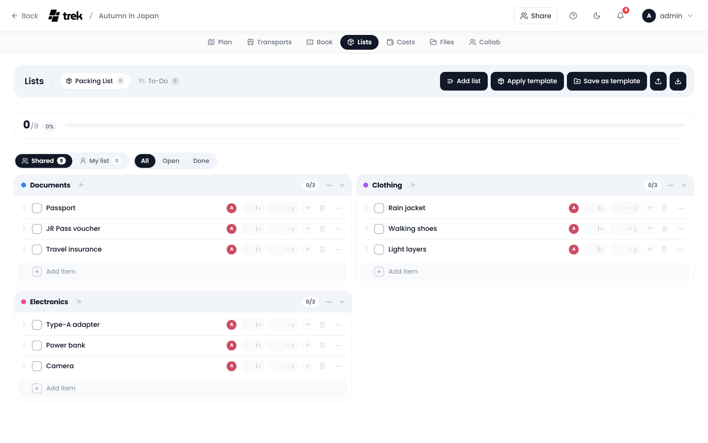

# Packing Lists

Build the trip's packing list together: items grouped into lists, ticked off as they go into the bag, shared with the group or kept to yourself, and, if you like, weighed per bag.



## Where to find it

Open the **Lists** tab inside the trip planner and pick **Packing List** in its bar (the other entry is **To-Do**, see [Todos-and-Tasks](Todos-and-Tasks)). The tab is only there when the Lists addon is enabled.

> **Admin:** Enable the **Lists** addon (its internal id is `packing`, and it covers both the packing list and the to-dos) and, if you want it, its nested **Bag Tracking** toggle in [Admin-Addons](Admin-Addons).

The **Lists bar** at the top holds, on the right, what applies to the whole packing list:

- **Add list** creates a new list (see [Categories](#categories)).
- **Apply template** adds a saved template (see [Templates](#templates)); it only appears when templates exist.
- **Save as template** saves this list as a template; instance admins only, and only when the list has items.
- **Export** (arrow up) prints or saves the list (see [Printing and exporting](#printing-and-exporting)).
- **Import** (arrow down) pastes or loads a whole list (see [Importing a list](#importing-a-list)).

On a narrow screen the buttons keep their icons and drop their names.

## Progress bar

A card under the bar shows how many items are packed out of all of them, the share as a percentage and a bar that fills in your accent colour. When everything is ticked, **All packed!** replaces the count and the bar turns green. The card is hidden on very small screens.

Once something is ticked, a red **Remove N checked** button sits at the right end of the card and deletes every ticked item after one confirmation.

## Filters

Under the progress card, beside the Shared and My list switch (see [The two views](#the-two-views)), three buttons narrow what is shown:

- **All**: every item, ticked or not.
- **Open**: what still has to be packed.
- **Done**: what is already packed.

On the desktop, **A to Z** at the far end of the same row shows each list's items in name order, so you can check at a glance whether something is already on the list. Click it again to go back to the manual order. TREK remembers the choice in this browser.

## Categories

Items are grouped into categories, each a card with a coloured dot taken from a palette of ten. A new packing list starts empty and reads *Packing list is empty* until you add something: create lists and items by hand, apply a saved template (see [Templates](#templates)), or paste a whole list in at once (see [Importing a list](#importing-a-list)).

The app calls these groups **lists**: **Add list** in the Lists bar asks for the name in a small dialog (*List name (e.g. Clothing)*), moving an item between them is **Move to List**, and removing one is **Delete List**. The REST API and this page call them categories.

Each list's head has the name, a count of packed and total items (green once all are packed), a toggle to fold it, and a **⋯** menu with:

- **Rename**: rename the list.
- **Check All**: tick every item in it.
- **Uncheck All**: untick every item in it.
- **Delete List**: delete the list and all its items. It does not ask first.

**Rename** and **Delete List** need the `packing_edit` permission; **Check All** and **Uncheck All** are always there.

### Assigning members to a category

The dashed person button in a list's head opens the trip members; click one to assign or unassign them. Assigned members show as round initials in the head, with the name on hover, and a click on one takes that member off again. Assigned members get a packing notification. See [Notifications](Notifications).

## Items

Each item row holds:

- a **checkbox** to mark it packed,
- the **name**; click it to rename the item, ticked or not,
- who brings it, as a small avatar with the full name as its tooltip,
- the **quantity** and, with bag tracking on, the **weight** in grams, as small badges you click to type into,
- with bag tracking on, the **bag** circle, which opens the bag picker. The picker stays open until you click beside it.

An item with a quantity above one also shows a packed counter (for example **3/10**) with a minus and a plus beside it: count the pieces in as they go into the bag. Once the count reaches the quantity, the item ticks itself off.

At the end of the row sit the **delete** bin and a **⋯** menu with **Move to List**, **Sharing**, **Rename** and **Delete**. Whatever a row does not use (a quantity of one, an empty weight, no bag, the bin and the menu) stays dimmed until you point at the row or tab into it, so the columns stay in line from row to row.

**Add item** at the foot of each list opens a field shaped like the next row: Enter adds the item and keeps the field open for the next one, Esc closes it. A whole list comes in at once with **Import** (below).

On phones the row keeps the name and reduces everything else: sharing shows as an icon rather than a sentence, a weight nobody entered prints nothing, and edit and delete sit behind the **⋯** button at the end of the row while the list is in edit mode.

## Importing a list

**Import** (arrow down) in the Lists bar opens the **Import Packing List** dialog. Paste the list into the box, or click **Load CSV/TXT/MD** at its foot to read a file, then click **Import N**, which counts the items it found. One item per line:

```
Category, Name, Weight in g (optional), Bag (optional), checked/unchecked (optional)
```

```
Toiletries, Toothbrush
Clothing, T-Shirts, 200
Documents, Passport, , Carry-on
Electronics, Charger, 50, Suitcase, checked
```

Commas, semicolons and tabs all work as separators, and a quoted value keeps its commas (`"Shirt, blue"`). A line with a single value is taken as just a name. A line without a category lands in **Other**, and a bag name that does not exist yet is created for you. `3x` in front of a name sets the quantity (`3x Socks`). Imported items are added to the list; nothing already on it is removed.

A Markdown list is read as well, the way Obsidian, Notion, GitHub and most notes apps write one. Every heading names the category of the items under it, `- [ ]` and `- [x]` become items (the second one already packed), plain bullets and numbered items work too, and a weight in brackets at the end of a line is picked up:

```
## Clothing
- [ ] 3x T-Shirts (200 g)
- [x] Rain jacket
```

Anything that is neither a heading nor a list item, a note or a blank line, is left out.

Import loads weights and bag assignments in bulk, and so does applying a template (see [Templates](#templates)). It needs the `packing_edit` permission.

## Printing and exporting

**Export** (arrow up) in the Lists bar takes the list along. It covers the view that is open, **Shared** or **My list**, and is there for everyone who can see the list, not only those who can edit it. On phones the same three entries are in the packing list's **⋯** menu.

- **Print or save as PDF** opens a preview of the list as a page: the trip and its dates in a dark block on top with the number of items, how many are packed, the total weight and the bags, then one card per category with a box to tick for every item, its quantity, weight and bag, and the bags with what each holds at the end. **Print or save as PDF** under the preview opens the browser's print dialog, where **Save as PDF** makes the PDF. The page is laid out for A4, in two columns, and a category never breaks across a column or a page.
- **Markdown checklist (.md)** saves the list as a Markdown checklist: a heading per category and a `- [ ]` or `- [x]` line per item, with its quantity and its weight per piece. It keeps everything but the bags.
- **CSV for import (.csv)** saves the list in exactly the format the import reads, bags included. Kept on your computer, it works as a packing template of your own that needs no admin: import it into the next trip.

Both files come back in through the import unchanged.

## Sharing packing items

Every packing item has a sharing tier that decides who sees it and who is bringing it. By default everything sits in the shared group pool; the other tiers are opt-in per item.

### The two views

Two pills at the top of the list switch what you are looking at:

- **Shared**: the group pool, the items everyone on the trip can see.
- **My list**: your own items, meaning your personal items, things you have been asked to bring, and things you shared with specific people.

Each pill shows a count of the items in it.

### The three tiers

Open **Sharing** in an item's **⋯** menu to move it between tiers:

- **Shared**: *In the group pool, visible to everyone.* This is where every item starts.
- **Personal**: *Private, only you can see it.*
- **Shared with…**: pick specific trip members below the two tier options. The item then shows only on your list and on theirs. (If you are the only one on the trip, this reads *No one else on this trip yet*.)

New items take the view you add them in: an item added in **My list** is Personal, one added in **Shared** goes to the group pool. The same goes for a template applied while **My list** is open. To share an item with specific people, add it first, then open its Sharing control and choose them.

In **My list**, a list whose items you have all shared with the same people passes that on: a new item added to it is shared with those people right away. If the items in the list differ, or one of them is kept to yourself, the new item stays Personal.

Only the item's owner (the person bringing it) can change its sharing. Someone you shared an item *with* sees it on their **My list** with a **by {name}** badge and can tick it off, but does not manage who else it is shared with.

### Who's bringing what

Every item in the **Shared** pool shows who is bringing it. For an item someone else added, the other members find two entries in its **⋯** menu instead of Sharing:

- **I can bring that too**: pledge to bring it as well. The item's badge then shows a **+1** next to the original bringer. Click it again (*I'm not bringing it*) to withdraw.
- **Copy to my list**: copy the item onto your own personal list as a separate private item, leaving the shared one untouched.

> Items created before this feature have no assigned bringer, so they show no "brought by" badge until someone edits their sharing.

> **Note:** this per-item sharing is separate from assigning **members to a category** (above). Category assignments only send a packing notification; they do not change who can see an item.

All of this is covered by the `packing_edit` permission; there is no extra addon or admin toggle.

## Bag tracking

Bag tracking is only there when an admin has turned it on.

> **Admin:** Turn on Bag Tracking in [Admin-Addons](Admin-Addons).

With it on, a **Bags** card sits to the right of the lists on wide screens; on narrower ones the **Bags** button above the progress card opens it as a sheet. Each bag shows:

- its name and colour dot,
- the total weight, and a weight limit if you set one. Click **Set limit** next to the weight (or the limit itself, to change it) and type the limit in kilograms, the way airlines state it; TREK stores it in grams. Clearing the field removes the limit again,
- a fill bar, measured against the limit when there is one; without one the bag is scaled against the heaviest bag, so bags stay comparable,
- the avatars of the members assigned to the bag, beside its name, with a dashed **+** to pick them,
- the item count, under the fill bar.

Below the bags, **Unassigned** counts the items that are in no bag and their weight. The foot of the card then shows:

- **Per person**: what each member carries, from the bags they are assigned to. A bag shared by several people is split evenly between them; the weight is then underlined and says so on hover.
- **Total weight**: the sum of everything, with **Packed** under it, the weight already packed (for an item with a packed counter, only the pieces counted in), and a thin bar for the share.

To use bags:

1. Click **+ Bags** in the head of the Bags card, or **Add bag** in an item's bag picker, and type a name. The colour is assigned automatically from a fixed palette; there is no colour picker. A click beside the field closes it again.
2. Put items into a bag with the bag picker on each item row.
3. Assign members to a bag with the dashed **+** beside its name; the picker closes on a click beside it.

## Templates

Packing lists can be saved and reused across trips:

- **Save as template** (instance admins only): click **Save as template** in the Lists bar and name the template in the dialog that opens. It saves the current list's items and categories with each item's weight, quantity and bag, and only shows when the list has items.
- **Apply template**: when templates exist, **Apply template** in the Lists bar opens them with their item counts. Picking one adds its items to the list in the view that is open, with their weight, quantity and bag, without removing anything already there. A bag the trip does not have yet is created.

Templates are managed by admins in [Admin-Packing-Templates](Admin-Packing-Templates). See also [Packing-Templates](Packing-Templates).

## Permissions

Every write needs the `packing_edit` permission. Saving a list as a template also needs an instance admin account; applying a template does not.

## See also

- [Todos-and-Tasks](Todos-and-Tasks)
- [Packing-Templates](Packing-Templates)
- [Admin-Addons](Admin-Addons)
- [Notifications](Notifications)
- [Trip-Planner-Overview](Trip-Planner-Overview)
