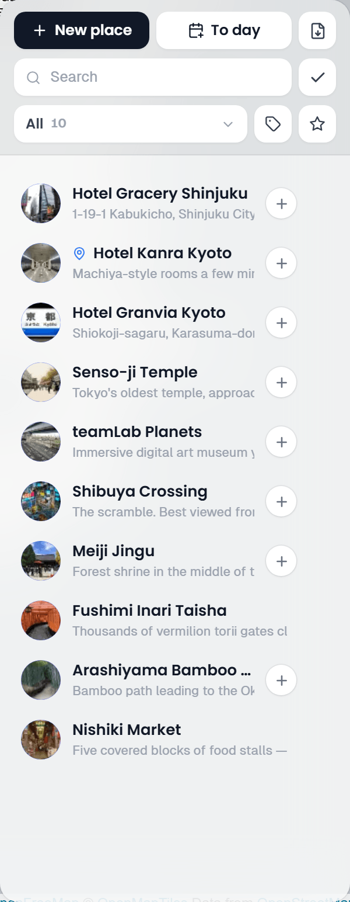
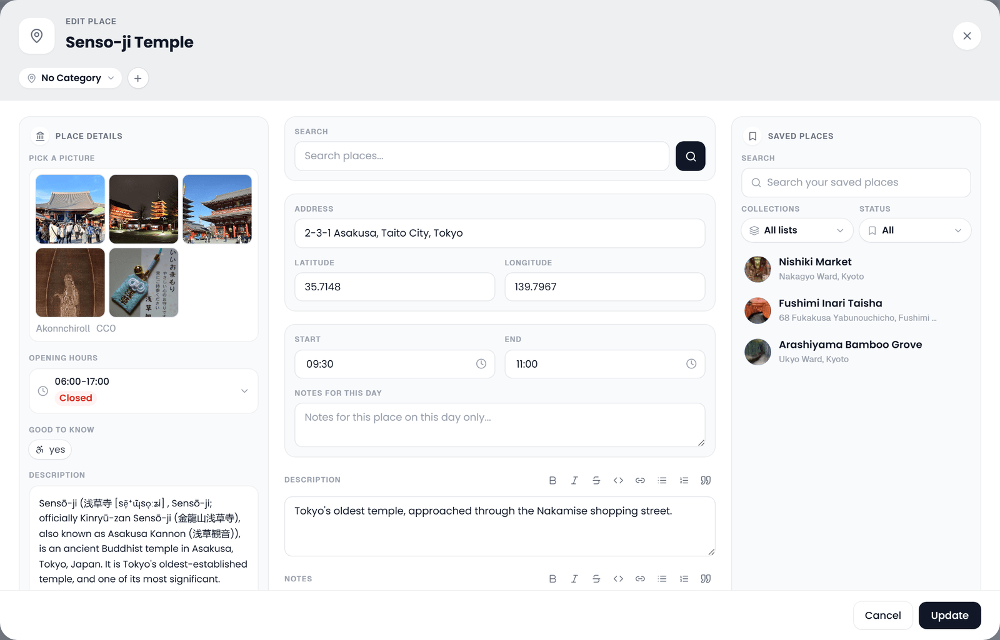
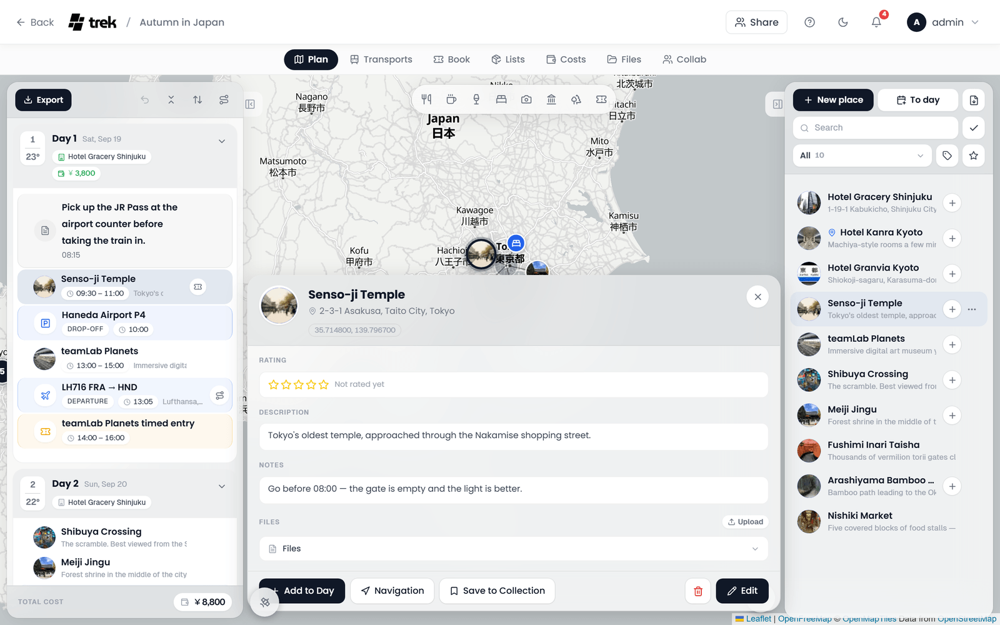

# Places and Search

Places are the building blocks of a trip: sights, restaurants, hotels, stations, trailheads. You add them by searching, by pasting a map link, by typing coordinates, from your saved places, by right-clicking the map or by importing a file or a list.

## The places column

The right column of the Plan tab lists every place of the trip. Its head band has three rows:

1. **Add Place/Activity** and the import button (*Import Places*). While a day is open, the add button splits in two: **New place** adds a place to the trip, **To day** (*Add to the open day*) puts it straight onto that day. In a narrow column both buttons drop to their icons. The import button opens a menu with **Import file** and **List Import** (it reads **Google List** when Google is the only list source); see [Importing multiple places](#importing-multiple-places).
2. **Search**, which narrows the list to places whose name, address, description or notes contain what you type, and the **Select** button, see [Selecting several places](#selecting-several-places).
3. The filters and the order:
   - **Show**: **All**, **Unplanned**, **Planned**, and **Tracks** once the trip has one, each with its count.
   - **Categories** (the tag icon): tick one or several categories, or **No Category**. A badge on the icon counts the categories in force, and **Clear filter** lifts them.
   - **Filter by rating** (the star): **All**, or a floor from **5+** down to **1+**.
   - **Filter by country or region** (the globe): every country the trip's places lie in, with its regions underneath, each with the number of places in it. Pick a country or one region; **All countries** is the default and **Clear filter** goes back to it. The button only appears once the trip spans more than one country or region.
   - **Sort by**: newest first (**Recently added**, the default), **Oldest first**, by name, **Highest rated** or **Recently changed**. The order applies to the list only, not to the map, and your browser remembers it.

With a day open and **Planned** chosen, the list shows only that day's places, and a chip says **Showing the open day only**. Its **X** (*Show the whole trip*) closes the day. See [Trip Planner Overview](Trip-Planner-Overview#layout).

Each row shows the place's photo or category tile, a short stroke in the track's colour for an imported track, the category icon, the name, the average member rating, and a line with the description or the address. Click a row to open the [place inspector](#the-place-inspector), or drag it onto a day. While a day is open, a place that is not on it yet shows a **+** (*+ Day*) that puts it on that day.

The **…** at the end of a row (*More options*) offers what a right-click offers: **Edit**, **+ Day** while a day is open, **Open Website**, **Google Maps**, **Save to Collection** with the [Collections](Collections) addon, and **Delete**.

### Selecting several places

Click **Select** (the tick next to the search field) to switch the list into select mode. Click places to tick them; a bar rises at the foot of the column with the number of ticked places and these actions:

| Action | What it does |
|---|---|
| **Select all** / **Deselect all** | Ticks every place the list currently shows, or none. |
| **Change category** | Gives every ticked place the same category. |
| **Save to Collection** | Saves the ticked places to a list in [Collections](Collections). With the Collections addon. |
| **Mark visited in your lists** | Marks the ticked places as visited in the lists they are saved in. With the Collections addon. |
| **Delete selected** | Deletes the ticked places from the trip. |
| **Done** | Leaves select mode. |

## Adding a place

- **Add Place/Activity** at the top of the places column opens the place form. While a day is open, **New place** adds the place to the trip and **To day** puts it straight onto that day.
- **Add place to this day** in a day's **+** menu does the same for any day. See [Day Plans and Notes](Day-Plans-and-Notes#adding-to-a-day).
- **Right-click anywhere on the map** to create a place at that spot. The address is filled in by reverse geocoding through OpenStreetMap, or through Amap inside mainland China when Amap holds the keyed slot (see [Which provider answers](#which-provider-answers)).
- A place from a **map category** or a **saved place** fills the form for you, see [Exploring the map by category](#exploring-the-map-by-category) and [Saved places](#saved-places).

## The place form

**Add Place/Activity** and **Edit Place** are the same dialog.

- **The head band** holds the name, which you type straight into the band, and the category as a pill. The **+** next to the pill (*New category*) turns it into a field for a new category's name; **OK** or Enter creates it, **Cancel** or Escape closes the field. Categories are shared by the whole instance, so creating one takes an admin account (see [Tags and Categories](Tags-and-Categories)). After a search pick, a pill names where the place came from. Once the place has coordinates, the round **Open in maps** pill opens it in a map app, the same menu as **Navigation** (see [Opening a place in a map app](#opening-a-place-in-a-map-app)).
- **Search** finds the place and fills in the rest, see [Searching for a place](#searching-for-a-place). A place picked from the search, or from a marker of the [map categories](#exploring-the-map-by-category), comes with the matching category already picked when the trip's palette has one (a hotel goes to the category named like Hotel or Accommodation, a café to Café or Bar, and so on). A category you chose yourself is never replaced.
- **Places near this pin** (the target button beside the search button) appears once the form has coordinates, for example after a right-click on the map. It lists the named places around that point, nearest first with their distance, so you can pick the café you clicked on instead of keeping a bare pin. The TREK API answers it; when it has nothing, Google with a key, otherwise OpenStreetMap. The same lookup is `POST /api/maps/nearby` and the MCP tool `search_nearby_places`.
- When a full search finds nothing, a box says *Nothing found for "…"* with **Add by hand**: it takes what you searched for as the name, if the name is still empty, and jumps to the phone, e-mail and opening hours fields.
- **Address**, **Latitude** and **Longitude** say where it is.
- **Phone**, **E-mail** and the opening hours are the place's own, see [Phone, e-mail and opening hours](#phone-e-mail-and-opening-hours).
- **Start**, **End** and **Notes for this day** appear when you edit a place from a day, since they belong to that one visit.
- **Description** and **Notes** take Markdown and each have a formatting bar.
- **Website** and **Files** sit side by side; **Attach** picks files.
- **Costs** links the place to expenses, see [Costs for a place](#costs-for-a-place).
- On a desktop, **Place details** sits on the left (see [Place details while searching](#place-details-while-searching)) and **Saved places** on the right (see [Saved places](#saved-places)).

**Add** saves a new place, **Update** an edited one. Enter in a field never saves, so a half-typed search cannot save the form by accident.

### Place fields

| Field | Notes |
|---|---|
| Name | Required. Typed into the head band. |
| Category | Pick one, **No Category**, or create a new one with the **+** (a new category starts with the colour `#6366f1` and the `MapPin` icon). |
| Address | Free text. |
| Latitude / Longitude | Decimal degrees. See [Entering coordinates manually](#entering-coordinates-manually). |
| Start / End | Only when you edit the place from a day: the time of this visit. |
| Notes for this day | Only when you edit the place from a day: a note for this visit alone. It shows under the place in the day plan. |
| Description | Markdown. |
| Notes | Markdown, up to 2,000 characters. |
| Website | A URL. |
| Phone / E-mail | Free text. Filled in by a search pick when the source knows them. |
| Opening hours | Per weekday, see [below](#phone-e-mail-and-opening-hours). |
| Files | **Attach** a file, or paste an image or a PDF anywhere in the dialog. The files are uploaded when the place is saved. The instance's **Allowed File Types** list applies (by default jpg, jpeg, png, gif, webp, heic, pdf, doc, docx, xls, xlsx, txt, csv, pkpass, pkpasses, md and markdown), plus video, which is exempt from that list. See [Documents-and-Files](Documents-and-Files). |

Two warnings appear under the times: one if the end lies before the start, and one (*Time overlap with:*) naming the places on the same day whose times overlap.

A new place that looks like one already on the trip (the same name, the same Google place, or practically the same coordinates) is not saved at once. A message says *'Louvre' is already in this trip.* and the save button turns into **Add anyway**.

### Phone, e-mail and opening hours

A place can carry its own **Phone**, **E-mail** and opening hours, so a guesthouse no provider knows gets the same fields as a place found through Google. A search pick fills in phone and website when its source has them; everything else you type yourself.

The hours stay folded away until you click **Add opening hours**. Each weekday then gets an *opens* and a *closes* time, or **Closed**. A button copies the first day's hours to every day, and **Remove opening hours** clears them all again. When the [Place details](#place-details-while-searching) column found hours for the place, a place without hours of its own takes them over on its own; one that already has some gets **Take over from the place details** instead.

The place inspector shows the phone and the e-mail address as pills in its head band (a click calls or writes), and your own hours win over the ones a provider knows.

### Costs for a place

With the [Costs](Budget-Tracking) addon enabled, the place form carries the same **Costs** block that bookings and transports have. **Create expense** saves the place and then opens the Costs editor for a new expense linked to it: the museum ticket, the guided tour, the entry fee. On a saved place, **Link existing expense** ties one that is already in Costs. Every linked expense is listed with edit, **Unlink, keep the expense** and **Remove expense**, and a place can carry several.

The expense belongs to the **place**, not to a day. Putting the same place on several days does not multiply it: you bought the ticket once. If you really pay each time, add a second expense from the Costs tab.

Deleting the place deletes its linked expenses too, the same way deleting a booking does.

## Searching for a place

Place search needs no API key. Two sources answer it together: the **TREK API**, TREK's own index of 73.6 million places, and **OpenStreetMap**. The index is strongest on businesses such as restaurants, shops and hotels; OpenStreetMap is where the temples, bridges, viewpoints and stations are. What the index is, where its data comes from and what TREK sends to it is on its own page: [TREK Places API](TREK-Places-API).

### Suggestions while you type

After two or more characters and a 300 ms pause, suggestions appear under the search field of the place form.

- Use **↑ / ↓** to move through them, **Enter** to pick one, **Esc** to close the list.
- Suggestions come from the TREK API, from its index and from an OpenStreetMap layer it keeps. A suggestion from that layer shows the name that matched what you typed, with the name used on the spot underneath when the two differ.
- Only when the TREK API has nothing does TREK ask the keyed provider (Google or Amap), or, without one, OpenStreetMap's own search service.
- An installed [search plugin](Plugin-Cookbook#suggestions-while-the-user-types) whose index can keep up with typing adds up to three of its places under the suggestions, marked with the plugin's name. Picking one fills in what the plugin knows about the place, with no second lookup.

### Language of place names

By default, search, suggestions and addresses answer in the language TREK is set to. **Settings > General > Language & region > Place names** picks another one, for example English names while the app is in German, or **Same as the app** again. Where a place has no name in that language, its local name is shown. The TREK API has no translations, so its results keep the names used on the spot either way.

### The full search

Press **Enter** without picking a suggestion, or click the search button beside the field, to run a full search. It asks the TREK API and OpenStreetMap at the same time and interleaves their answers, TREK first, up to ten results. A place both of them know (within 60 metres, with a matching name) is listed once.

A Google or Amap key does not change this. The keyed provider is asked only when the TREK API and OpenStreetMap both come back empty; see [Google and Amap](#google-and-amap).

Installed [search plugins](Plugin-Cookbook#answer-place-searches-from-your-own-index) add their results below the core list. Only the ones built for it also answer while you type; the others appear here, once the search is run.

### Where each result came from

Every row, in the suggestions and in the search results, on the desktop and on the phone, carries a small mark naming its source: **TREK**, **OpenStreetMap**, **Google** or **Amap** (高德地图, or 高德地圖 in traditional Chinese), and for a row from a search plugin the name the plugin was installed under. A list that mixes several sources stays readable that way. Results from the offline cache carry no mark; see [Searching offline](#searching-offline).

### The open day steers the search

Every search is hinted with the area you are planning, so "Hase-dera" finds the temple beside your hotel in Kamakura rather than the one of the same name in Nara. The hint is taken from:

1. the places on the day you have open, or, with no day open or an empty one,
2. all of the trip's places.

A hint that reaches further than about 60 km from its centre is dropped instead of sent. The middle of a round trip sits in open country between the cities, and pointing the search there ranks worse than no hint at all. Measured over 126 places of a real trip, the day hint put the right place among the first five results 70.6 percent of the time, against 54.8 percent with no hint and 57.1 percent with a hint around the whole trip.

Without any hint, the TREK API turns down a single common word such as `bar` as too broad, and OpenStreetMap answers that search on its own. Once the trip has a place or two, the index joins in.

The place form on the desktop and the search sheet on the phone use the same hint.

## Google and Amap

### With a Google Maps API key

> **Admin:** The Google Maps API key is instance-wide, set in **Admin → Settings → API Keys → Google Maps API Key**. It is stored encrypted at rest and used for every member of the instance. It can also come from the `PLACES_API_KEY` environment variable, which wins over the field and leaves it read-only; see [Environment Variables](Environment-Variables#place-search-google-places).

A key does not buy a different search by itself. Google fills the slot that answers once the TREK API and OpenStreetMap both have nothing, and it adds what only a commercial provider has: ratings and photos. No open dataset carries either of those for ordinary businesses. A place found through Google keeps its Google id, so its details, rating and photos keep coming from Google.

That order means a search the index answered with the wrong place never reaches Google on its own. Two ways to send it there:

- **Per search:** under a result list that did not come from Google, a small line reads **Not the right place? Search Google instead**. It sends the same query to Google Places alone, once, and the results carry the Google mark. The line only appears where a search can reach Google at all: an instance with a Google key, and with neither Amap nor OpenStreetMap picked as the provider, the same rule the switch below follows. Desktop form and phone search sheet alike. The MCP tool `search_place` does the same with `provider: 'google'`, see [MCP-Tools-and-Resources](MCP-Tools-and-Resources).
- **For every search:** the switch **Search with Google only** in the key's block (below) sends every search and every suggestion to Google Places and asks nothing of the TREK API or OpenStreetMap, from the app and from `search_place` alike. Off, the order above applies. The switch does nothing without a key, and nothing while Amap or OpenStreetMap is picked as the provider. Switching it on or off is recorded in the [Audit Log](Audit-Log) as `admin.places_google_only`.

The key's block carries five switches under **What the key may be used for**:

| Switch | What it covers |
|---|---|
| **Place Photos** | Google photos. Wikimedia pictures are unaffected. |
| **Place Autocomplete** | The suggestions while you type. |
| **Place Details** | The details of a place: hours, rating, website. |
| **Place Enrichment** | The **Place details** column in the place form, see [below](#place-details-while-searching). |
| **Search with Google only** | Every search and every suggestion goes to Google Places instead of the TREK API and OpenStreetMap. Off by default. On, every list already comes from Google, so the per-search line above has nothing to offer and does not appear; off, the line appears under lists the TREK API or OpenStreetMap produced. |

Under the switches, **Daily limit for Google calls** caps how many calls TREK makes to Google per day. A badge beside it shows today's count (*Today: 120 of 500*). Once the limit is reached, TREK stops calling Google until the next day (UTC) and searches with OpenStreetMap instead. Leave the field empty for no limit, which is the default.

> **Place Autocomplete and Place Details act on every provider**, not only on Google. Switched off, the suggestion dropdown stays empty and details lookups stop for the TREK API and OpenStreetMap too; the full search keeps working. Leave both on unless that is what you want.

> **API key restrictions:** TREK calls the Google Places API from the server, not the browser. If you apply **HTTP referrers** restrictions to your key in Google Cloud Console, you must also set `APP_URL` in your environment: TREK sends it as the `Referer` header on every outbound Google API request, and without it Google rejects every server-side call with `REQUEST_DENIED`. For server-side deployments, **IP address** restrictions are simpler and need no extra configuration. See [Troubleshooting](Troubleshooting) if photos are missing after adding a key.

### With an Amap (高德地图) API key

> **Admin:** Set the key in **Admin → Settings → API Keys → Amap (高德地图) API Key**, then pick **Amap (高德地图)** under **Place search provider** in the same card. It needs a **Web 服务** (web service) key from [console.amap.com](https://console.amap.com/dev/key/app); a JS API key is a different credential and is rejected.

Google Places is unreachable from most networks inside mainland China, and OpenStreetMap knows very little about Chinese restaurants, shops and shopping centres. With Amap selected it takes the slot Google otherwise holds, and for a search around a trip inside China it answers first: a search or a suggestion centred inside China goes to Amap before the TREK API and OpenStreetMap, which are asked only when Amap has nothing (Amap is never asked twice for the same search). Centred anywhere else, the TREK API and OpenStreetMap answer first and Amap only when they have nothing, so a search for the Eiffel Tower does not come back in Macau. Amap answers in Chinese, with ratings, phone numbers and opening hours where Amap has them. This order only applies when Amap is picked outright under **Place search provider**; on **Auto**, where Amap holds the slot because no Google key is set, the TREK API and OpenStreetMap always answer first. Suggestions, place details and the reverse geocoding behind right-click-to-add-a-place go through Amap as well. Rows that came from Amap carry an Amap mark like every other source.

Amap does not supply place photos here. Its images come with no licence statement TREK could show next to them, so an Amap place gets its picture from Wikimedia Commons like any other, with the credit and licence attached.

A place remembers where it came from. One picked from Amap keeps its Amap id, one picked from Google keeps its Google id, and each keeps opening against the provider that knows it, whichever provider the admin selects later.

Amap links can be pasted into the search field too; see [Pasting a map URL](#pasting-a-map-url). A place in China also offers **高德地图** in its **Navigation** menu, whichever provider answers searches; see [Opening a place in a map app](#opening-a-place-in-a-map-app).

### Which provider answers

**Admin → Settings → API Keys → Place search provider** decides only who fills the keyed slot beside the TREK API and OpenStreetMap. Those two are asked either way.

| Setting | Who fills the keyed slot |
|---|---|
| `Automatic` | Google when a Google key is set, otherwise Amap when an Amap key is, otherwise nobody. The default, and what every install had before Amap existed: adding an Amap key never moves an install off Google on its own. |
| `Google Places` | Google. With no Google key the slot stays empty rather than falling to Amap. |
| `Amap (高德地图)` | Amap. With no Amap key the slot stays empty. |
| `OpenStreetMap` | Nobody, whatever keys are configured. Search runs on the TREK API and OpenStreetMap alone. |

When the selected provider has no key, the card says so: place search is then answered by the TREK index and OpenStreetMap alone.

To keep searches from reaching the TREK API at all, set `TREK_PLACES_ENABLED=false` on the server; see [Switching it off](TREK-Places-API#switching-it-off).

## Place details while searching

On desktop the place form carries a **Place details** column on its left. Pick a search result and it fills in on its own, with no extra click; until then it reads *Pick a result to see more*. Nothing changes about the usual flow of searching, picking and saving, and if you already know the place you can ignore the column.

The column shows what it can find:

- **Pick a picture**: pictures near or of the place. Click one to make it that place's thumbnail; click it again to clear the choice. The picture then appears everywhere the place does (list, map marker, itinerary, PDF export and shared trips), exactly like a [custom place image](#custom-place-image).
- **A rating**, for a place that came from Google or Amap.
- **Opening Hours**: today's hours up front and the whole week a click away, with an open or closed badge worked out in the place's own time zone. When the hours cannot be read reliably there is no badge rather than a wrong one.
- **Good to know**: facts such as cuisine, outdoor seating, takeaway, step-free access, Wi-Fi or a menu link, where OpenStreetMap carries them.
- **Description**, when one is available. It is *not* written into the place automatically. Use **Use this text** to copy it into the description field; the button is disabled with *Clear the description field first* while you have a description of your own, so nothing you wrote gets overwritten.

One credit line sits under the picture grid, and it belongs to the picture in play: the tile you are hovering, or failing that the one you picked, or the first picture before you have done either. It names the author, links that name to the source page, and adds the licence with a link to its terms. The other tiles carry author and licence as a tooltip only, without the links. Google's pictures get an author line and nothing else, because Google grants no reusable licence for them. Most Wikimedia Commons pictures are CC BY or CC BY-SA, which means the credit has to travel with the picture, so once you pick one, the credit stays visible under the thumbnail in the place inspector too.

### Where the information comes from

**Pictures** come from Wikimedia Commons, resolved from the place's own tags first: the Wikidata image, the lead image of its Wikipedia article, its Commons category. Only when those turn up too few does TREK look for pictures taken nearby, within 60 metres, and never for shops, restaurants, cafés and other everyday businesses. Two percent of those have a picture on Wikimedia, against 70 percent of churches, so a picture taken nearby is almost always of the building across the square. A missing picture is the honest answer there.

**Descriptions** come from the first source that has one:

1. The OpenStreetMap `description` tag, for a place from OpenStreetMap.
2. The Wikivoyage article, then the Wikipedia article, that the place is tagged with, in your language where one exists. TREK resolves the article from the tag rather than guessing it from the name, so an ambiguous name never pulls in the wrong article.
3. The place's own website, for a place from the TREK API: the summary the site publishes for machines, credited with the site's host name and linked back. This is what gives restaurants, shops and hotels a description at all. Your server never opens the website itself; the TREK API has read it once for everyone.
4. Google's editorial summary, with a Google key and **Place Details** on.
5. The article about the chain a branch belongs to, headed **About the chain** with the note *This describes the chain, not this branch.*

**Opening hours** come from OpenStreetMap first, because an OpenStreetMap entry describes that exact building where a chain's website often carries one set of hours for every branch. After that come the hours a place from the TREK API publishes on its own site, and for a place found through Google, Google's hours.

Pictures are copied to your own server and served from there. Nothing is loaded directly from Google or Wikimedia while you browse, so no visitor's address leaves your instance.

> **Admin:** the column is controlled by **Place Enrichment**, under **What the key may be used for** in the Google Maps API Key block of **Admin → Settings → API Keys**, and it is on by default. Wikipedia and OpenStreetMap are always used; the Google half additionally follows **Place Photos** and **Place Details**. Turning Place Enrichment off leaves the column with a short note and makes no outbound calls.

On the phone, the place editor shows the same details under its search field: the pictures to pick from, the opening hours, the rating and the description with **Use this text**.

## Saved places

With the [Collections](Collections) addon on, the place form on a desktop carries a **Saved places** column on its right: the places you saved in your lists, nearest to the trip first. **Search your saved places** narrows it by name, and two filters narrow it by list (**All lists** or one of them) and by **Status**. Click a saved place to fill the form with it, as a search result would.

## Pasting a map URL

Paste a `maps.app.goo.gl/…`, `goo.gl/maps/…` or `maps.google.*/…` URL into the search field and press the search button. TREK resolves it on the server and fills in the name, address and coordinates.

Amap links work the same way, as long as the link carries a coordinate: `uri.amap.com/marker?position=…` share links, map URLs with the coordinate in the address, and `surl.amap.com` short links that resolve to one of those. A bare `amap.com/place/…` POI page is an id and nothing else, and TREK answers it with an error rather than guessing where it is. Coordinates are converted from GCJ-02 to WGS-84 on the way in, so the place lands where it belongs on every other map.

## Entering coordinates manually

**Paste** a `lat, lng` pair (for example `48.8566, 2.3522`) into the **Latitude** field, separated by a comma, a semicolon or a space. TREK detects the pair and fills both coordinate fields at once. This works on paste only: the coordinate fields accept digits, a decimal point and a leading minus, so typing a pair by hand drops the separator and leaves a single invalid number (`48.85662.3522`) behind. Type the two values into their own fields instead.

## The place inspector

Click a place in the places column, in a day, or on the map, and its inspector opens over the map.

- **The head band** shows the photo, with a green ring while the place is open and a red one while it is closed, the name (double-click it to rename the place), the address on one line with the full address in a tooltip, and pills: **Open** or **Closed**, the category, the time of the visit, the Google rating, the phone number to call, the e-mail address, and the coordinates. **X** closes the inspector.
- **Rating**: every member's vote, see [Rating a place](#rating-a-place).
- **Description**, **Notes** and **Notes for this day**, rendered as Markdown.
- **Bookings** pinned to this stop, as small cards with the status, date, time and booking code. For a hotel, the stays booked there are listed too (see [Accommodations](Accommodations)). Click a card (*Open booking*) to open the booking's detail. Next to them, **Participants** says who joins this stop.
- **Opening Hours**: today's line, and the whole week a click away.
- **Files**: the place's files and the files of its bookings, with **Upload**.
- For an imported track: its statistics and **Track color**, see [GPX tracks](Map-Features#gpx-tracks).

The footer holds **Add to Day** or **Remove from Day** for the selected day, **Navigation**, **Open Website**, **Save to Collection**, and on the right **Delete** and **Edit**.

## Rating a place

Every trip member can rate a place from 1 to 5 stars, even when place editing is restricted to certain members. Open the place inspector: the **Rating** row shows the stars, the average with the number of votes in brackets, and the avatars of who voted; rest the pointer on it to see everyone's stars. Click a star to cast your vote, and click the same star again to clear it. A place nobody has rated reads **Not rated yet**.

The average also sits beside the place's name in the places column and on a marker's hover card on the map; a marker that carries no order badge shows it as a small disc in its corner instead. To narrow the list, **Filter by rating** (the star in the places column) picks a floor from 1 to 5 stars and keeps only the places whose average reaches it.

Saved places in [Collections](Collections) are rated the same way. Saving a trip place to a list or copying a list place into a trip carries the votes along, but only those of people who are members on both sides.

> **AI / MCP:** `rate_place` sets or clears your own vote; see [MCP-Tools-and-Resources](MCP-Tools-and-Resources).

## Custom place image

By default a place's thumbnail is fetched automatically (from Google or Wikimedia when the place was imported or matched, otherwise it shows a category icon). To use your own photo instead, click the round photo in the head band of the place inspector. When the place or one of its bookings has pictures attached (JPG, PNG, GIF or WebP), a small menu offers **Upload from device** and **From attached files**, so a photo already on the trip can be reused without uploading it again. Pick an image and it becomes that place's thumbnail everywhere (list, map marker, itinerary, PDF export and shared trips). A small remove button on the photo clears the custom image and restores the automatic default. Accepted formats are JPG, PNG, GIF and WebP (HEIC is converted automatically), up to 20 MB.

A picture picked under **Pick a picture** in the place form works the same way, see [Place details while searching](#place-details-while-searching). The same control is available on saved places in [Collections](Collections#place-detail).

## Opening a place in a map app

**Navigation** in the footer of the place inspector, on the phone's place sheet and on a saved place in Collections (on the desktop and on the phone), and the **Open in maps** pill in the place form, open a short menu of map apps, in this order: **Google Maps**, **Waze**, **Apple Maps**, **OpenStreetMap**, **CoMaps**, for a place in China **高德地图** (Amap), and on Android **Other map app**. Waze starts navigating straight away; the others open the place, and starting navigation from there is one tap. When only one app is available the button opens it directly. The right-click menu of a stop in a day no longer lists map apps; use **Navigation**. The **…** menu of a row in the places column still has **Google Maps**.

**Other map app** hands the place's coordinates to Android as a `geo:` link, so Android offers every map app installed on the phone, OsmAnd or Organic Maps for example.

To skip the menu, pick your app under **Settings > General > Travel & map > Open places in**. With an app picked, every navigate button opens it straight away; **Ask every time** brings the menu back. A place that app cannot open (Amap outside China, Waze without coordinates) still shows the full menu.

Which entries appear depends on the place and on where you are, not on the search provider the admin picked. Apple Maps is left out on Android, and **Other map app** is offered only there. Amap is offered by where the place is, because it only has a map of China: a stop in Shanghai gets it whoever is planning the trip, a stop in Lisbon never does. Waze, Apple Maps, CoMaps and Amap need the place's coordinates; Google Maps and OpenStreetMap can still open a place that has none, Google from its name and address, OpenStreetMap from its name. Coordinates handed to Amap are converted to its own datum on the way out, so the pin lands on the right street.

In the installed app the map app takes over the current window rather than a new tab, so coming back lands you where you were.

## Importing multiple places

The import button in the places column (*Import Places*) offers two ways:

- **Import file** takes a `.gpx`, `.kml` or `.kmz` file, from tools like Google My Maps, Google Earth or a GPS tracker. Pick the file or drop it on the dialog, then choose what to import: **Waypoints**, **Routes** and **Tracks (with path geometry)** for GPX, **Points (Placemarks)** and **Paths (LineStrings)** for KML and KMZ. Dropping a file straight onto the places column opens the same dialog with it.
- **List Import** reads a shared list. Both Google Maps and Naver Maps list URLs are supported, with a **Provider** switch when both are available, and a shared Google Maps directions link works too: its stops become places, in driving order. Stops a route gives only by name are looked up through the TREK API first.

Imported tracks each get their own line colour so multiple routes stay apart on the map; you can override it per track in the place inspector. See [Map Features](Map-Features#gpx-tracks) for the details. An import can be undone with **Undo** in the days column.

Importing the same list again does not duplicate what is already in the trip. A place is recognised by the provider id it was imported with (Google place id, Google feature id, or OSM id) before its name or its coordinates are considered, so renaming a place in TREK, or moving its pin, does not make it come back as a second copy on the next import.

> **Admin:** with a Google Maps API key in **Admin → Settings → API Keys**, the list import offers **Enrich places via Google**, which looks up each imported place to fill in photos, address and contact details, one Google lookup per place. **Import file** offers the same switch while **Waypoints** (GPX) or **Points (Placemarks)** (KML, KMZ) are ticked: each imported point is looked up on Google afterwards and gets its photo, address, website and phone, while paths and tracks stay as they are. Without a key the imports work the same, just without that option.

## Exploring the map by category

With **Explore places on the map** switched on in [Display Settings](Display-Settings#explore-places-on-the-map), the trip map carries a row of category buttons: **Restaurants**, **Cafés**, **Bars & nightlife**, **Accommodation**, **Sights**, **Museums & culture**, **Nature & parks** and **Activities**. Click one to show that kind of place around the part of the map you are looking at. After you move the map, **Search this area** runs it again for the new view.

The TREK API answers these first, from the map centre out to a radius that covers the view, at most 20 km. When it has nothing for the area, or cannot be reached, the public Overpass mirrors of OpenStreetMap answer instead, narrowed to a window of half a degree around the centre; `OVERPASS_URL` and `OVERPASS_TIMEOUT_MS` on [Environment Variables](Environment-Variables) steer those. Results from the TREK API come with address, website, phone and opening hours where the index has them, under the names used on the spot rather than translations. The [Road trip](Road-Trip#search-along-the-route) search along the drive asks the same two sources.

### Categories from plugins

An installed [plugin](Plugins) can add up to four buttons of its own to the row: trailheads, EV chargers, step-free places, public toilets and drinking water, campsites, or a community's own list of places. They come after the built-in buttons, behind a thin divider. When the row holds more buttons than it has room for, it scrolls sideways instead of shrinking them, on the phone as on the desktop.

A plugin's buttons are there while the plugin is switched on and the admin has granted it the permission to add map categories (`hook:poi-category-provider`, see [Plugin Permissions](Plugin-Permissions)). Like the built-in ones they show only an icon, and a picked one fills with the plugin's colour. Rest the pointer on one for its name: in your language when the plugin ships a name for it, otherwise in the plugin's own wording.

A plugin button works like a built-in one: one category at a time, and **Search this area** after you move the map. Only the plugin that added the button is asked, for the part of the map you are looking at, narrowed to the same half-degree window as OpenStreetMap, and at most 60 of its places are shown. The request carries that area, the category and your language, and names no trip. The plugin answers as you, so it can follow your own settings for it, and TREK keeps no copy of the answer. A plugin that takes longer than eight seconds, or fails, gets a red dot on its button and a **Search this area** to try again. The built-in buttons never wait for it.

Plugin categories need a connection. Offline, or with **Force offline mode** on, TREK does not ask the plugin at all: a picked button shows the red dot, and **Search this area** tries again once you are back online. See [Offline Mode and PWA](Offline-Mode-and-PWA).

The markers carry the icon and colour the plugin chose for the category. On the desktop, resting the pointer on a marker shows the place's name and, where the plugin sends them, up to six rows only it knows, such as a trail's length or a step-free entrance. They are always shown as plain text. The phone has no hover, so it does not show these rows.

Clicking or tapping a marker opens the place form with the name, address, website, phone and coordinates filled in, the same as for a marker from a built-in button, for anyone allowed to edit places. A website only comes along when it is an http or https address. Once saved it is an ordinary place of the trip, and it stays when the plugin goes.

When the admin switches a plugin off, uninstalls it or takes the permission away, its buttons disappear, and their markers with them: for the admin straight away, for everyone else the next time TREK loads, or as soon as they press one.

> **Admin:** the Plugins panel marks a plugin that asks for the permission with an **Adds map categories** chip, and a registry plugin's detail lists the categories it would add, with their icons, colours and names, before you install it. See [Admin-Plugins](Admin-Plugins#the-pre-install-review-dialog).

> **AI / MCP:** `list_plugin_poi_categories` names the categories plugins add, and `search_plugin_pois` asks the plugin behind one of them for its places in a map rectangle; see [MCP-Tools-and-Resources](MCP-Tools-and-Resources).

To build such a plugin, see [Plugin Cookbook](Plugin-Cookbook#add-your-own-place-categories-to-the-map).

## Searching offline

When a trip is kept for offline use, TREK also downloads the places around it from the TREK API: one request of up to 3000 places, in a box around the trip's places with some margin, at most 1.5 degrees a side (a trip spread wider gets its centre). For a city the size of Rostock that is about a megabyte. The download is repeated only when the trip's area changes, and it happens whether or not **Store map tiles offline** is on: the tiles are the big part, the places are not.

With no network, or with **Force offline mode** on, suggestions and the full search then answer from that cache: places whose name starts with or contains what you typed, ignoring case and accents, across every trip you keep offline. Picking one fills in its name, address, coordinates, website and phone from the cache. Answers from the cache carry no source mark, because they are not a live answer from anyone, and they are never written to the [Place Search Log](#place-search-log).

Switching a trip's offline storage off removes its cached places with the rest of its data, and **Clear cache** in **Settings → Offline** removes them all. With the TREK API switched off nothing is downloaded, and offline search has nothing to answer from. See [Offline Mode and PWA](Offline-Mode-and-PWA).

## Place Search Log

> **Admin:** switch it on under **Admin → Settings → API Keys → Place Search Log**, on the desktop or the phone. It is off by default.

With the log on, every time somebody picks a place from a list of search results or suggestions, TREK writes one row: what was typed, the language TREK was set to, the hint coordinate, which source answered, where in the list the picked place stood and how long the list was, and the picked place's name, id and coordinate. Coordinates are rounded to three decimals, about 100 metres. A row holds no user, no trip and no session, and a search nobody picked from leaves no row at all.

It exists so a different place index can be measured against real searches later: how often was the place people actually wanted among the first five results.

- **Nothing leaves the instance.** The log lives in your database, and only an admin can read it.
- **Retention:** rows older than 180 days are deleted every night, whether the log is on or off, so switching it off also lets what it collected age out.
- **Reading and wiping:** there is no screen for it. Signed in as an admin, `GET /api/place-shadow/summary` returns the row count, the counts per source and how often the pick was the first result or among the first five. `GET /api/place-shadow/export` returns the rows oldest first, 2000 per page; pass the `nextAfter` value back as `?after=` for the next page. `DELETE /api/place-shadow` deletes every row.
- Switching the log on or off is recorded in the [Audit Log](Audit-Log) as `admin.place_shadow`.

**See also:** [TREK Places API](TREK-Places-API) · [Day-Plans-and-Notes](Day-Plans-and-Notes) · [Map-Features](Map-Features) · [Collections](Collections) · [Offline-Mode-and-PWA](Offline-Mode-and-PWA) · [Tags-and-Categories](Tags-and-Categories)
