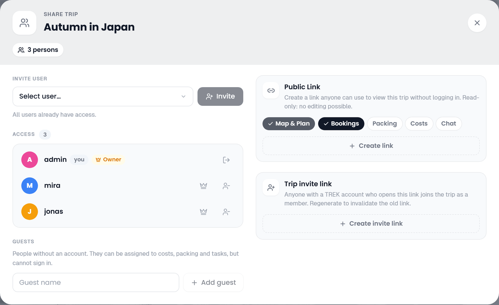

# Public Share Links

Share a read-only view of your trip with people who do not have a TREK account. The viewer opens in a browser without logging in.



## Creating a share link

Open your trip and click the **Share** button (Users icon) in the top navbar. This opens the **Share Trip** dialog. The **Public Link** card appears in its right column and is visible only to users with the `share_manage` permission (trip owner and admins by default).

Click **Create link** to generate a token.

The share URL takes the form:

```
<your-instance>/shared/<token>
```

Copy this URL and send it to anyone you want to share the trip with. No TREK account is required to view it.

### How long a link lives

A share link is valid for **90 days**, counted from the last time it was saved. Creating the link writes a 90-day expiry, and flipping one of the unlocked permission toggles re-saves the link and writes a new one, so a link you actively manage never lapses under you.

Once the 90 days are up, visitors get **Link expired or invalid**. Only an unknown, expired or deleted link shows that screen. When the page cannot be loaded for another reason (the server restarting, a proxy error, a viewer who is briefly offline), the visitor sees **This trip could not be loaded** with the hint that this does not mean the link has expired, and **Try again** reloads it in place. The **Public Link** card in the Share dialog does not show this: it keeps displaying the URL and the **Delete link** button, because the owner-side lookup ignores the expiry. There is no expired badge to warn you.

To revive a lapsed link, flip one of the unlocked toggles — **Bookings**, **Packing**, **Costs** or **Chat** — and flip it back if you did not mean to change anything. **Map & Plan** is locked, so clicking it sends no request and will not revive the link. Flipping an unlocked toggle re-saves the **same** token for another 90 days and the old URL starts working again. If you want a genuinely different URL, because the old one leaked for instance, use **Delete link** and then **Create link**.

Links created before TREK added the expiry carry no expiry at all and work indefinitely. The first time you change one of their toggles, that save puts them on the 90-day clock like every other link.

## Permission toggles

When creating or updating a share link you choose what the recipient can see. The available flags are:

| Toggle | Default | What it shows |
|--------|---------|---------------|
| **Map & Plan** (`share_map`) | Always on | The Plan tab with the interactive map and day-by-day itinerary. This toggle is locked on and cannot be disabled from the UI; a link whose flag was turned off outside the UI has no Plan tab, and the server withholds its days, places and notes entirely. |
| **Bookings** (`share_bookings`) | **On** | The Bookings tab with reservations and transport. Also controls whether transport items appear inline in the day plan. |
| **Packing** (`share_packing`) | Off | The packing list tab, grouped by category |
| **Costs** (`share_budget`) | Off | The Costs tab with a total summary and line items grouped by category |
| **Chat** (`share_collab`) | Off | A read-only Chat tab showing messages in chronological order |

Disabled toggles hide the corresponding tab from the public viewer entirely. Permission changes take effect immediately — you do not need to recreate the link.

### Options

Under the toggles, the **Options** row has two switches that narrow what the page shows. Both are off by default and apply the moment you flip them.

| Option | What it does |
|--------|--------------|
| **Travel & stays only** (`share_travel_only`) | The link shows how the trip gets from place to place and where it sleeps, and nothing else: each day keeps its transports and its stay, day notes and activities are left out, days with neither are not shown, and the Bookings tab lists only transports and hotel bookings. Useful for family or an emergency contact. |
| **Without photos** (`share_hide_images`) | The place photos are left out of the page; places show their category icon instead. |

Both are enforced by the server: a viewer of a travel-only link never receives the activities, and a link without photos does not serve them either.

### Which currency guests see

A public viewer has no account, so there is no "their" display currency to use. The Costs tab is rendered in **the sharer's display currency, falling back to the trip's own currency** — in other words, a guest sees the money the way the person who shared the trip sees it. If the sharer leaves their display currency on **Trip currency** (the default), guests read the trip in the trip's own currency. See [Currencies](Currencies).

## What the public viewer shows

The shared trip page speaks the planner's design. A light top bar carries the TREK logo, the trip's name, a **Read-only shared view** pill and the language picker, so a viewer can read the trip in their own language. Below it the trip opens as a postcard: its cover image, the date range, the title, the description and how big the trip is (days, places and, when Bookings is shared, bookings). The tab bar under the hero stays at the top of the window while the page scrolls, and offers only the sections you enabled. With nothing but the plan shared there is no tab bar at all.

The Plan tab appears whenever **Map & Plan** is on, which is every link created through the share UI, since that toggle is locked on there. A link whose `share_map` flag was turned off outside the UI (through the REST API or the `create_share_link` MCP tool, both of which take it as a plain boolean) has no Plan tab at all: the server withholds the days, places, assignments and notes entirely, and the viewer opens on the first section the owner did share.

On a wide screen the Plan tab puts the days on the left and the map on the right, and the map stays in view while the days scroll past it. On a phone the map comes first and the days follow under it. Every day is a card like the planner's: its number on a tile, its name and date, its stays with check-in and check-out marked, and how many places it has. The plan of the day is open underneath, places with their photo or category colour, address, description, notes, planned time and links to Google Maps, the website and the phone number, and transports and notes as tinted rows. The chevron folds a day away. Under the last day, a **Not planned yet** card lists the places the trip has collected but not put on a day, drawn the same way (not on a travel-only link).

Which day the map shows is picked in the select at the map's top edge, with a step back and forth beside it, or by clicking a day's head; clicking it again goes back to the whole trip. A picked day numbers its stops on the map in visiting order, the same numbers the places wear in the list (a place the day returns to shows both, e.g. `1, 3`), and joins them with a dashed connector. That connector is a straight line showing sequence, not a driving route: TREK will not send a shared itinerary to a third-party routing service on an anonymous visitor's behalf. The whole trip shows every geocoded place as an unnumbered pin with no connector. On either view, pins that sit close together are grouped into a cluster bubble with their count, the same way the planner's map does it, so the stops of a busy day stay tappable on a phone; click a cluster to zoom in on its members, and at maximum zoom it fans them out.

The Bookings tab lists the transports first and the other bookings after them, as the booking cards of the planner: status, type, title, day and time, route, carrier and numbers, location, note and link. Confirmation codes, travellers and prices never leave the server.

The Packing tab shows how much is packed and one card per category. The Costs tab opens with the total and each category's share of it, then one card per category with its expenses. The Chat tab (when enabled via `share_collab`) shows the messages as bubbles, grouped by date, with the sender's avatar. Viewers cannot send messages.

## Revoking a share link

Open the Share button in the navbar, then click **Delete link** in the share link section. The existing URL stops working immediately for anyone who has it.

## Journey public share

The Travel Journal (Journey addon) has a separate share mechanism with its own token namespace and permission flags (timeline, gallery, map). See [Journey-Journal](Journey-Journal) for details.

## Related pages

[Trip-Members-and-Sharing](Trip-Members-and-Sharing) · [Currencies](Currencies) · [Journey-Journal](Journey-Journal) · [Real-Time-Collaboration](Real-Time-Collaboration)
