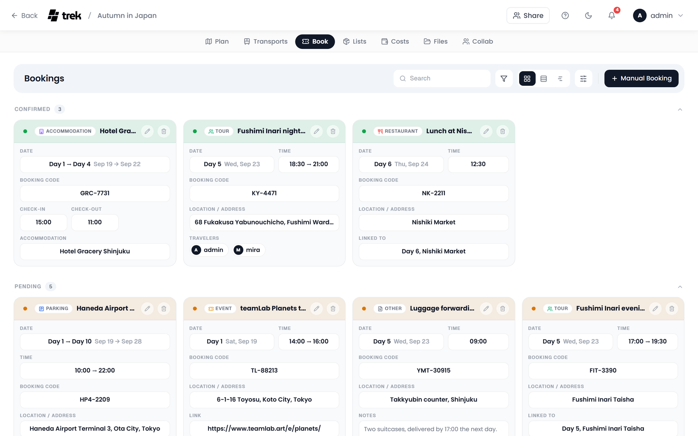
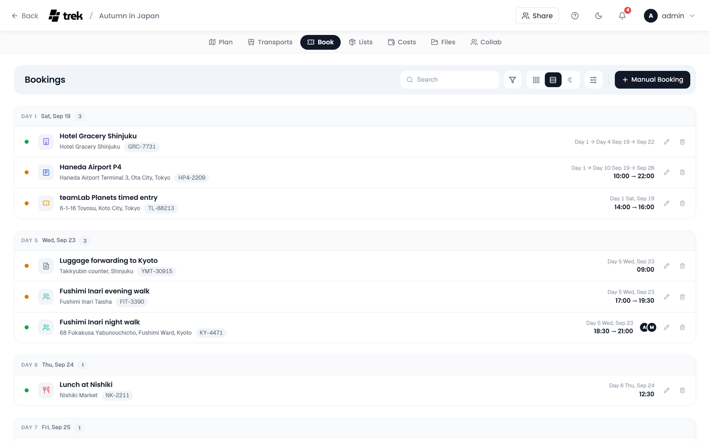
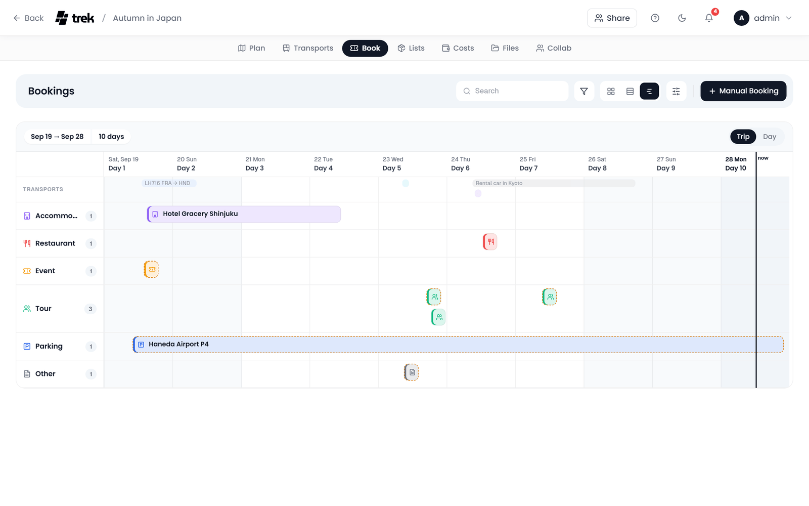
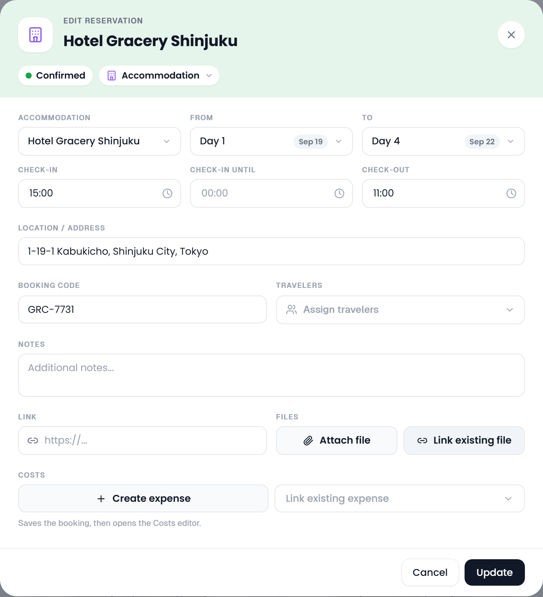

# Reservations & Bookings

Everything you booked for a trip that is not a way of getting around: hotels, restaurant tables, event tickets, tours, parking and anything else with a confirmation behind it. Flights, trains, rental cars and the other rides have a tab of their own, see [Transport-Flights-Trains-Cars](Transport-Flights-Trains-Cars).

## Where to find it

Open a trip and select the **Bookings** tab. It lists accommodation, restaurant, event, tour, parking and other bookings. Transport records never show up here; they stay on the **Transports** tab, which works the same way and is described on [its own page](Transport-Flights-Trains-Cars).

The tab starts with a bar like the other planner tabs. The name sits on the left. On the right are a search box, **Filter**, the switch between **Cards**, **List** and **Timeline**, **View options** and **Export as spreadsheet (CSV)** (the spreadsheet icon, see [Exporting as CSV](#exporting-as-csv)). If you may edit bookings, the bar ends with **Import booking confirmations** (the download icon, shown when your server can [import confirmations](#import-from-booking-confirmation)) and **Manual Booking**.

A trip without any bookings shows *No reservations yet* instead, with **Manual Booking** and **Import from file** as buttons right under it.

## Reservation types

TREK knows seventeen types. Six of them belong to the Bookings tab and eleven to the Transports tab:

| Type | Tab | How it is created |
|------|-----|-------------------|
| Accommodation | Bookings | **Manual Booking**, or the day plan (see [Accommodations](Accommodations)) |
| Restaurant | Bookings | **Manual Booking** |
| Event | Bookings | **Manual Booking** |
| Tour | Bookings | **Manual Booking** |
| Parking | Bookings | **Manual Booking**; a booking at one fixed place, such as airport parking |
| Other | Bookings | **Manual Booking** |
| Flight, Train, Bus, Car, Taxi, Bicycle, Cruise, Ferry, Cable car, Other | Transports | The transport editor, see [Transport-Flights-Trains-Cars](Transport-Flights-Trains-Cars) |
| Public transit | Transports | The public transit search, see [Public transit search](Transport-Flights-Trains-Cars#public-transit-search) |

A new booking made with **Manual Booking** starts as type **Other**. Change it with the type pill in the head of the editor.

## Views

The three buttons in the bar switch how the bookings are laid out. Each tab remembers its own choice in your browser.

### Cards

The default. Bookings sit as cards in sections, **Confirmed** first and **Pending** after it, with up to four cards in a row on a wide screen. Click a section head to fold it away; which sections are folded is remembered per trip. Click a card to open the [booking detail](#the-booking-detail).

### List

One row per booking, grouped by day: a section for every trip day with bookings, plus **Before the trip**, **After the trip** and **No date** where needed. A row carries the status dot, the type icon, the title, a line with the route or place, carrier and number, seat and platform, the booking code, linked costs and the number of files. The day and time sit on the right, followed by the travelers and the edit and delete buttons.

Use the arrow keys to move between rows, and Enter or Space to open the one in focus.

### Timeline

The timeline puts the bookings on the trip's days, one lane per type, with a bar from start to end in local time. A pending booking has a dashed amber outline. Point at a bar to see its day, times, route and status; click it to open the detail.

Two zoom levels sit above the chart:

- **Trip** fits every day of the trip into the width. Click a day heading to open that day by the hour.
- **Day** spreads a single day over an hour scale, with larger bars that also show the times and the route. The arrows step to the previous and next day, and **Today** jumps back to the current day during the trip.

While the trip is running, a line marks the current time. Bookings dated before or after the trip, or without any date, cannot sit on the chart; they wait below it as small cards under **Before the trip**, **After the trip** and **No date**.

### View options

The sliders button in the bar holds the settings for the current view. A small dot on it means something differs from the default.

- In **Cards** and **List**: **Group by** (Status, Day, Type or No grouping) and **Sort by** (Date, Title, Type or Status). The last entry flips the direction: *Earliest first* or *Latest first* for dates, *A to Z* or *Z to A* otherwise. Cards group by status by default, the list by day.
- In **Timeline**: **One lane per type** (off puts every bar in a single lane) and **Show the other tab**, which draws the Transports tab's entries in a thin, dimmed lane at the top so you can see a dinner next to the flight home.
- **Reset view** goes back to the defaults.

## Search and filters

The search box looks through the title, the type, the place and address, the accommodation, the notes, the booking code, carriers, flight and train numbers, stations and airports, per-segment codes and the travelers' names. Escape clears it.

**Filter** opens a panel with three parts:

- **Status**: All, Confirmed or Pending.
- **Type**: tick one or more types; each shows how many bookings it has. Only shown when the tab has more than one type.
- **Travelers**: shown once the trip has more than one member and at least one booking has travelers. Click people to see only their bookings; several can be active at once.

A number on the Filter button counts what is switched on, and a chip such as *3 of 12* appears next to the search. Click the chip, or **Reset filters** in the panel, to see everything again. Filters are kept per trip and per tab until you close the browser tab.

## Exporting as CSV

**Export as spreadsheet (CSV)**, the spreadsheet icon after **View options**, downloads the bookings as a CSV file. It holds exactly what the tab shows: the search and the filters apply, and the rows follow **Sort by** from the view options (the grouping is left out, one row per booking). The columns are **Type**, **Title**, **Status**, **Start**, **End**, **From**, **To**, **Location**, **Confirmation** and **Notes**; **From** and **To** are filled for bookings with a route. The file is semicolon-separated with a UTF-8 byte-order mark, so Excel opens it cleanly, and is named after the trip and the tab, such as `berlin-2026-bookings.csv`. A cell that would start with `=`, `+`, `-` or `@` gets a leading apostrophe, so a spreadsheet never runs it as a formula.

The button is there for every member who can see the tab, as soon as it has at least one booking. The Transports tab exports its own list the same way.

## Pending and Confirmed

Every booking is either **Pending** or **Confirmed**. The colour follows it everywhere: an amber dot and head band for pending, green for confirmed.

To switch it, click the status dot on a card or list row (its tooltip reads *Set to Confirmed* or *Set to Pending*), the status pill in the booking detail, or the pill in the head of the editor. The card moves to its new section straight away.

Travelers are set per booking in the editor, from the trip roster, guests included.

> **AI / MCP:** `set_reservation_travelers` writes that list; it replaces it wholesale and ignores anybody who is not on the trip. See [MCP-Tools-and-Resources](MCP-Tools-and-Resources).

## Reservation card contents

A card starts with a head band tinted by the status. In it are the status dot, the type chip, the title, and the edit and delete buttons for members who may change bookings. Below it, a card shows whatever the booking has:

- **Date** and **Time**: the day or day range with the calendar date, and the start and end time. A stay shows its check-in and check-out times instead.
- **Booking Code**: if **Blur booking codes** is on in your [General Settings](Display-Settings#blur-booking-codes), the code stays blurred until you point at it or click it.
- **Route** for bookings with endpoints, and **Segment codes** when the legs of a connection each have their own code.
- Type-specific fields: airline and flight number, train number, platform, seat, check-in and check-out.
- **Location / Address**, the linked **Accommodation**, and **Linked to**, the day and stop the booking is pinned to.
- **Link**, the booking URL. A link TREK refuses to open is shown as plain text.
- **Notes**, rendered as markdown and cut after four lines.
- **Travelers**, **Files** (click one to open it) and the linked costs at the foot, with a total per currency.

Two small marks can sit next to the title. An amber warning icon means the booking needs a look, see [Review mark](#review-mark). An **AirTrail** pill shows a flight that syncs with AirTrail; a grey **Not synced** pill means that flight was removed in AirTrail.

Plugins can add their own panel to the foot of a card.

## The booking detail

Clicking a booking opens its detail over the page. The same popup opens wherever a booking shows up:

- a card, a list row or a timeline bar on the Bookings and Transports tabs,
- a booking row in the day plan, a rental car pill in a day's head band, a booking pinned to a stop,
- the ticket button (**Open booking**) on a booked stay's pill in a day's head band; the hotel's name on the same pill still opens the place,
- the **Reservations** list in a day's details, the **Bookings** cards in the place inspector (for a hotel, these also list the stay booked for it),
- a booking's endpoint on the map, and the rides on the [Road Trip](Road-Trip) rail.

The head band carries the type, the title and a row of pills: the status (click it to switch), the type, the day, and the booking code with a copy button. If you may edit bookings, click the title to rename it.

Below it come tiles with the key figures: departure and arrival times with their places, or check-in, check-out and the number of nights for a stay, plus duration, transfers and walking time for a public transit journey, and platform and seat. After them: the itinerary of a transit journey, the route with its stop times when there are more than two stops, the segment codes, every other field, travelers, notes, the linked expenses under **Costs** (click one to open it in the expense dialog), the files with **Show in files**, and any plugin panels.

The bar at the foot holds:

- **On map**: shows the booking on the plan. A booking with a route switches its line on and opens the plan on its day; a booking tied to a place opens the plan with that place selected. The button is highlighted while the line is on, and pressing it again switches it off.
- **Change route**: public transit journeys only, see [Public transit search](Transport-Flights-Trains-Cars#public-transit-search).
- **Delete** and **Edit**. Edit closes the detail and opens the booking's editor.

## Creating a reservation

1. Click **Manual Booking**. The editor opens as **New Reservation**.
2. Type the title into the head band. It is the one required field; **Add** stays disabled until it has one.
3. Pick the type with the pill in the head band: Accommodation, Restaurant, Event, Tour, Parking or Other. The pill next to it reads **Pending**; click it to make the booking **Confirmed**.
4. Optionally pick **Link to day assignment**: a searchable list of every stop in the plan, grouped by day. It pins the booking to that stop, and an empty date is filled with that day.
5. Set **Date**, **Start time**, **End date** and **End time**. The calendars only offer days inside the trip, and an end before the start is marked in red and blocks saving.
6. Optionally pick a **Place / Activity** from the trip. It fills the title and the address only where you left them empty. **Location / Address** takes any address.
7. Enter the **Booking Code** and pick the **Travelers** from the trip roster, named guests included.
8. Add **Notes**, a **Link** to the booking, and **Files**: **Attach file** uploads from your device (PDF, Word documents, text files, images), and on a saved booking **Link existing file** ties in a file the trip already has. Files picked before the first save are uploaded right after it.
9. With the Costs addon on, **Create expense** saves the booking and opens the expense editor for a cost linked to it. On a saved booking, **Link existing expense** ties in an expense that is already in Costs and belongs nowhere yet. A booking can carry several expenses; each has edit, **Unlink, keep the expense** and remove buttons. See [Budget-Tracking](Budget-Tracking#expenses-linked-to-a-booking-or-a-place).
10. Click **Add**.

For the type **Accommodation**, the date and place fields give way to the stay: **Accommodation** (the place), **From** and **To** (the check-in and check-out days), **Check-in**, **Check-in until** and **Check-out**, then **Location / Address**, filled from the picked place. Saving creates the stay in the day plan as well. See [Accommodations](Accommodations).

A booking for one particular stop is quicker from the plan: point at the stop in the days column and click the ticket button at the end of its row (**Add booking**). The editor opens already linked to that stop.

## Editing and deleting

Click the pencil on a card or list row, or **Edit** in the booking detail. The editor opens as **Edit Reservation** with everything the booking has; change what you need and click **Update**.

If you have changed something and then press Escape or click beside the editor, TREK asks *Discard your changes?* before it closes. **Keep editing** takes you back to the form, **Discard** closes it without saving. The cross and **Cancel** close the editor straight away.

To delete a booking, click the bin on its card or row, or **Delete** in the detail. TREK asks once (*Delete booking?*) before it removes the booking.

## Import from booking confirmation

TREK can read booking confirmations, PDF tickets and wallet passes and turn them into bookings, using [KDE Itinerary](https://apps.kde.org/itinerary/). Every booking it finds opens in the normal editor for you to check before anything is saved.

### Supported formats

| Format | Extension |
|--------|-----------|
| Booking confirmation email | `.eml` |
| PDF ticket or confirmation | `.pdf` |
| Apple Wallet pass | `.pkpass` |
| HTML confirmation page | `.html`, `.htm` |
| Plain-text email | `.txt` |
| Photo of a ticket or confirmation | `.jpg`, `.jpeg`, `.png`, `.webp` (only with the AI Parsing addon and a model that reads images) |

Up to 5 files per import, 10 MB each. A photo always goes to the AI model, never to KDE Itinerary, and the upload dialog only offers photos when the model reads images. See [AI-Booking-Import](AI-Booking-Import#photos).

### How to import

1. On the **Bookings** or the **Transports** tab, click **Import booking confirmations** (the download icon in the bar). On a tab without bookings the button reads **Import from file**.
2. Drop your files onto the upload area, or click it to pick them, then click **Import**.
3. The dialog closes and a widget in the bottom right corner shows *Parsing files…*, with a count when there are several files. You can keep working meanwhile: the widget follows you to other pages and survives a reload.
4. When it is done, click **Import** in the widget.
5. Each booking found opens in its editor, one after the other: the reservation editor for bookings, the transport editor for rides. The file it came from is already attached. Check it, fix what needs fixing, and save. Nothing is stored before you do.

If nothing could be read, the widget says *No reservations could be extracted from the uploaded files.* With the AI Parsing addon on, it also offers **Try AI parsing** for the same files.

Each saved booking appears for every trip member straight away.

### What gets created automatically

- **Hotels** become a booking and a stay in the day plan, on the check-in and check-out days from the confirmation. The hotel is matched to a trip place with the same name, or its address is looked up and a new place is created, so its pin appears on the map.
- **Restaurants and events** keep their venue as the booking's address. No trip place is created for them; pick one in the editor if the place is already in the trip.
- **A price** becomes a linked expense in the currency it was quoted in, when the Costs addon is on. Without it, the price stays on the booking.

### When the button is not visible

The import button is hidden only when the server has neither the `kitinerary-extractor` binary nor the [AI Parsing addon](AI-Booking-Import). With the AI addon enabled and configured, import works without the binary and every file goes straight to the model.

The binary ships inside the official TREK Docker image. If you run TREK from source, install the `libkitinerary-bin` package (Debian trixie, Ubuntu 25.04 or newer) or set `KITINERARY_EXTRACTOR_PATH` to the binary's full path. See [Environment-Variables](Environment-Variables).

### Review mark

A booking TREK could not complete on its own carries an amber warning icon next to its title, and a **Review** pill in its detail. It comes from AirTrail imports whose date is not exact or whose airport could not be placed, and from bookings an AI assistant created with the flag set. Open the booking, check the missing parts and save it; saving in the editor clears the mark. File imports never keep it, because each one passes through the editor before it is saved.

### AI fallback for hard-to-read files

KDE Itinerary only recognises structured tickets. For confirmations it cannot read (plain-text emails, unusual PDF layouts, vendors it does not know) TREK can hand the file to an AI model instead. The optional **AI Parsing** addon runs only for the files Itinerary returns nothing for, and it works with a self-hosted local model, so booking data need not leave your server. See [AI-Booking-Import](AI-Booking-Import).

## Import from AirTrail

With the **AirTrail** integration addon enabled and your instance connected under **Settings → Integrations**, the **Transports** tab shows **Import from AirTrail** (the plane icon in the bar, or an **AirTrail** button on an empty tab). It lists the flights in your AirTrail account, with the ones inside the trip dates under *During this trip* and already selected. Each imported flight becomes a flight booking that stays in sync with AirTrail both ways.

### Connecting flights (layovers)

When selected flights form a connection (each leg leaves from the airport the previous one landed at, within 24 hours) the picker groups them and offers to **import them as one flight with a layover**. The offer is ticked by default; untick it to keep separate bookings. A joined booking keeps each leg's airline, flight number, times and seat, the connecting airport becomes a stop on the route, and each leg shows up on its own day in the plan. Since a stop is not a destination, the layover country is not counted as visited in Atlas.

AirTrail has no multi-leg flights, so a joined booking is imported **without live sync**. It keeps the blue **AirTrail** pill; its tooltip says the layover has no single AirTrail flight to sync back to. The grey **Not synced** pill means something else: that flight was removed in AirTrail. The source flights of a joined booking stay known, so the picker will not offer them again. The same happens when you add a stop to a synced flight by hand: the booking detaches from AirTrail rather than sync a route AirTrail cannot represent.

## Permissions

Creating, editing, importing and deleting bookings, switching their status and renaming them all need the `reservation_edit` permission. Members without it see the cards and the detail, but no edit, delete or status buttons.

Some entry points in the day plan follow the plan's own right, `day_edit`: **Add booking** on a stop, the transport editor opened from the plan, and **Change route** on a public transit journey. See [Admin-Permissions](Admin-Permissions).

## Real-time sync

Every change to a booking reaches all trip members who have the trip open, without a reload.

## See also

- [Transport-Flights-Trains-Cars](Transport-Flights-Trains-Cars)
- [Accommodations](Accommodations)
- [AI-Booking-Import](AI-Booking-Import)
- [Budget-Tracking](Budget-Tracking)
- [Documents-and-Files](Documents-and-Files)
- [Trip-Planner-Overview](Trip-Planner-Overview)
