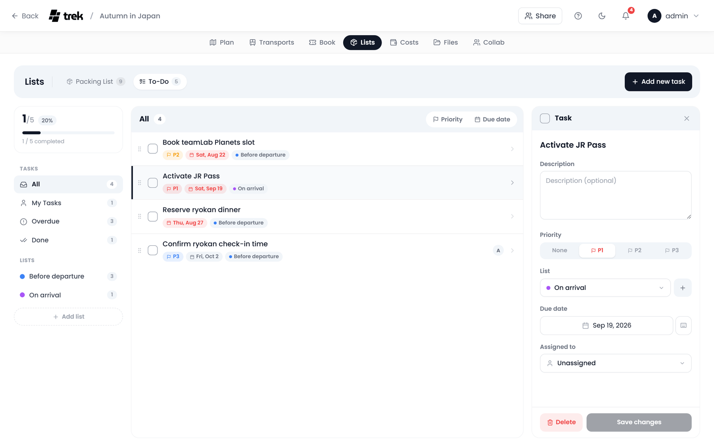

# Todos and Tasks

Keep track of what has to be done before and during the trip: visas to apply for, tables to book, who picks up the rental car.

## Where to find it

Open the **Lists** tab inside the trip planner and pick **To-Do** in its bar. The to-dos share the Lists addon with the [packing list](Packing-Lists), so the tab is only there when that addon is enabled.

> **Admin:** Enable the **Lists** addon in [Admin-Addons](Admin-Addons).

## Layout

The to-do view has two columns, and a third while a task is open:

- **Left sidebar**: a progress card (done of all, as a count, a percentage and a bar), the filters under **Tasks**, one row per list under **Lists**, and **Add list**, which asks for the name in a small dialog.
- **Task list**: a card whose head names the active filter or list with its count and holds the sort, **Priority** or **Due date**. Each row is a checkbox, the name, the description, the priority, due date and list as small badges, and the assignee as an avatar with the name as its tooltip.
- **Detail pane**: click a task and it opens on the right, headed **Task**. Its head carries a checkbox that ticks the task off, the fields scroll in the middle, and **Delete** and **Save changes** stay in sight at its foot.

## Task fields

| Field | Notes |
|---|---|
| Name | Required. |
| Done | The checkbox; ticks the task off. |
| Description | Optional text with Markdown (see below). |
| Priority | **None**, **P1**, **P2** or **P3**, picked on one segmented track. |
| List | Optional grouping. The sidebar heading is **Lists**, the button reads **Add list**, and a task without one shows **No list**. The **+** beside the field names a new list. |
| Due date | Optional date. |
| Assigned to | Optional trip member, guests included; **Unassigned** otherwise. |

Click a task row to open the detail pane, where every field can be changed. **Save changes** keeps them.

The description understands Markdown: bold text, lists and links render as such, in the task list (shortened to one line) and in the detail pane. In the detail pane a click on the text switches it back to the editing box (the tooltip reads *Click to edit, links open directly*); a click on a link opens the link instead. An empty description is the editing box straight away.

## Priority levels

| Level | Label | Colour |
|---|---|---|
| 1 | P1 | Red (`#ef4444`) |
| 2 | P2 | Amber (`#f59e0b`) |
| 3 | P3 | Blue (`#3b82f6`) |

A task without a priority shows no badge.

## Sidebar filters

| Filter | Shows |
|---|---|
| **All** | Every task not yet done. |
| **My Tasks** | Tasks not yet done that are assigned to you. |
| **Overdue** | Tasks not yet done whose due date has passed. |
| **Done** | Tasks that are ticked off. |
| One row per list | Every task in that list, done or not. |

## Sorting

The sort sits in the head of the task list. **Priority** orders the tasks from P1 to P2 to P3 (tasks without a priority come last), **Due date** puts the nearest deadline first. Only one of the two is on at a time; a second click on the active one goes back to your own order, which you can change by dragging the rows.

## Adding tasks

1. Click **Add new task** at the right end of the Lists bar (it is there while **To-Do** is open).
2. The **New task** dialog opens with the cursor in the head band. Type the task's name where it reads *Task name*.
3. Fill in what you need of **Description**, **Priority**, **List** and **Due date** (side by side) and **Assigned to**. With a list picked in the sidebar, the new task starts in that list.
4. Click **Create task**, or press Enter in the name. The task is added and opens in the detail pane.

**Create task** stays greyed out until the task has a name.

## Permissions

Every write needs the `packing_edit` permission, the same one as the packing list. Without it the tasks can be read but not changed.

## See also

- [Packing-Lists](Packing-Lists)
- [Admin-Addons](Admin-Addons)
- [Trip-Planner-Overview](Trip-Planner-Overview)
