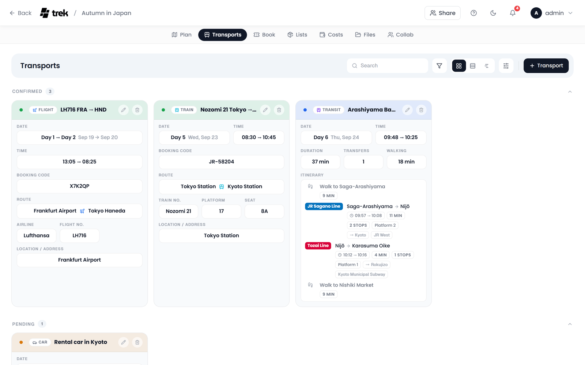
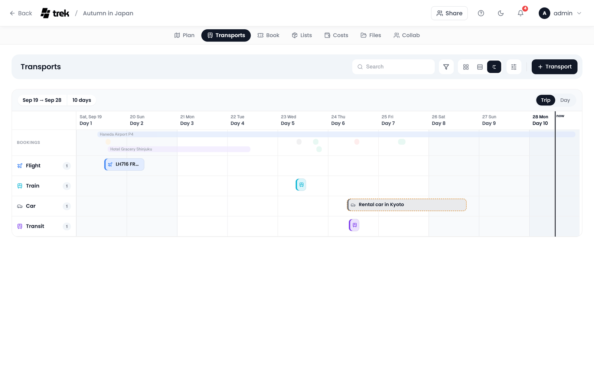
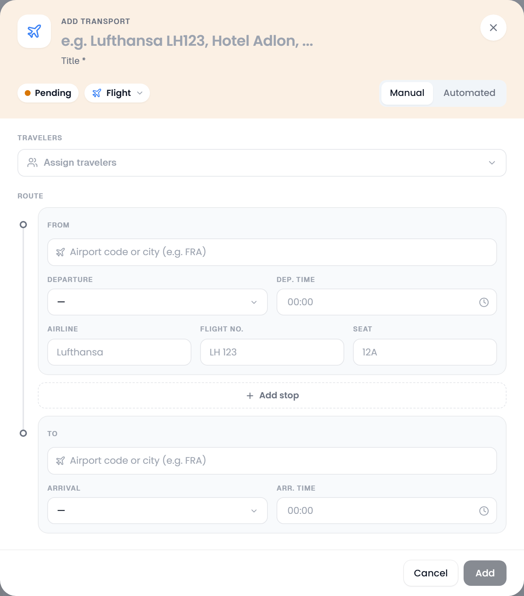
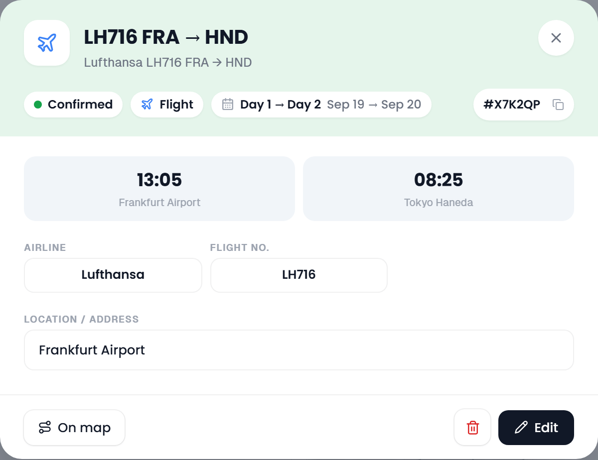

# Transport: Flights, Trains & Cars

Flights, trains, rental cars, ferries and every other ride of a trip, with their departure and arrival points, local times and the details that come with each kind of ticket. Public transit connections can be looked up and added to a day in a few clicks.

## Where to create

There are several ways to add a transport:

- On the **Transports** tab, click **Transport** at the top right. The editor opens as **Add transport**.
- In the day plan, click the **+** in a day's head band (*Add to day*) and pick **Add transport** for that day, or **Public transit** to search a connection on it.
- Click the travel-time connector between two stops in the day plan and pick **Public transit**. The search opens with that leg's start and end filled in and the departure time taken from the stop you are leaving.
- Import the confirmation with **Import booking confirmations**, or bring flights in from AirTrail. See [Import from booking confirmation](Reservations-and-Bookings#import-from-booking-confirmation) and [Import from AirTrail](Reservations-and-Bookings#import-from-airtrail).

The entries in the day's menu need the right to edit days. **Public transit** only appears on a trip with a start and an end date, since a search needs real dates to depart on.

Transport records live on the **Transports** tab and never on the [Bookings](Reservations-and-Bookings) tab, so the same ride is never listed twice. They do show up next to your other bookings in the day plan, dimmed on the Bookings tab's timeline when **Show the other tab** is on, and on a [public share link](Public-Share-Links), whose single **Bookings** tab lists everything together.

## The Transports tab

The tab works exactly like the Bookings tab: the same bar with search, **Filter**, the **Cards**, **List** and **Timeline** views and **View options**, the same cards and the same detail popup. [Reservations-and-Bookings](Reservations-and-Bookings#views) describes them. A few things are specific to transports:

- The bar also holds **Import from AirTrail** (the plane icon) when the AirTrail addon is on.
- **Export as spreadsheet (CSV)** saves the filtered transports as a CSV, with the first and last stop of each route under **From** and **To**. See [Exporting as CSV](Reservations-and-Bookings#exporting-as-csv).
- Cards show the whole route, stop by stop, with the type's icon between the stops, and **Segment codes** when the legs of a connection have their own codes.
- Public transit journeys have no status. They are tinted blue, and in the cards view they sit among the confirmed entries in time order. **View options → Public transit as its own section** gives them a section of their own, **Automated public transit**. The list always does that when it is grouped by status.
- On the timeline, **Show the other tab** draws the Bookings tab's entries in a dimmed lane at the top.

## The transport editor

The head band holds the title, which you type straight into it, and three controls next to each other:

- the **status** pill, **Pending** for a new transport; click it to switch to **Confirmed**,
- the **type** pill, see [Transport types](#transport-types),
- the **Manual** / **Automated** switch, only while creating a transport on a trip with dates. **Automated** turns the dialog into the [public transit search](#public-transit-search).

Until the title has something in it, the line under it marks the title as required and **Add** stays disabled. Once the route has two ends, that line shows the route instead.

## Transport types

Ten types are created in the editor: **Flight**, **Train**, **Bus**, **Car**, **Taxi**, **Bicycle**, **Cruise**, **Ferry**, **Cable car** and **Other**. **Cable car** covers gondolas and aerial cableways and has its own icon. An eleventh type, **Public transit**, only comes from the public transit search.

> **AI / MCP:** `create_transport` accepts the same ten. Scheduled public transit is its own tool: `create_transit_journey` attaches the provider's itinerary. See [MCP-Tools-and-Resources](MCP-Tools-and-Resources).

## Common fields

Every transport has these fields, whatever its type:

| Field | Notes |
|-------|-------|
| Title | Required, typed in the head band |
| Status | Pending or Confirmed, the pill in the head band |
| Travelers | Who is on this ride: trip members and named guests |
| Route | Where it starts and ends, with its days and times; see [Routes](#routes) |
| Booking Code | Optional. With **Blur booking codes** on, a filled code stays blurred until you point at it or click into it |
| Notes | Optional; shown as markdown on the card |
| Link | Optional booking URL, next to **Files** |
| Files | **Attach file** uploads a ticket; on a saved transport **Link existing file** ties in a file the trip already has |
| Costs | With the Costs addon: **Create expense**, or **Link existing expense** once the transport is saved. See [Budget-Tracking](Budget-Tracking#expenses-linked-to-a-booking-or-a-place) |

When editing, the foot of the dialog also has **Delete**, which asks once before it removes the transport.

If you have changed something and then press Escape or click beside the dialog, TREK asks *Discard your changes?* first: **Keep editing** returns to the form, **Discard** closes it without saving.

The notes of a transport also print in the [trip PDF](PDF-Export). The PDF preview has a **Transport notes** switch to leave them out.

## Routes

### Flights

A flight's route is a chain of airports, drawn as a rail from **From** to **To**. Search each airport by city or IATA code (at least two characters); results show the code, the airport, the city and the country. Once an airport is picked, its time zone appears next to the time fields (**Dep. TZ**, **Arr. TZ**), so you enter local times without doing any maths.

Every airport the plane leaves from has **Departure** and **Dep. time**, every airport it lands at **Arrival** and **Arr. time**, and each leg has its own **Airline**, **Flight No.** and **Seat**. **Add stop** between two airports inserts a layover. With more than two airports, each leg also gets its own **Booking Code**, for itineraries where every segment has a separate reference.

### Trains

Trains use the same rail, with stations instead of airports. Search each station with the location picker; **Add stop** inserts a change of trains. Each leg has its own departure and arrival day and time, **Train No.**, **Platform** and **Seat**, and its own **Booking Code** once the route has more than two stations. A simple train from A to B is just one leg.

Trains saved before the multi-leg editor existed still open fine: their train number, platform and seat are read as a single leg.

### Cruises

A cruise uses the same rail as a train, with ports instead of stations. The first stop is **Embarkation**, the last **Disembarkation**, and **Add port** between two of them inserts a **Port of call**. Every port the ship arrives at has **Arrival** and **Arr. time**, every port it leaves from **Departure** and **Dep. time**, so a port of call carries both. A cruise has no train number, platform or seat.

### Cars, buses and everything else

The other types have a single **From** and **To**. The location picker offers the trip's own places before you type; type at least three characters to search, and pick one of the results. A name that is only typed and never picked is not saved.

Below the two ends come **Date** and **Start time**, then **End date** and **End time**. For a **Car**, they read **Pickup**, **Pickup time**, **Return** and **Return time**. There is no separate rental type: a rental and your own car are both a Car.

A car can also have **Stops along the way**, the places the drive passes through between pickup and return. **Add stop** adds a row with a location and an optional time, the arrows move a stop up or down, and a stop without a picked location is dropped on save. The order of the stops is the route: the map draws the drive through them in that order instead of straight from pickup to return.

## Public transit search

The **Automated** mode searches real public transit connections, by default through [Transitous](https://transitous.org/), which is free open data with no API key. It opens from the **Manual** / **Automated** switch in the editor, from **Public transit** in a day's **+** menu, or from the travel-time connector between two stops.

The head band reads **Public transit** and holds a day pill: the search runs for that day. Then:

1. Pick **From** and **To**. Quick picks are offered before you type: first the day's accommodation, then the airports, stations and ports the day's flights, trains, buses, ferries and cruises leave from or arrive at, then the day's own places. Any stop or station can be searched as well. **Swap** turns the two around.
2. Choose **Depart** or **Arrive** and the time.
3. Narrow the modes if you like: Train, Subway, Tram, Bus, Ferry, Cable car.
4. Rank the results by **Best route**, **Fewer transfers** or **Less walking**, and click **Search**.
5. Each result shows the local departure and arrival times, the duration, the transfers (or *Direct*), the walking time and the line badges in their official colours. Expand one for the stop by stop breakdown.
6. **Add to day** saves the connection as a **Public transit** entry.

The journey slots into the day at its departure time and shows its line badges in the plan; the chevron on its row unfolds the itinerary right there. Clicking the row opens the [booking detail](Reservations-and-Bookings#the-booking-detail), with duration, transfers and walking time at the top and the **Itinerary** below them. **Change route** at its foot runs the search again, already filled with the journey's two ends and its day; the connection you add then takes the old one's place. **Edit** opens the ordinary transport editor for the booking code, the travelers, the notes and the files.

On a phone, the journey opens in its own view with the same itinerary and actions.

Self-hosters can point the `TRANSIT_API_URL` environment variable at their own MOTIS instance.

> **Admin:** which service answers the search is set under **Admin → Settings → API Keys → Transit Provider**. **Transitous (free)** is the default: community GTFS feeds, keyless, with the best coverage in Europe. **Google** runs the stop search and the route plan through the Google Maps API key in the same card, for regions Transitous has no data for. Google bills per search, and the key has to be allowed to call the **Routes API** and the **Places API (New)** (text search); the legacy Directions API is not used. A key saved only in a member's own settings serves that member alone, so save it as an admin to apply it to the whole instance. While no Google key is available, the search stays on Transitous even with Google selected, which is why an empty result names the service that answered (*No connections found via Google*).

## Opening a transport

Click a transport anywhere, on its card, in the day plan, on the map or in the road trip rail, and its detail opens.

For a transport, the tiles at the top show the departure and arrival times with their airports or stations, and the platform and seat when they are set. A route with stops lists every stop with its time. The foot of the detail has **On map**, which switches the route's line on and opens the plan on its day, **Delete** and **Edit**. See [The booking detail](Reservations-and-Bookings#the-booking-detail) for everything else it shows.

From the plan, **Edit** on a transport needs the right to edit days; on the Transports tab it needs the right to edit bookings.

## On the map

A transport with both ends set can be drawn as a line on the trip map:

- **Flights**, **cruises** and **ferries** follow a great-circle curve, the way they actually travel across the globe.
- **Cars**, **buses**, **taxis** and **bicycles** follow real roads, routed on demand through a public OSRM router (driving for car, bus and taxi, cycling for the bicycle). A straight line shows while the route loads, and stays when routing fails or the distance is over about 2000 km.
- **Trains** are drawn as a straight line through all their stations.
- **Cable cars** are drawn as a straight line from the valley to the mountain station, the way the rope runs.
- **Public transit** journeys follow their real rail and bus lines, each ride in its line's own colour and the walks between them as a dotted grey line. A journey the provider sent no shape for falls back to a straight line. A journey is also drawn whenever its day's **Route** is switched on, so it has no route button of its own in the day plan.

Confirmed transports get a solid line, pending ones a dashed line. Each end carries a pill-shaped marker with the transport's icon; click it to open the detail. Turn on **Booking route labels** (Settings → General → Travel & map) to print the airport code or station name in the pill as well, once the two ends are far enough apart on screen.

Lines are off until you ask for them: the route button on a transport's row in the day plan (**Show booking routes**) draws one, **Show all booking routes** in the toolbar above the days draws them all, and **On map** in the detail does the same for one booking. **Always show booking routes** in the same settings draws them from the start. See [Map-Features](Map-Features#reservation-and-transport-overlay).

## In the day plan

A transport shows up on its day as a row between the stops, tinted with its type's colour, with its time as a badge and its route or carrier underneath. When a departure or arrival has a time zone, a small globe after the time names it on hover. A ride that runs over several days appears on each of them with a label for the phase:

| Type | First day | Days in between | Last day |
|------|-----------|-----------------|----------|
| Flight | Departure | In transit | Arrival |
| Car | Pickup | Active | Return |
| Everything else | Start | Ongoing | End |

A rental car in its middle days is not a row but a pill in the day's head band. A flight or train with stops shows **one row per leg** instead, each on its own day at its own time.

Drag a transport row to move it within its day or onto another day. The rows of a flight or train with stops, and the middle days of a longer ride, stay where their times put them. Click a row to open its detail.

See [Day-Plans-and-Notes](Day-Plans-and-Notes#multi-day-reservations) for how the days are put together.

## See also

- [Reservations-and-Bookings](Reservations-and-Bookings)
- [Accommodations](Accommodations)
- [Map-Features](Map-Features)
- [Day-Plans-and-Notes](Day-Plans-and-Notes)
- [Road-Trip](Road-Trip)
