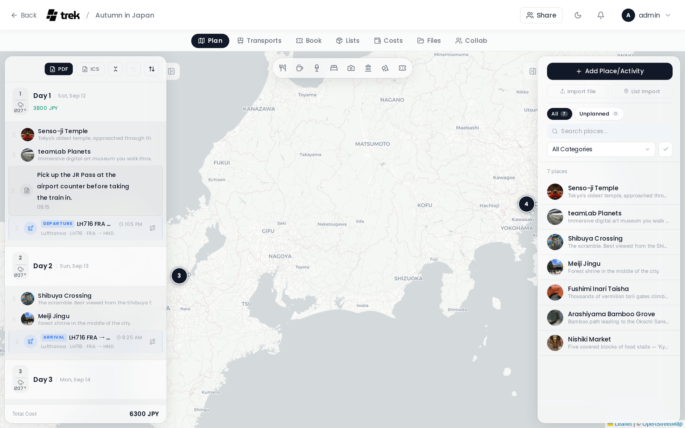
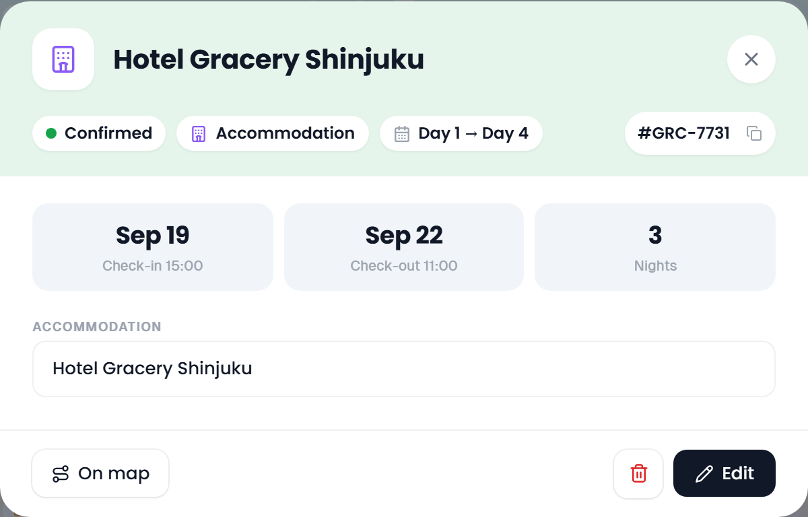

# Trip Planner Overview

The trip planner is where a trip is built. Open it by clicking a trip card on the [dashboard](My-Trips-Dashboard).



## Layout

On a desktop or a tablet (768 px and wider) the **Plan** tab has three parts:

```
┌─────────────────┬──────────────────────────┬──────────────────┐
│  Days           │                          │  Places          │
│  (left)         │           Map            │  (right)         │
│                 │         (centre)         │                  │
└─────────────────┴──────────────────────────┴──────────────────┘
```

- **Days** on the left: the trip day by day. Every day is a card with its places, bookings, transports and notes. See [Day Plans and Notes](Day-Plans-and-Notes).
- **Map** in the centre: the places of the trip, the route of the selected day and the booking routes you switched on. The lock on the map (*Lock the map view*) keeps the view where it is, so picking a day or a place no longer zooms or pans; click it again to let the map follow the selection. See [Map Features](Map-Features).
- **Places** on the right: every place of the trip, with search, filters, import and a select mode. See [Places and Search](Places-and-Search).

The two side columns float over the map. Drag the inner edge of a column to make it wider or narrower. On a tablet the edge follows a finger as well and shows a grip, also in the narrower portrait layout, and with the keyboard focus on it the arrow keys change the width. The small tab on its edge tucks the column away, and a tucked column leaves a tile named **Plan** or **Places** at the edge of the map that brings it back.

Two panels open over the map, centred between the columns:

- **Day details** opens when you click a day's head band: the weather, the day's bookings and its stay. The chevron folds it to a slim bar, **X** closes it. See [Day details panel](Day-Plans-and-Notes#day-detail-panel).
- **The place inspector** opens when you click a place, in either column or on the map. See [The place inspector](Places-and-Search#the-place-inspector).

Opening a day also narrows the places column. With a day open, **Planned** in the **Show** menu of the places column lists and counts only the places on that day, the same set the map draws, and a chip under the filters says **Showing the open day only**. Its **X** (*Show the whole trip*) closes the day again, so list, count and map return to the whole trip. **All** and **Unplanned** stay trip-wide on purpose: a place on some other day is planned, whichever day happens to be open.

With the [Road trip](Road-Trip) addon on, a **Days** / **Road trip** switch sits above the days column. See [Road trip view](#road-trip-view).

## Tabs

The tab bar sits directly below the main navigation bar.

| Tab | What it holds |
|---|---|
| **Plan** | Days, map and places, as described on this page. Always shown. |
| **Transports** | Flights, trains, buses, cars, taxis, bicycles, ferries, cruises, cable cars and public transit, as cards, a list or a timeline. See [Transport: Flights, Trains, Cars](Transport-Flights-Trains-Cars). |
| **Bookings** | Stays, restaurants, events, tours, parking and other bookings, in the same three views. See [Reservations and Bookings](Reservations-and-Bookings). |
| **Lists** | Packing list and to-dos. See [Packing Lists](Packing-Lists) and [Todos and Tasks](Todos-and-Tasks). |
| **Costs** | Expenses, splits and settling up, as a list or a table. See [Costs](Budget-Tracking). |
| **Files** | Tickets, receipts and other documents. See [Documents and Files](Documents-and-Files). |
| **Collab** | Chat, shared notes, polls and What's Next. See [Real-Time Collaboration](Real-Time-Collaboration). |

> **Admin:** The **Lists**, **Costs**, **Files** and **Collab** tabs only appear when the matching addon is enabled. See [Admin-Addons](Admin-Addons).

The active tab is saved in `sessionStorage` per trip, so switching between trips brings you back to where you were. The installed app (PWA) goes further: after the system closed it, it reopens on the trip and the tab it was on, and on a phone on the plan day as well.

## Bookings on the plan

A booking or transport opens its detail first, wherever you click it on the Plan tab:

- a booking or transport row in a day,
- a rental car pill in a day's head band, or the ticket at the end of a stay pill there (*Open booking*),
- a booking in the day details panel, including the booking box of a stay,
- a booking card in the place inspector,
- an endpoint of a booking route on the map,
- a ride, terminal or booking chip in the road trip rail.

The detail shows status, type and day, the booking code with a copy button, the times, travelers, notes, files and linked expenses. Its footer holds **On map**, **Change route** for a public transit journey, **Delete** and **Edit**. **Edit** opens the editor. See [Reservations and Bookings](Reservations-and-Bookings) for everything the detail shows.



## Dialogs

Every dialog of a trip shares one frame. The head band carries an icon tile, a small line that says what the dialog does (for example **Edit Place** or **Add accommodation**), the name, and pills for facts such as the status, the type or the category. In the dialogs for a place, a booking, a transport or a note, the name is a field: you type it straight into the band. **Cancel** and the save button sit in the footer. **Escape** or the **X** in the head band closes the dialog without saving.

When a dialog opens, the focus moves inside it (on a desktop into its first field), and **Tab** stays inside until it closes. In the dialogs for a place, a booking and a transport, a stray click beside the dialog or **Escape** no longer throws away what you typed: once something has changed, TREK asks *Discard your changes?* with **Keep editing** and **Discard**.

## Undo

The planner keeps your recent actions in a short undo ring: adding, deleting and importing places, putting them on a day, taking them off, moving them to another day, reordering, optimizing a route, clearing a day, locking a place and changing categories. The **Undo** button (a curved arrow) sits in the head band of the days column. It is greyed out until there is something to undo, its tooltip names the last action (*Undo: Route optimized*), and a click reverses it.

Deleting a day is not in the ring. The question before the delete lists what goes with the day instead; see [Deleting a day](Day-Plans-and-Notes#deleting-a-day). An earlier reorder of the days can still be undone afterwards, minus the day that is gone.

## Road trip view

With the [Road trip](Road-Trip) addon enabled, the **Days** / **Road trip** switch above the days column turns the day cards into one continuous drive: arrival times, daily travel times, driving limits, range, search along the route, via points and current hazard warnings. The choice is kept per trip for the browser session. All of it is on its own page:

- [Daily travel times and day endings](Road-Trip#daily-travel-times-and-day-endings), including **End the day here** and dragging an end-of-day label on the map.
- [Driving settings](Road-Trip#driving-settings), shared by everyone on the trip.
- [Search along the route](Road-Trip#search-along-the-route), **Add manually** and [adding a stop from the search](Road-Trip#adding-a-stop-from-the-search), with the accommodation portals.
- [Charger availability and tariffs](Road-Trip#charger-availability-and-tariffs).
- [Weather warnings and disaster alerts](Road-Trip#weather-warnings-and-disaster-alerts).
- [Booked nights on the drive](Road-Trip#booked-nights-on-the-drive) and [starting and ending the day at the stay](Road-Trip#starting-and-ending-the-day-at-the-stay).
- [Importing a Google Maps route](Road-Trip#importing-a-google-maps-route).
- [MCP tools](Road-Trip#mcp-tools) for planning a drive from an assistant.

In the Road trip view, **Edit** on a stop on the way or on a booked night opens the compact stop dialog with its stay and check-in instead of the full place form; **More details** in that dialog opens the full form. Ordinary places keep the full place form.

## Mobile layout

On screens narrower than 768 px, TREK does not squeeze the three columns together. It opens a dedicated trip screen instead: a rail of day chips under the top bar, a switch between the day plan and a full-screen map, and a dock at the bottom for the other tabs. While a trip is running, today's chip is marked, and a button beside the rail (*Jump to today*) scrolls back to it, in the plan and on the map. Reopening a trip selects a day again instead of showing an empty plan.

## Splash screen

When you open a trip, a short loading screen shows the trip title while the plan and the place photos are fetched. Once the data is there and a short grace period for photos has passed, the planner appears.

## Related pages

- [Day Plans and Notes](Day-Plans-and-Notes)
- [Places and Search](Places-and-Search)
- [Map Features](Map-Features)
- [Route Optimization](Route-Optimization)
- [Weather Forecasts](Weather-Forecasts)
- [Accommodations](Accommodations)
- [Reservations and Bookings](Reservations-and-Bookings)
- [Road Trip](Road-Trip)
- [Admin-Addons](Admin-Addons)
