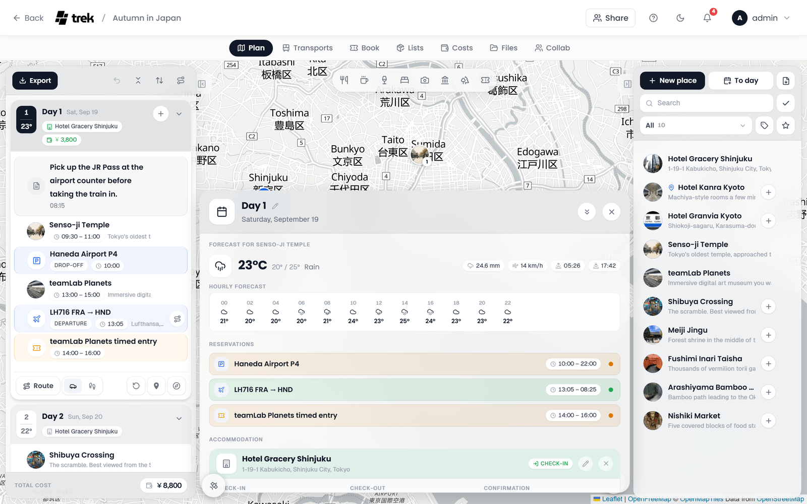

# Weather Forecasts

TREK shows a weather forecast for every dated day of a trip, and a climate estimate for days too far ahead for a forecast. The data comes from Open-Meteo, so no API key is needed.

## Where forecasts appear

- **On each day card:** the tile at the left of a day's head band shows the day's number and, under it, the temperature. Rest the pointer on it for the weather and the place it is for. See [Day Plans and Notes](Day-Plans-and-Notes#the-head-band).
- **In the day details:** click a day's head band to open the [day details panel](Day-Plans-and-Notes#day-detail-panel). The full forecast sits at its top.

A day shows weather when it has a date and a place to take it from: the first place on the day that has coordinates, or, on a day without one, the hotel you wake up in. The forecast never falls back to some other place of the trip, so on a road trip a day always shows the weather of where you actually are. The day details name that place (*Forecast for Hotel Adler*).

## What is shown

The day details show:

- the weather icon, the temperature and the condition, with the day's low and high next to it,
- pills for the **Rain probability**, the **Precipitation** (only when some is expected), the **Wind** (km/h, or mph when Fahrenheit is selected), **Sunrise** and **Sunset**; rest the pointer on a pill for its name,
- the **Hourly Forecast**: an icon and a temperature every two hours, with the chance of rain under each slot that has one. Slots with a chance of rain above 50 % are highlighted.

A day without a date, or without a place to take the weather from, has no weather section. When the weather cannot be loaded, the panel says *No weather data available. Add a place with coordinates.*

## Data source and time windows

| Date range | Data source | Cache |
|---|---|---|
| From yesterday up to 16 days ahead | Open-Meteo forecast API | 1 hour |
| More than a day in the past | Open-Meteo archive API (actual historical data), for the reading on the day card and for the day details. The archive lags a few days behind, so for a recent day it cannot answer yet the day details fall back to the forecast API | 24 hours (1 hour for a day details reading from the forecast API) |
| More than 16 days ahead | Climate estimate from the same date a year earlier | 24 hours |

Climate estimates carry a **Ø** in front of the temperature (for example *Ø 18°C*), so they are never mistaken for a real forecast, and the day details add a line saying that a real forecast is available within 16 days of the date. The reading on the day card fetches again quietly in the background when a cached climate estimate could be upgraded to a live forecast.

## Temperature and wind units

Temperature follows **Temperature Unit** under Settings > General > Language & region (see [Display-Settings](Display-Settings)): switch between °C and °F there. Wind speed is shown in km/h with °C and in mph with °F.

## Session cache

The reading on the day cards is kept in `sessionStorage` for the length of your browser session, so moving between days does not ask for the same weather again. A cached forecast older than an hour is shown at once and refreshed in the background. The day details fetch the detailed forecast each time they open.

**See also:** [Day-Plans-and-Notes](Day-Plans-and-Notes) · [Display-Settings](Display-Settings) · [Road-Trip](Road-Trip#weather-warnings-and-disaster-alerts)
