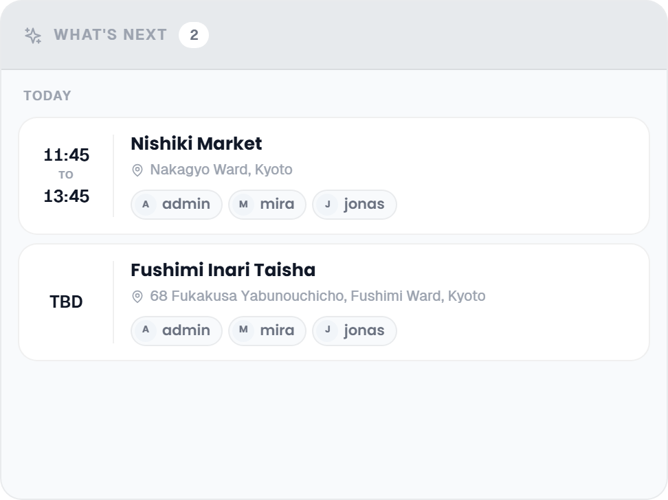

# What's Next Widget

The What's Next card lists the next stops planned on the trip, across all days, so the group can see at a glance where it is heading and who is going.

## Where to find it

Open the trip planner and select the **Collab** tab. On a **desktop** (a window 1024 px wide or more) What's Next is a card of its own; with every sub-feature on, it sits next to Polls under Notes and Links, with Chat on the left. In a narrower window the Collab panels turn into a tab bar with one panel at a time, and this one is the tab labelled **What's Next**. On a **phone** (under 768 px) the mobile trip planner takes over, and its Collab tab offers Chat, Notes, Links and Polls only: the widget is not there.

The Collab addon must be enabled and the What's Next sub-feature must be turned on. See [Real-Time-Collaboration](Real-Time-Collaboration).

## What it shows

The card lists the next **8** places planned on the trip's days, sorted by date and time. The head band shows how many there are. A place is listed when its day is still ahead, or when its day is today and it either has no time yet or its start time has not passed. Earlier stops drop off the list on their own, and days without a date are left out.

The stops are grouped under a heading per day: **Today**, **Tomorrow**, or the short weekday and date for days further out, followed by the day's title when it has one. Each stop is a small card with:

- **Time** on the left: the start time, or **TBD** when none is set, and under it *to* and the end time when there is one. Times follow your 12 or 24 hour setting.
- **Name** of the place.
- **Address**, with a pin, when the place has one.
- **Who is going**, as chips with avatar and name: the members assigned to that stop, or everyone on the trip when nobody in particular is.

With nothing ahead the card reads *No upcoming activities*.

## When it updates

The card follows the trip live: when you or anyone else adds, moves, times or removes a stop in the day plan, the list changes without a reload.

## Requirements

- Collab addon enabled (admin).
- What's Next sub-feature enabled (admin).
- Places planned on dated days that are still ahead.

## Related pages

[Real-Time-Collaboration](Real-Time-Collaboration) · [Collab-Chat](Collab-Chat) · [Collab-Notes](Collab-Notes) · [Collab-Polls](Collab-Polls) · [Day-Plans-and-Notes](Day-Plans-and-Notes)
